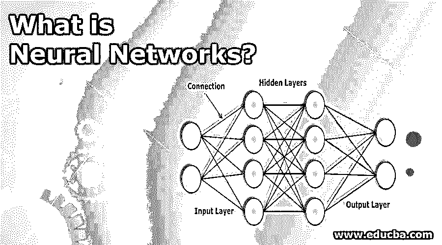
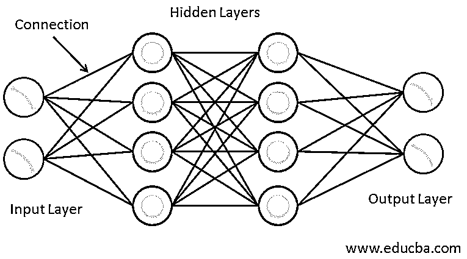
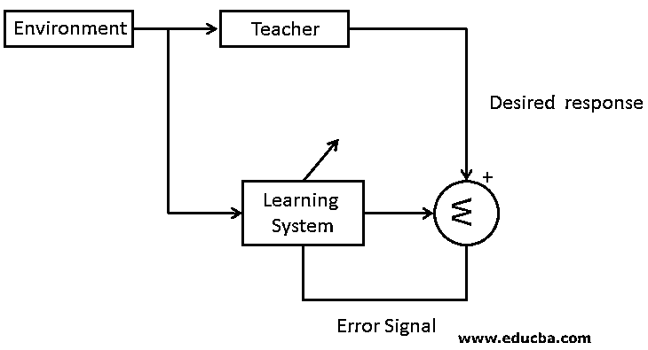
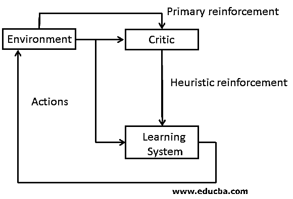
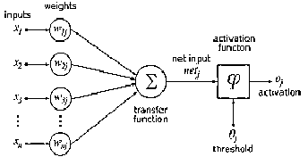
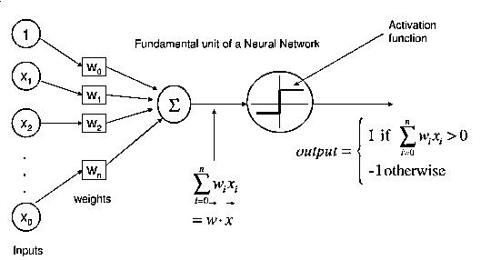
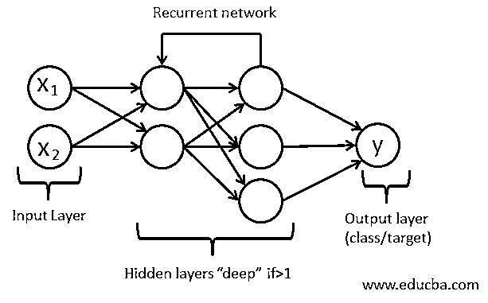

# 什么是神经网络？

> 原文：<https://www.educba.com/what-is-neural-networks/>

## 什么是神经网络？

受生物神经网络启发来执行涉及大量数据的不同任务的计算系统被称为人工神经网络或 ANN。使用不同的算法来理解一组给定数据中的关系，以便从不断变化的输入中产生最佳结果。网络被训练以产生期望的输出，并且不同的模型被用于预测数据的未来结果。这些节点相互连接，这样它就像人脑一样工作。原始数据中不同的相关性和隐藏模式被用来对数据进行聚类和分类。

<small>网页开发、编程语言、软件测试&其他</small>

### 理解神经网络

训练和教授神经网络就像训练儿童发育中的大脑一样。它们不能被直接编程用于特定的任务。相反，他们以这样的方式接受训练，以便他们能够根据变化的输入进行调整。

有三种方法或学习范例来教授神经网络。

*   监督学习
*   [强化学习](https://www.educba.com/what-is-reinforcement-learning/)
*   无监督学习

#### 1.监督学习

顾名思义，有监督的学习意味着有一个监督者或老师在场。这意味着一组带标签的数据集已经具有期望的输出，即由神经网络执行的最优动作[，其已经存在于一些数据集。然后给机器新的数据集来分析训练数据集并产生正确的输出。](https://www.educba.com/application-of-neural-network/)

这是一个封闭的反馈系统，但环境不在其中。

#### 2.强化学习

在这种情况下，输入-输出映射的学习是通过与环境的持续交互来实现的，以最小化性能的标量指数。在这种情况下，评论家而不是老师将初级强化信号，即从环境接收的标量输入，转换成启发式强化信号(更高质量的强化信号)标量输入。

这种学习的目的是最小化成本函数，即在一系列步骤中采取行动的预期累积成本。

#### 3.无监督学习

顾名思义，没有老师或主管可用。在这种情况下，数据既没有被标记也没有被分类，并且神经网络没有可用的先验指导。在这种情况下，机器必须根据相似性、差异和模式对提供的数据集进行分组，而无需事先提供任何训练。

### 使用神经网络

神经网络是一个加权图，其中节点是神经元，带权重的边表示连接。它从外界获取输入，用 x(n)表示。

每个输入乘以各自的权重，然后相加。如果加权和等于零，则添加偏差，其中偏差的输入为 1，权重为 b。然后，该加权和被传递给激活函数。激活函数限制了神经元输出的幅度。有各种激活函数，如阈值函数、分段线性函数或 Sigmoid 函数。

### 神经网络体系结构

基本上有三种类型的神经网络结构。

*   单层前馈网络
*   多层前馈网络
*   循环网络

#### 1.单层前馈网络

在这里，我们有一个源节点的输入层，它被投射到神经元的输出层。这个网络是一个前馈或非循环网络。它被称为单层，因为它仅指输出层的计算神经元。不对输入层执行任何计算；因此它没有被计算在内。

#### 2.多层前馈网络

在这种情况下，除了输入和输出层之外，还有一个或多个隐藏层。这一层的节点称为隐藏神经元或隐藏单元。隐藏层的作用是介入输出和外部输入之间。输入层节点将输入信号提供给第二层的节点，即隐藏层，隐藏层的输出作为下一层的输入，这继续到网络的其余部分。

#### 3.循环网络

递归网络几乎类似于前馈网络。主要区别在于它至少有一个反馈回路。可能有零个或多个隐藏层，但至少会有一个反馈回路。

### 神经网络的优势

下面是提到的优点:

*   经过培训后，可以在信息不完整的情况下工作。
*   具备容错能力。
*   具有分布式存储器
*   可以让机器学习。
*   并行处理。
*   存储整个网络的信息。
*   可以学习非线性和复杂的关系。
*   概括的能力，即从以前的关系中学习后，可以推断出看不见的关系。

### 必需的神经网络技能

下面给出了所需的神经网络技能:

*   应用数学和算法知识。
*   概率统计。
*   分布式计算。
*   基本的编程技能。
*   数据建模和评估。
*   软件工程和系统设计。

### 为什么要用神经网络？

*   它有助于模拟现实世界的非线性和复杂关系。
*   它们[用于模式识别](https://www.educba.com/pattern-recognition-applications/)，因为它们可以概括。
*   它们有许多应用，如文本摘要、签名识别、手写识别等等。
*   它可以对高波动性的数据进行建模。

### 神经网络范围

它在未来有着广阔的范围。研究人员正在不断研究基于神经网络的新技术。一切都在转化为自动化；因此，他们在处理变化方面非常有效，并能相应地适应变化。由于新技术的增加，有许多工程师和神经网络专家的职位空缺。因此，在未来，神经网络也将被证明是一个主要的工作提供者。

### 这项技术将如何帮助你的职业发展

在神经网络领域有巨大的职业发展。神经网络工程师的平均年薪大约在 33，856 美元到 153，240 美元之间。

### 结论——什么是神经网络？

神经网络有很多好处。他们可以根据变化的环境学习和适应。此外，他们对其他领域以及神经病学和心理学领域也有贡献。因此，无论是现在还是将来，神经网络都有广阔的发展空间。

### 推荐文章

这是一个什么是神经网络的指南？在这里，我们讨论了神经网络的介绍，工作，技能，职业发展和优势。您也可以浏览我们推荐的其他文章，了解更多信息——

1.  [机器学习 vs 神经网络](https://www.educba.com/machine-learning-vs-neural-network/)
2.  [神经网络的分类](https://www.educba.com/classification-of-neural-network/)
3.  [神经网络的实现](https://www.educba.com/implementation-of-neural-networks/)
4.  [网络拓扑](https://www.educba.com/network-topologies/)

