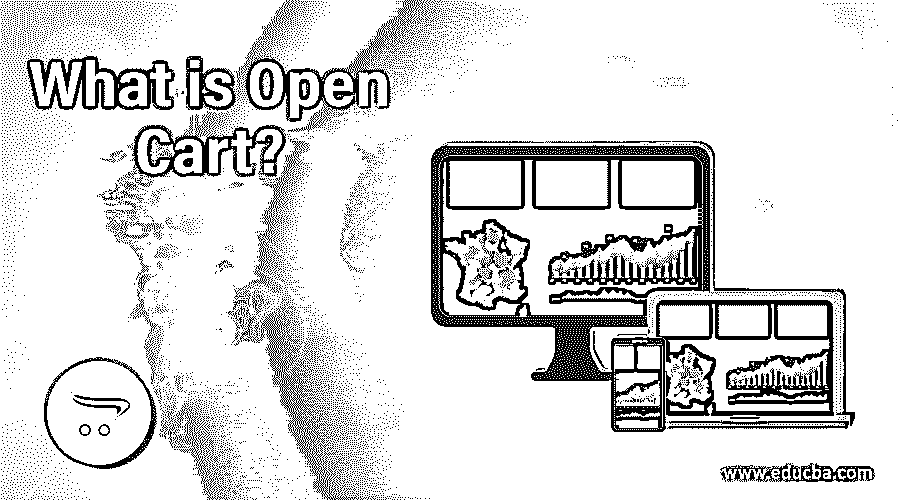
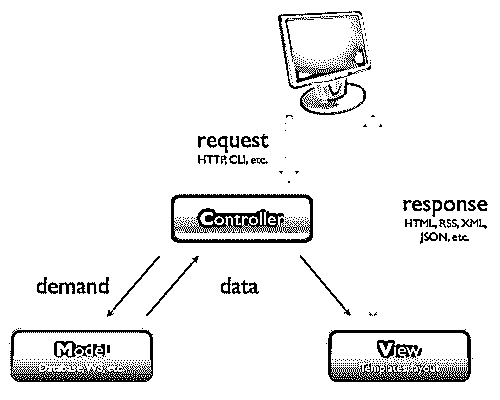

# 什么是敞车？

> 原文：<https://www.educba.com/what-is-open-cart/>

## 什么是敞车？

Open Cart 是一个免费的开源电子商务平台&由 open cart ltd 开发的在线商店开发和管理系统，于 2010 年 4 月发布。它用 cake php 语言编写，支持 GNU 下免费提供的跨平台操作系统。它使用 PHP、Mysql 数据库和 html 组件来开发 cms。根据 wikitech 的数据，大约有 3，420，000 个网络应用或网站在使用开放式购物车。它带有 13000+模块和主题，支付网关和运输方式。所以毫无疑问，它是排名第一的电子商务软件供应商。

由 Open Cart Ltd 开发，它是网上商店最有前途的 cms 之一。它基于 php 和 MVC 架构，旨在为 web 开发人员提供一个透明可靠的工具，使用 open cart 定制模块和插件来制作高性能的电子商务网站或在线商店。

<small>网页开发、编程语言、软件测试&其他</small>

基本上，要理解 open cart，我们需要理解它的布局结构，它在一个层次结构中包含以下模块。

*   账户
*   接纳
*   种类
*   检验
*   接触
*   默认
*   家
*   信息
*   制造商
*   结果
*   网站地图

### 开放式购物车的 MVC 结构

但在理解之前，我们需要先了解一下 open cart 的 MVC 结构，即模型、视图、控制器。

*   **控制器:**它包含应用程序或程序的主要控制。它只负责程序的流程。在基于 web 的 MVC 结构中，当浏览器点击 URL 时，它是程序或应用程序调用的第一层。
*   **模型:**它是一个单向数据流协调器。它的主要任务是保存应用程序的主数据，[如 SQL 查询](https://www.educba.com/what-is-sql-server/)或数据库对象。由于不能直接调用模型，所以所有的数据都是从模型中合并的，所以控制器根据请求从模型中访问数据，并将其发送到服务器。
*   视图:它是 MVC 结构的最后一层，因为它包含了应用程序的主要用户界面。它是用户唯一可见的层；否则，模型和控制器对用户是不可见的。它包含 HTML、CSS、javascript、jquery、ajax、json 对象等形式的数据。

作为增长最快和最稳定的开源电子商务平台之一，它有充分的理由让 web 开发人员更容易地创建在线商店或应用程序，例如:

*   **易于开发:**如果你有 php 和 mysql 数据库的基础知识，操作和定制一个开放的购物车是非常容易的。只是我们必须为每个模型视图做一个新的扩展。
*   **用户友好:**与许多[电子商务开发平台](https://www.educba.com/e-commerce-interview-questions/)类似，使用其友好的管理仪表板可以轻松制作和维护应用程序，例如:
    *   目录
    *   销售
    *   扩展ˌ扩张
    *   系统
*   对在线开放式购物车管理商店系统进行更改非常容易。
*   数以百计的电子商务商店的扩展和模块可在开放的购物车。

作为一个开源平台，它为我们发展电子商务业务和在线商店提供了广阔的空间。作为 2018 年最佳购物车软件，它是任何小型创业公司作为在线商店的最佳软件，并增加了他们的移动性和收入。它充斥着用户在其应用程序或程序中想要的所有电子商务解决方案。

这是非常容易使用和改变，并即时从任何地方操纵你的应用程序。在这种情况下，您需要清楚地理解以下步骤:

*   **步骤 1:** 了解开放式购物车中的模块(始终使用最新版本以获得最佳结果)
*   **第二步:**设置欢迎模块。
*   **第三步:**设置横幅模块。
*   **第四步:**特色模块的使用。
*   **第五步:**设置特殊模块为插件。
*   **步骤 6:** 创建对多个商店的访问。

当您在一个开放的购物车中与附属机构合作时，也会发生同样的情况。

### 优势

*   它附带了大量的插件、模块和扩展。
*   它有一个很大的社区，所以你可以使用开放式购物车来解决你面临的每一个问题。
*   在一个开放的 cart 平台上进行修改更容易。
*   它有很高的效率和服务器资源。
*   与其他电子商务平台相比，管理仪表板非常容易理解。

### 技能

因为它是一个 web 开发平台，所以你需要了解与 web 开发相关的基本技能[，可以是:](https://www.educba.com/career-in-web-development/)

*   HTML5
*   CSS3
*   java 描述语言
*   JQUERY
*   引导程序
*   服务器端编程语言（Professional Hypertext Preprocessor 的缩写）
*   关系型数据库
*   APACHE(用于本地系统)
*   opencart mvc
*   事件系统

### 特征

各种各样的特性使得 web 开发者更加贪婪地使用开放式购物车作为在线商店 cms。它的一些特点是:

*   不限类别
*   无限产品
*   无限制造商
*   多种货币
*   多语言
*   产品评论
*   产品评级
*   20 多个支付网关
*   8 种以上运输方式

谈到它的未来，因为它是开源的，所以它将永远有一个庞大的社区。不仅如此，这个开放的购物车社区从 2014 年开始日益壮大。该公司定期更新其功能、模块、扩展和插件。因此，它使 web 开发人员更容易和有效地制作一个非常优化的在线商店。

就目前的市场需求而言，它也有许多竞争对手，如 Quick.cart 和 PrestaShop。因此，在开放式购物车中，总会有一个竞争级别。但是许多组织更倾向于使用 open cart 作为他们的在线商店平台。

因为它是 Prestashop 的竞争对手之一，所以它是初学者或中级程序员或电子商务创业公司所有者的一个非常好的平台。因为它有大量的功能，所以它比 Quick.cart 好，但比 PrestaShop 可靠的少 5。然而，与 PrestaShop 相比，它需要为其应用程序添加更多的功能。添加更多类似 PrestaShop 的功能会使其效率低下。所以它需要在功能上下功夫，给用户更强更可靠的效率。它有大量的插件和模块，所以对于初学者来说，这是一个很好的机会，因为它是开源的，免费的，并且有一个庞大的社区。

### 推荐文章

这是一个什么是开放式购物车的指南。这里我们讨论了优势、基本技能和特性。您也可以浏览我们推荐的其他文章，了解更多信息——

1.  [什么是 MySQL 数据库](https://www.educba.com/what-is-mysql-database/)
2.  [什么是 HTML](https://www.educba.com/what-is-html/)
3.  [什么是 MySQL？](https://www.educba.com/what-is-mysql/)
4.  [什么是 SQL](https://www.educba.com/what-is-sql/)

