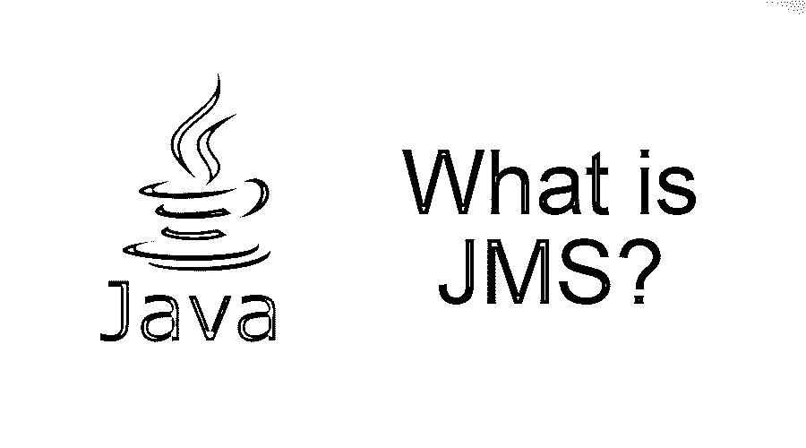
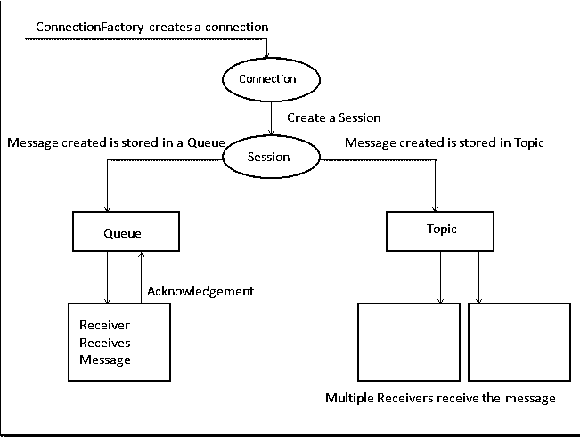

# JMS 是什么？

> 原文：<https://www.educba.com/what-is-jms/>

## JMS 简介

它代表 Java 消息服务，用于在特定系统内的多个单元和应用程序之间建立成功的通信网络。通常，它以应用程序接口的形式，借助于队列路径将消息从一个应用程序传递到另一个应用程序。众所周知，它具有自动消息通信、执行活动的约束更少或没有约束、带有通用消息协议的内置接口等特性。

### 谅解

*   它是一个从一个应用程序向另一个应用程序发送消息的 API。
*   假设一个应用程序服务器在印度，另一个应用程序在其他国家，那么它将帮助创建一条消息，并将其从宿主应用程序发送到接收该消息的接收方应用程序。
*   它由一个队列组成，在这个队列中，它从一个应用程序创建一条消息，这条消息将一直在队列中，直到接收方应用程序收到这条消息。

### 它是如何让工作变得如此简单的？

*   它引入了消息传递，这是一种通信形式，需要一个中介来执行彼此不协调的两个应用程序之间的通信。
*   发送方和接收方不需要同时出现来传递消息。这使得沟通更容易。

### 你能用 JMS 做什么？

它最大限度地减少了发送消息时的约束。

<small>网页开发、编程语言、软件测试&其他</small>

它提供了一种自动化的方式，因为程序员不需要知道消息传递过程所需的概念集。

它为通用协议和其他消息服务提供了一个接口。

使用它可以通过两种方式传递消息:

**1。点对点:**

*   这是一种通信方法，发送者(创建和发送消息的人)一次只能将消息发送给一个接收者(接收消息的人)。
*   这种方法使用一种队列机制，消息将被发送到一个队列，一个目标点。发送方将消息发送到目的地，目的地的接收方可以使用该消息。
*   重要的是接收者注册到目的地，否则接收者不能使用消息。
*   如果没有接收者注册到目的地，则消息将在目的地中，直到任何接收者注册到目的地来接收它。
*   任何数量的发送者都可以发送消息，但是一个接收者可以消费消息。

**2。发布/订阅:**

*   这种通信方法允许发送者将消息传递给许多接收者。
*   与队列不同，它使用主题作为目标点。
*   所以在这个方法中，所有的消费者都必须订阅目的地点。
*   一旦消息从发送者发送到目的地点，订阅该主题的所有活动接收者都可以使用该消息。
*   与队列不同，主题目标点不能保存消息，除非订阅的使用者在消息传递时处于非活动状态。
*   这种订阅称为持久订阅。

### 工作

应用程序架构由以下组件组成:

#### JMS 提供者

*   它提供控制和管理功能，并实现必要的消息传输接口。

#### JMS 客户端

*   它们是发送方和接收方，使用 JMS 发送和使用消息。
*   它们是用 [Java 编程语言](https://www.educba.com/java-programming-language-features/)编写的。

#### 受管理的对象

*   它们由目的地点(队列和主题)和连接工厂组成。
*   它们是预先配置的，也称为 JMS 对象。

#### 信息

*   最后的组件或部分是传达必要信息的实际消息。

### 优势

它具有以下优点

*   由于有效的负载平衡，它具有更大的吞吐量
*   能够使具有不同消息提供者的两个应用程序之间的通信成为可能。
*   这非常简单可靠。
*   它有一个非常清晰、明确和简单的 API，使程序员能够掌握体系结构，创建消息并启用通信网络。
*   它是非常通用的。在 JMS 中，消息既可以点对点发送，也可以广播给几个接收者。最主要的是，当需要时，将这两种方法结合起来并传递消息也足够有效。
*   组件之间的通信是松散耦合的。
*   只有当消息被接收方接收并确认时，该消息才会从队列中删除。
*   它有一个异步消息队列。
*   由于是异步的，消息发送的频率通常不会比指定的时间更快，因此可以创建许多消息并通过网络再次发送，从而提高效率。
*   由于其简单的体系结构，它被广泛支持并被每个行业所接受，它已经被实现为 Java 应用程序的消息传输服务。

### 所需技能

*   要了解 JMS。
*   必须了解 Java。
*   Java 框架的知识是必要的。
*   对连接转移概念的基本理解。
*   对它的建筑理解是至关重要的

### 为什么要用？

JMS 连接:ConnectionFactory 对象创建一个连接，该连接是通过实现用于消息传输的连接接口来建立的。

为了创建连接，

一旦建立了连接，我们就必须根据我们打算使用它执行的消息传输类型来创建目的地点。

要创建队列会话，

要创建主题会话，

之后，我们需要创建队列接收者或主题订阅者，并通过目的地点对象调用它。

该过程完成后，关闭连接。

### 范围

*   在 JMS 中，范围只不过是资源可用性级别的规范。
*   可以通过更改 JMS 提供者的配置属性来设置范围。
*   通过管理控制台，转到资源-> JMS -> JMS 提供者。
*   在这里，您可以将范围设置为所需的级别。问

作为一份工作，如果你想成为一名成功的 Java 开发人员，并且具备良好的系统基础设施知识，这是非常必要的。

### 我们为什么需要它？

我们需要 JMS 来完成以下任务。

*   应用程序易于扩展。
*   用 Java 编写的应用程序的简单通信。
*   创建一组代码和理解消息服务[算法](https://www.educba.com/what-is-an-algorithm/)以创建连接的时间消耗。

### 谁是学习 JMS 技术的合适受众？

任何有 Java 应用程序开发和管理多个 Java 应用程序数据经验的人。

### 这项技术将如何帮助你的职业发展？

职业发展将是巨大的，因为你将深入学习系统需求和 java 应用程序接口特性，给你一条成为卓越的 java 应用程序开发人员的捷径，甚至超越成为项目或交付经理，因为你将管理几个将发挥作用的 Java 应用程序。

### 结论

它已经被信息技术行业的专家所接受。它将继续增长，因此学习它将帮助你适应行业不断增长的需求，帮助你更新 java，并帮助你在更长的职业生涯中取得更大的成就。

### 推荐文章

这是什么是 JMS 的指南？.在这里，我们讨论了 JMS 的基本概念、所需技能、工作、需求以及职业发展和优势。您也可以浏览我们推荐的其他文章，了解更多信息——

1.  > [Java vs Node JS](https://www.educba.com/java-vs-node-js/)
2.  [Java 春季面试试题](https://www.educba.com/java-spring-interview-questions/)
3.  [Java 面向对象编程](https://www.educba.com/object-oriented-programming-in-java/)
4.  [Java 默认方法](https://www.educba.com/java-default-method/)

