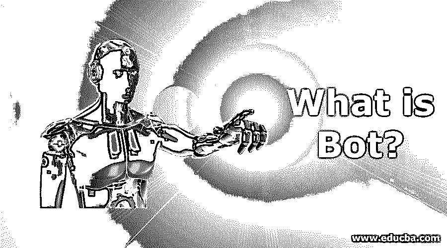

# Bot 是什么？

> 原文：<https://www.educba.com/what-is-bot/>

## Bot 简介

通过 Bot，人们可以了解软件应用程序的相关信息。当通过互联网连接时，这种应用程序会自动运行以执行一些任务。该机器人兼容重复和简单的任务。表演率远高于人的承受能力。在网络爬虫中，机器人被大量使用。当执行网络爬虫活动时，有一个自动脚本来帮助分析互联网服务器上可用的信息，与人工工作相比速度更快。

### Bot 是什么？

机器人被定义为自动执行某些任务的软件。它没有人类的速度快。在他们的帮助下，人们可以在互联网上搜索一些新开发的网站。在拒绝服务攻击的情况下，它们是一个很好的选择。它也被认为是一个运行软件的“机器人设备”。

<small>网页开发、编程语言、软件测试&其他</small>

### 了解机器人

在当今时代，机器人正在成为一项有用的技术。它已经成为在互联网上执行任务的一种简单方式。这样的任务处理 API 软件。当研究详细理解时，学习一些与之相关的概念是至关重要的。

*   **蛮力工作:**很多都有，有助于专门抓取网页。
*   **决策树:**还有一些其他的机器人就像决策树一样。在这种情况下，用户持有导航。这种导航仍然具有有限的选择。

### Bot 是如何让工作变得如此简单的？

机器人是一项伟大的技术，已经取代了人类的工作。这样的应用使生活变得更加容易。

它在以下几个任务中很有帮助:

*   执行自动化任务:这是使用机器人的最大优势之一。在没有任何人类对话的情况下，很容易下订单并让订单送达。
*   轻松对话:通过聊天机器人，人们可以轻松地开始对话，以执行任何特定或重复的任务。
*   **行为像人:**使用 bot 技术的一大特点。存在一些专门以这种方式设计的机器人。当你开始一段对话时，你会觉得像是在和一个人交谈。

### Bot 有什么用？

机器人是多种事情的有效工具。它是一个与多种软件进行简单交互的工具。

*   **接触外界:**机器人可以接触外界，代表任何用户执行任务。
*   **生产绩效:**它使人工任务变得简单，有助于快速达到生产绩效。
*   **快速过程:**它是快速技术之一，已经把人类执行搜索任务的时间速度甩在了后面。
*   **执行重复性任务:**有了机器人，执行重复性的任务就容易了。这个应用程序耗时更少。

### 你能用机器人做什么？

任何用户在使用 bot 技术时都会获得最大的利益。有了这样一个有益的工具，任务变得容易和简单。

Bot 执行的主要功能包括:

*   **获取信息:**在聊天机器人的帮助下，不需要太多时间就可以轻松获取信息。它是一种可以有效利用来获取大量信息的工具。
*   **电商渠道:**很多时候，初创公司把它作为[进行电商活动的渠道](https://www.educba.com/e-commerce-interview-questions/)。此类活动包括集团采购记录和销售分析。

### 使用 Bot

使用机器人时，了解一些与之相关的概念是很重要的。

*   **Bot store:** 它就像是‘应用商店’，有助于检查在场的 Bot。当用户找到所需的 bot 时，可以很容易地从 bot 商店安装它。
*   许多公司通常考虑使用机器人作为搜索引擎机制。这有助于找到机器人和轻松安排时间。经过整理后，他们可以很容易地排名。
*   **HTTP:** Bot 借助 HTTP 从其框架接收活动。

### 优势

许多公司发现它是开展多项活动的有效工具。

*   **快速处理:**有了 bots，每个企业都能轻松享受快速处理。当在网站上使用它时，它可以轻松地同时与许多客户进行对话，并快速回复。
*   **不贵:**与雇佣一群工人相比，这对企业来说成本并不高。
*   **提高客户满意度:**任何使用 bot 的企业都可以获得额外的客户满意度。聊天机器人可以长时间工作而不需要任何睡眠时间。
*   **防止错误:**使用 bot 时，有可能错误不会发生。随着机器人的应用，客户将获得正确的答案。

### 为什么要用 Bot？

大多数情况下，功能完善的技术会在每个行业运行很长时间。伴随着它，变化和进步给它增加了更多的改进。许多企业依赖 bot，因为它是一种有益的工具。

有一些原因使它成为一个要求很高的工具，这些原因是:

*   成本更低，也更容易理解。
*   没有必要安装机器人。它们作为网页源呈现给客户。
*   很容易与他人分享，将其用作聊天平台。
*   它减少了人力的使用。
*   它有几项改进，可以提供更好的性能。

### 范围

目前，机器人在各种类型的组织中越来越受欢迎。它们以科学的逻辑存在于过去的岁月里。目前，它已经在企业中得到了越来越多的重视。这样的受欢迎程度来自于[人工智能和机器学习](https://www.educba.com/machine-learning-vs-artificial-intelligence/)的进步。

*   **认知度提高:**许多企业正在采用 it 作为快速技术。它在诸如安全、营销、通信、品牌等几个方面是有帮助的。
*   **立足未来:**经过多次推进，it 已经进入企业内部管理领域。在未来的时间里，它将成为每个行业的重要工具。

### 我们为什么需要机器人？

有了这种技术，一些初创企业和公司在业务活动中获得了重大收益。这项技术在许多任务中都有广泛的应用。

*   它有助于确定专用的开发工具。
*   它在人工学习概念方面取得了一些进展。
*   使用 teleparadigm，可以发布几个使用 bot 技术的条款。
*   它有助于提高操作任务的透明度。
*   需要完全控制地管理可用资源。
*   它有助于更好的投资活动。

### 这项技术将如何帮助你的职业发展？

与人类活动相比，这种技术容易且以更快方式执行任务。在不久的将来，机器人技术编程语言的进步将扩大其作为职业选择的范围。应用这种技术可以在生活中获得高分。

有一些理由证明它与高级职业发展选项兼容，这些理由是:

*   这是一项正在取代人工任务的技术。
*   它有一个很好的流程和执行任务的时间。
*   这有助于达到很高的客户满意度。

### 结论

在这篇文章中，有一个关于与机器人相关的每个方面的详细描述。为了对它们有一个全面的了解，这是一篇包含了所有关于它们的信息的文章。

### 推荐文章

这是一个什么是机器人的指南？在这里，我们讨论为什么我们应该使用它，为什么我们需要它，它的优势，它的范围。您也可以浏览我们推荐的其他文章，了解更多信息——

1.  [PowerShell 是什么？](https://www.educba.com/what-is-powershell/)
2.  [什么是 SQL Server？](https://www.educba.com/what-is-sql-server/)
3.  [JavaScript 是什么？](https://www.educba.com/what-is-javascript/)
4.  [Python 是什么？](https://www.educba.com/what-is-python/)

