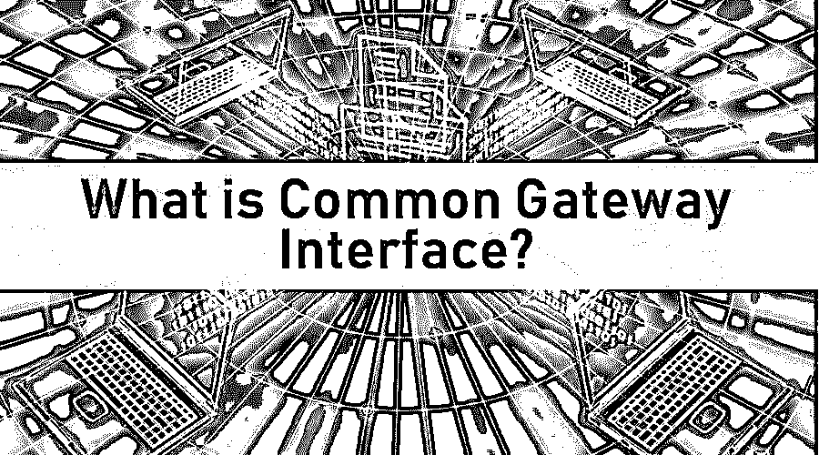
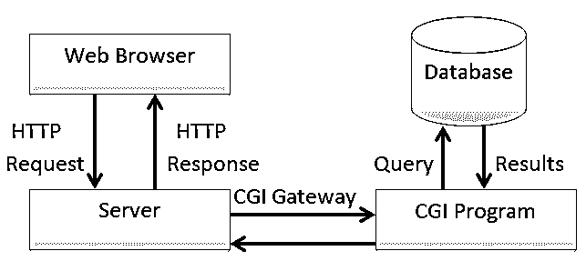

# 什么是通用网关接口？

> 原文：<https://www.educba.com/what-is-common-gateway-interface/>

## 通用网关接口介绍

通用网关接口(CGI)是使用一组规则将用户请求传播到 web 资源(如 web 服务器或 web 应用程序)并通过 web 接口响应用户的标准过程。CGI 包括几个用于网络通信的工作脚本和程序。CGI 是超文本传输协议(HTTP)的一部分。CGI 流程的一个例子是 web 浏览器将表单数据发送到后端服务器，CGI 连接到 web 服务器上的应用程序，程序响应 Web 浏览器。

### 公共网关接口

*   这项技术允许网络浏览器通过网络服务器提交表格和连接程序。
*   web 浏览器发送表单和连接到服务器上的程序的最佳方式。
*   举个例子，当你填写表格并提交表格时，点击提交按钮，结果是，这一级的结果是 CGI。

### 了解通用网关接口

<small>网页开发、编程语言、软件测试&其他</small>

*   网络浏览器将信息提交给服务器。服务器将数据传送到应用程序(CGI 程序)。应用程序作出响应，并沿链向上返回，返回到您的 web 浏览器，您的 web 浏览器可能是某种结果，并且可能在后端发生一些事情，如数据库或发送电子邮件或类似的事情。
*   CGI 用于简单的交互式应用程序。
*   谷歌地图或 Gmail 等更复杂的应用程序使用另一种称为 [Ajax](https://www.educba.com/ajax-interview-questions/) 的技术，这种技术有时实际上在后端使用 CGI 与服务器上的应用程序进行通信。
*   CGI 应用程序可以用任何编程语言编写。最常见的是像 Perl、PHP 和 Python 这样的语言，这些语言往往是简单的语言。出于这个原因，CGI 应用程序通常被称为 CGI 脚本，因为它们往往是脚本语言，它们通常被称为 CGI 脚本。
*   它们可以用任何编程语言编写，如 ASP 或 Java，甚至可以使用 C++，但需要注意的是，CGI 应用程序运行在服务器上。
*   在其服务器上运行应用程序的要求以及安全限制等都必须根据服务器的规则来遵循，而不是基于本地计算机或应用程序的规则；这是因为 CGI 应用程序运行在服务器中，而不是在网络浏览器中。

### 工作

*   它是一个公共网关接口(CGI ),允许我们使用任何类型的编码语言编写服务器端开发。 [C++](https://www.educba.com/c-plus-plus-string-functions/) 也不例外。还有，出于保护因素，PHP 主要是通过 CGI 而不是模块(mod_php)来应用的。
*   CGI 要求执行数据文件，如果它们可能被编译或不重要。编译后的 C++可执行数据文件使用 STDIN 读取请求，并通过 STDOUT 进行回复。任务不会就此结束。它作为几个以手机为中心的软件程序的 API 后端。
*   接近巨大领导者的网络方法似乎也很困难，尽管它实际上是一个适当的有组织的基本架构。计算机程序可能很复杂，但是这个系统很容易理解。
*   Web 服务器在通过 CGI 将请求重定向到执行者方面起着重要的作用。众多加速器让 CGI 优先选择 WSGI，让 FSCGI 优先选择 Python，但它们都专注于一个共同的过程。

### 优势

*   常见的网关接口程序是独立于语言的。
*   通用网关接口程序可以用任何编程语言编写。
*   这很简单
*   它是安全的，因为 CGI 应用程序运行在服务器上。
*   它是轻量级和快速的，因为你不需要任何特定的库来制作一个 CGI 程序。

### 所需技能

基本上，通用网关接口程序是独立于语言的，但是你可以用任何语言编写它们，并让它们在许多环境中运行。一些足以创建 CGI 脚本的编程语言是 Perl、PHP、 [UNIX Shell](https://www.educba.com/what-is-unix-shell/) 、C 语言、Visual Basic、C#、Python 和 Java。

### 谁是学习通用网关接口技术的合适受众？

**1。PHP 开发人员:** [PHP](https://www.educba.com/what-is-php/) 是一种服务器端脚本语言，主要用于 [Web 开发](https://www.educba.com/career-in-web-development/)。PHP 解释器通常准备像 web 服务器中的模块一样应用的 PHP 代码，以及作为通用网关接口(CGI)可执行文件。web 服务器应用程序将来自解释和执行的 PHP 程序的那些结果组合在一起，这些结果可以是任何类型的数据，比如使用 made web 页面时的图像。PHP 代码也可以通过命令行界面(CLI)来执行，并且它们被用于应用独立的可视化软件程序。

**2。Android 开发者:Android 是最著名的移动应用操作系统。由谷歌开发，而且是开源的。**

**3。Python 开发者:** CGI 脚本对于使用 Python 脚本的 Python 开发者来说非常有用。

**4。IOT 开发者:**智能手机、智能手表、机器等物联网都是使用 c 和 c++语言的嵌入式系统，使用 CGI 程序与硬件和软件进行交互。

### 这项技术将如何帮助你的职业发展？

有许多职业领域使用通用网关接口(CGI ),如下所示。

**1。Web 开发人员:**当然，Web 开发是一个极好的职业决策。但是，你不会在一两个月内变得有学问。除了不同的领域，事业的起步需要更多的耐心。Web 开发并不容易；这需要定期进行更多的练习。即便如此，它提供了从自由职业者、工作场所、家里或者任何地方赚钱的灵活性。然而，你必须在所有的网络时尚中更加灵活。对于全球的 web 开发者来说，有几种可能性。

如今，网络开发者对软件公司的要求非常高；除此之外，一些不同的公司需要互联网营销，响应网站/应用程序；他们通常会寻找一个优秀的 web 开发人员来解决他们所有的业务难题。

**2。Python 脚本:**今天，Python 是世界上最重要和最著名的语言之一，并且它还在继续引起人们的兴趣。

使用 FastCGI，然后是 WSGI(在此之前，只能使用 Python 脚本，而常规的通用网关接口通常不够快)。因此，FastCGI 不是为每个请求制定一个新的方法，而是使用长期的过程来处理大量的请求。这提高了执行速度，减少了开发时间。

### 结论

CGI 相当古老，主要由几种编程语言更新，包括 PHP 等等。基本上，它可以是一个相对基础的工具，用来处理 [Linux 管理](https://www.educba.com/careers-in-linux-administration/)职责，比如使用 web 浏览器对您的 Linux 服务器进行远程定制监控。当建立持续的 web 应用程序，而这些应用程序并不真正集中于普通的 CGI 时，你必须防止模仿 CGI 模型。在反向代理后面运行的自包含 HTTP 服务器可以以更可靠和一致的方式为您提供所有必要的信息。尽管 FastCGI 是一个优秀且有益的协议，但它也受到了所有弱点的影响，因为它的目标是与遗留 CGI 脚本相适应。

### 推荐文章

这是什么是公共网关接口的指南？.在这里，我们讨论了通用网关接口的工作、所需技能、职业发展和优势。您也可以浏览我们推荐的其他文章，了解更多信息——

1.  [PHP 框架](https://www.educba.com/php-frameworks/)
2.  [什么是 PHP 数组？](https://www.educba.com/what-is-php-array/)
3.  [什么是网关？](https://www.educba.com/what-is-gateway/)
4.  [物联网职业](https://www.educba.com/iot-careers/)

