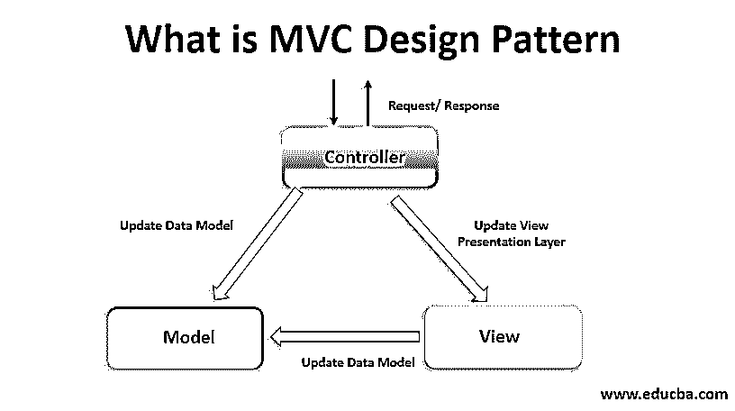
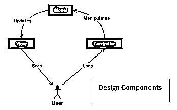

# 什么是 MVC 设计模式？

> 原文：<https://www.educba.com/what-is-mvc-design-pattern/>

## 什么是 MVC 设计模式？

MVC 设计模式也被称为模型-视图-控制器。它是一种常见的架构模式，用于设计和创建应用程序的接口和结构。

这种模式将应用程序分成三个相互依赖和连接的部分。这些设计用于区分数据的呈现方式，从用户接受数据到显示数据的方式。这些设计模式在 web 应用程序和 GUI 开发中已经变得很常见。

<small>网页开发、编程语言、软件测试&其他</small>

### 理解 MVC 设计模式

理解这些设计模式既容易又简单。该理论代表模型-视图-控制器模式。这三个部分的功能是

#### 1.模型

设计模式的这一部分是主要部分，纯粹包含应用程序信息。它不包含如何向用户显示数据的任何信息。它独立于用户界面。它控制应用程序的逻辑和规则。

#### 2.视角

这部分帮助用户查看模型的数据。这一部分主要关注的是访问模型的数据。视图部分使用图表、表格或图示来表示信息。它还可以显示类似的数据，并针对不同的目的使用条形图和表格。它是应用程序包含的信息的可视化。

#### 3.控制器

大部分工作由控制器完成。它为输入提供支持，并将输入转换为应用程序的命令。它用于模型和视图零件之间。模型和视图是互连的，所以执行反映在视图部分。

### MVC 设计模式是如何让工作变得如此简单的？

今天，大多数应用程序都遵循这种模式。它有助于代码的重用和并行开发。这使得工作更加容易和简单。通过 MVC 设计模式创建的组件在本质上是相互独立的。这一特性有助于开发人员在其他多个应用程序中轻松快速地重用组件和代码。

由于视图监视数据，并控制数据呈现给用户的方式，因此开发人员可以针对不同的应用程序使用具有不同数据的类似视图。这为开发人员节省了大量的时间和精力。

### 顶级 MVC 设计模式公司

一些使用 MVC 设计模式的顶级公司是

*   微软公司(全球知名的 PC 软件主要厂商)
*   去吧爸爸，
*   （里面或周围有树的）小山谷
*   可视化工作室
*   狂野切线

### 你能用 MVC 设计模式做什么？

web 应用程序通常使用它们来设计界面。一些流行的编码语言如 C#、Python、PHP 和 Java 都是基于 MVC 理论的。设计模式有助于管理代码。MVC 组件的分离[有助于开发更容易学习的可重用代码。Java Swing、苹果的 Cocoa、MFC 库等 UI 工具包都用到了 MVC 的理论。](https://www.educba.com/mvc-interview-questions/)

### 使用 MVC 设计模式

MVC 经常在 web 应用程序中使用。这些应用程序中的视图是应用程序创建的 [HTML 或 XHTML 文件](https://www.educba.com/html-vs-xhtml/)。

控制器以获取输入的形式接收输入，然后管理和处理模型的输入。该模型包含关于执行特定任务的过程的数据和规则。

在不同的用户界面实现中，模型代码的副本(不是较高层的)被移除。MVC 模式为任何问题提供了解决方案的核心，并有助于使这些解决方案适应每台机器。

### 优势

使用 MVC 设计模式的一些主要优点是

*   模型可以有多种视图
*   职责划分有助于开发人员未来的开发和升级。
*   MVC 理论在模型、视图和控制器之间具有低耦合性。
*   多个开发人员可以同时处理模型、视图和控制器。
*   所需模型的视图被分组在一起。

### 所需技能

它是 web 应用程序中使用的一种架构模式。事先了解编程和网络应用程序将是一个优势。编码和脚本以及 Python、Java 或 C#等基础知识语言的实践将对学习者和开发者有所帮助。MVC 不是一个完整的应用，它通常需要一个服务层、数据访问层或逻辑层。

### 为什么要使用 MVC 设计模式？

它最重要的用途是将视图从模型和控制器中分离出来。它有助于分离显示和数据，并允许在不影响其他数据的情况下修改每个数据。它主要用于开发图形用户界面。

MVC 已经广泛应用于主要程序的 web 应用程序中。一些框架如 JavaScript MVC、Ember JS 和 Backbone 在客户端部分支持 MVC 的过程。

### 范围

这个范围是光明的，要求很高。几乎所有基于网站的顶级公司和行业都使用 MVC 设计模式来开发用户界面和模型。

### 谁是学习 MVC 设计模式技术的合适受众？

这用于编程平台，学习这些设计的合适受众是开发人员和程序员。学习者应该热衷于学习设计模式，并相应地将它们应用到他们的项目中。

### 这项技术将如何帮助你的职业发展？

它为它的开发者准备了很多东西。通过使用 MVC 理论，用户可以学到很多技巧和方法。有许多与这些设计模式相关的技能，学习这项技术不仅有助于学习者提高技能，还有助于他们未来的规划。从长远来看，这些技能将帮助学习者，并为他们的职业生涯提供有影响力的成长。

### 结论

理解它是一项重要的技术。这种技术允许创建可重用的、独立的、易于升级的模型。开发应用程序所需的时间变得更少，开发人员创建了一个高效的应用程序。MVC 理论是计算机编程的一个基本概念，它有助于提供一些 web 开发服务和项目。

最后，对于开发人员来说，掌握 MVC 模型的技术和方法并学习如何将它们应用到自己的项目中是很重要的。

### 推荐文章

这是 MVC 设计模式的指南。这里我们讨论了 MVC 设计模式的基本概念、范围、职业和优势。您也可以浏览我们推荐的其他文章，了解更多信息——

1.  [MVC 视图数据](https://www.educba.com/mvc-viewdata/)
2.  [MVC 中的 TempData](https://www.educba.com/tempdata-in-mvc/)
3.  [MVC 中的实体框架](https://www.educba.com/entity-framework-in-mvc/)
4.  [MVC 下拉列表](https://www.educba.com/mvc-dropdownlist/)

