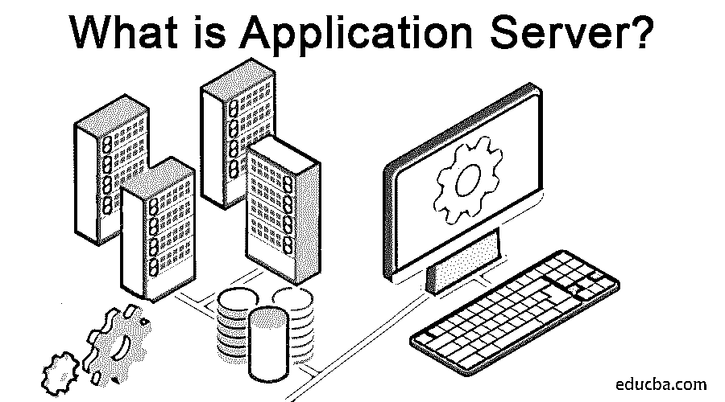
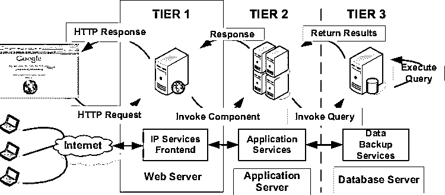

# 什么是应用服务器？

> 原文：<https://www.educba.com/what-is-application-server/>

## 应用服务器简介

应用服务器是一种设计用于安装、操作和托管应用程序的服务器。在应用服务器的早期，互联网上应用程序的数量有了巨大的增长。随着向应用程序添加越来越多的功能的需求，这些应用程序变得越来越大，运行和维护也变得越来越复杂。在网络上需要某种程序，同时它能以一种有效的、有组织的方式共享应用程序的能力。

### 什么是应用服务器？

应用服务器是驻留在服务器端的程序，它是服务器程序员，为任何应用程序提供业务逻辑。该服务器可以是网络或分布式网络的一部分。

<small>网页开发、编程语言、软件测试&其他</small>

现在，如果我们想知道服务器程序的用途，它是这样的:

理想情况下，服务器程序用于向驻留在同一台机器上或位于网络上的客户端程序提供服务。

### 工作

它们基本上用于具有三层架构的基于网络的应用程序。应用服务器所处的位置描述如下:

*   第 1 层–这是位于客户端的 GUI 界面，通常是瘦客户端(例如浏览器)
*   第 2 层——这被称为中间层，由应用服务器组成。
*   第 3 层–这是第 3 层层，即后端服务器。例如数据库服务器。

**资料来源:**[https://images . app . goo . GL/icjbvqjyhmpvbb 9](https://www.researchgate.net/figure/A-Typical-3-Tier-Server-Architecture-Tier-1-Web-Server-Tier-2-Application-Server-Tier_fig1_221147997)

正如我们所见，它们通常与 web 服务器通信，为来自客户端的任何请求提供服务。

客户端首先向 web 服务器发出请求。然后，web 服务器将其发送到中间层，即应用服务器，应用服务器进一步从第 3 层层(如数据库服务器)获取信息，并将其发送回 web 服务器。web 服务器进一步将所需的信息发送回客户端。不同的方法被用来通过 web 服务器处理请求，其中一些方法如 JSP (Java 服务器页面)、CGI、ASP(动态服务器页面)、Java 脚本、Java servlets 等。

### 应用服务器的使用

它通过[连接到数据库](https://www.educba.com/careers-in-database-administration/)并将信息返回给 web 服务器来帮助客户端处理任何请求。

应用服务器的主要用途如下:

*   一种减少客户程序大小和复杂性的机制。
*   需要缓存和控制数据流以获得更好的性能。
*   一种实现数据和最终用户流量安全的机制。

尽管它们可能有不同的目的，但并不是所有的应用服务器都用于相同的功能集。例如，有人可能需要它来实现可伸缩性；其他人可能需要它来更好地管理 web 应用程序等。

### 优势

*   提供处理所有组件和运行服务的机制，如会话管理、同步和异步客户端通知。
*   在一个地方安装应用程序变得非常容易。
*   对任何配置的更改，比如移动数据库服务器，都可以从一个位置集中完成。
*   通过它们可以轻松部署补丁和安全更新。
*   它能够根据可用性将请求分发到不同的服务器。这是通过负载平衡实现的。
*   它为应用程序提供安全性。
*   它通过恢复/故障转移恢复能力实现容错。
*   如果我们需要在每台机器上单独安装一份配置，这会节省大量时间。
*   它支持事务支持。
*   说到性能，应用服务器极大地提高了应用程序的性能，因为它是基于客户机-服务器模型的。

### 例子

现在有大量的应用服务器在使用。下面是一些例子:

*   JBoss
*   中间件
*   万维网环球服务系统
*   玻璃鱼
*   Tcat 服务器
*   Apache Geronimo
*   JRun
*   甲骨文 OC4J 公司
*   Sun GlassFish 企业服务器
*   SAP Netweaver 组件
*   Sybase 企业应用服务器

### 应用服务器的类型

应用服务器可以分为三类:

*   **活动应用服务器**–该服务器用于为服务器端涉及的业务逻辑提供支持和丰富的环境，业务逻辑以规则、组件和对象的形式表示。这些类型的服务器也称为状态服务器。
*   **网络信息服务器**–这种类型的服务器用于通过使用 HTML 模板从数据库[生成页面。这些类型的服务器也称为无状态服务器。](https://www.educba.com/what-is-html/)
*   **组件服务器**–该软件在提供对 COBRA、DLL 和 Java Bean 等软件组件的数据库访问方面起着主要作用。它还为事务处理请求提供支持。

### 选择正确的

为了为您的应用程序选择正确的解决方案，您可以从识别特定环境的需求并确定其优先级开始。

一些因素可能是:

*   表演
*   管理
*   发展
*   支持
*   服从
*   可量测性
*   可靠性
*   费用

完成上述任务后，您就可以开始寻找最能满足您需求的应用服务器了。例如，如果您有一个庞大的客户群，那么应用程序性能应该是重中之重。如果你的公司很小，成本可能也是一个因素。如果您的应用程序每天都在增长，可伸缩性和管理也是需要考虑的主要因素之一。

### 结论

作为这篇文章的一部分，我们已经了解了应用服务器的概述，它们的工作和使用，拥有和选择正确的应用服务器的优势。在本文结束时，读者应该能够选择更适合他们环境的应用服务器。

### 推荐文章

这是一个什么是应用服务器的指南。这里我们讨论应用服务器的优点、应用和类型。您也可以浏览我们推荐的其他文章，了解更多信息——

1.  [什么是网络安全？](https://www.educba.com/what-is-network-security/)
2.  [什么是 Perl 编程语言？](https://www.educba.com/what-is-perl/)
3.  [什么是预测分析？](https://www.educba.com/what-is-predictive-analytics/)
4.  什么是 Ansible？

