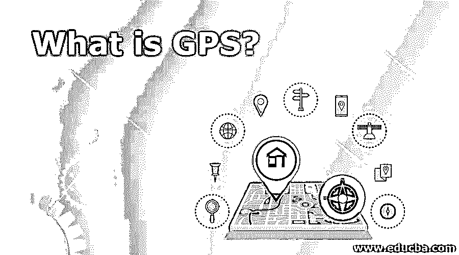

# 什么是 GPS？

> 原文：<https://www.educba.com/what-is-gps/>

## 什么是 GPS？

GPS，即全球定位系统，具有导航和定位系统。由于 GPS 的强大功能，现代交通系统已经简化，跟踪任何地方的位置不再是一件麻烦的事情。它在监控、导航、测量等各种应用中有着广泛的用途。全球定位系统是完全基于卫星的导航系统。它由近 30 颗卫星组成，在两万公里的高度绕地球运行。最初由美国开始用于军事导航目的，任何人都可以在启用 GPS 模块的情况下接收无线电信号。

### GPS 是如何让工作变得如此简单的？

GPS 简化了实时定位和时间同步。因此，它已经成为任何基于手机的应用不可或缺的一部分。

<small>网页开发、编程语言、软件测试&其他</small>

以下是它使我们的工作变得简单的一些其他方式:

*   孩子们的安全是每个父母都关心的问题。通常，被单独留下的孩子可能会迷路，这对父母来说是一场噩梦。它可以在这种情况下提供帮助，因为它可以帮助父母通过一个支持 GPS 的可穿戴跟踪设备来跟踪他们的孩子。
*   老年人经常患有各种疾病，如阿尔茨海默氏症，让他们独自漫游可能是一个严重的问题。然而，有了它的帮助，人们可以跟踪老年人并确保他们的安全。
*   在公路旅行、徒步旅行等过程中，总有迷路的危险。它确保你在迷路的时候总能找到回来的路。
*   SOS 的出现确保了道路安全，因为只需点击一个按钮，你就可以分享你的位置，救援行动将立即展开。
*   它还允许你收集你所有的旅行，并制作这些旅行的视觉书签。
*   如果你有宠物，你可以在它的脖子上系一个 GPS 项圈，以确保宠物不会迷路。
*   在紧急情况下，如果你拨打 911，你总是会根据你的位置找到帮助，这是通过 GPS 跟踪的。
*   如果有一个紧急约会，你需要早点到达，你可以用它来找到到达目的地的最佳和最短的路线。
*   如今，在附近寻找餐馆只是小菜一碟，因为它能让你找到最好的餐馆。
*   当你旅行时，有时你可能会丢失行李。然而，它可以让你跟踪一切，避免丢失任何重要的东西。
*   在拥挤的地方，像音乐会，活动，你可能会失去彼此的踪迹。有了这个，在这种情况下你可以随时追踪你的朋友和家人。
*   如今独自旅行是一种艺术。然而，如果全球定位系统使用不当，人们可能会在某些地方迷路。

所有这些特征都存在于目前市场上容易买到的 GPS 使能设备中。

### 工作

GPS 卫星每天在精确的轨道上环绕地球两次。每颗卫星都发送独特的信号和特定的轨道参数，这使得 GPS 设备能够连接到计算机并解码卫星的准确位置。GPS 接收器使用该信息和三边测量来计算用户的精确位置。这背后的工作拓扑[是这样的，GPS 接收器测量到每颗卫星的距离到接收发射信号所用的时间。然后，接收器可以确定用户的位置，并以电子方式显示出来，用于测量各种东西，如回家的路线、高尔夫球场地图等。](https://www.educba.com/what-is-network-topology/)

为了计算一个人的纬度和经度的位置并跟踪其运动，需要将 GPS 接收机锁定在至少三颗卫星的信号上。接收器可以追踪你的三维位置，包括海拔高度以及经度和纬度。当视野中有四颗或更多的卫星时，这就完成了。一般来说，一个完全依赖于当天时间和地球位置的 GPS 接收器可以跟踪八个或更多的卫星。然而，很少有设备具有实现所有这些的编程功能。

GPS 单元可以根据你的位置计算诸如速度、轨迹、方位、旅行距离、到目的地的距离、日出和日落的时间等信息。

### GPS 的优点和缺点

下面给出了提到的优点和缺点:

#### 优势:

*   GPS 简化了导航系统，因为您总是会被告知到达目的地的正确转弯和路径。
*   与其他导航设备不同，天气不会对 GPS 的功能造成任何阻碍，因为它在任何气候下都可以正常工作。
*   其他导航系统相对于 GPS 来说极其昂贵，每个人都买得起。
*   百分之百的覆盖率是全球定位系统的突出特点之一。
*   如果你搬到一个新地方，它能让你找到附近的餐馆、加油站等等。
*   它可以与手机等其他技术相结合，这是一个有用的功能。
*   GPS 的功能经常被美国更新，因此它通常是非常先进的。
*   万一你在水中找不到出路，它可以让你在水中导航。

#### 缺点:

*   在某些情况下，它可能会停止工作，因此，将地图作为备份选项将会派上用场。
*   在某些情况下，它的电池可能会没电，因此需要外部电源，这总是不可能的。
*   如果有障碍物，如树木、建筑物或风暴等气候灾害，GPS 信号将会不准确。

### 使用

它有无限的潜力，而它的局限性只是根深蒂固地存在于人类的想象中。它是多用途的，它的使用几乎遍及每个部门。从帮助农民到驾驶飞机，它已经帮助了不同的行业。为了跟踪需要帮助的人，军队和紧急救援人员在他们的应用中使用 GPS。全球定位系统应用分为五类:定位、导航、跟踪、绘图和定时。

以下是它的一些应用:

*   航空:接收器为飞行员提供飞机的实时位置信息。还根据飞机运行的位置提供不同的目的地地图。
*   **Marine:** 为了在水域中导航，船长们需要一个具有精确导航属性的应用程序，这将使他们能够跟踪他们前进道路上的任何障碍。
*   **农业:**拖拉机配有 GPS 接收器，可以跟踪种植和收获季节。这让他们不会错过农忙季节，并提前做好准备。
*   **军事:**该系统在战时充当各国的防御机制。最初由美国国防部开发，现在每个国家都在军事行动中使用。
*   **电信:**为了确保其运营的完美服务，运营商提供支持 GPS 的移动设备。
*   **社交活动:**在各种体育活动中，如骑自行车、徒步旅行、滑翔伞、地理藏宝，都会用到 GPS 技术。
*   旅行:如果你独自旅行迷路了，GPS 追踪器会帮你找到回来的路。

### 例子

全球定位系统的工作原理是基于从卫星数据流中收集的数据，然后根据你的位置发送给你。如前所述，它用于农业、耕作、军事、教育、科学等。

这些驱动器通过 GPS 接收器辅助导航。它也用于海事法的目的。此外，航空公司和本地管制员一起使用 GPS 参考。

### 为什么要用 GPS？

由于并行多信道设计，GPS 接收机的精度近来有所提高。一旦打开，接收器就会锁定卫星。在十米范围内，Garman GPS 接收器非常精确，提高了水的精确度。Garman GPS 接收机中的广域自动化系统可以将其精度再提高 3 米。WAAS 卫星非常灵活，使用它们不需要额外的设备。差分 GPS 的精确度更高。有两种由 GPS 卫星发射的低功率无线电信号。这些信号可以穿过塑料、玻璃，但无法穿透建筑物、山脉等物体。然而，这可以通过更加灵敏的现代接收器来实现。

这种信号传输的三种信息是:

*   id 码被称为伪随机码，用于识别信息传输卫星。设备的卫星页面会告诉您发送信号的卫星。
*   星历数据确定卫星的位置和健康状况。它还给出当前时间和日期的信息。
*   历书数据给出了卫星全天的位置信息。

### 信号误差

虽然 GPS 接收机通常完美无缺，功能极其多样，但某些因素可能会妨碍其信号和精度。

*   信号变慢的地方可能会有对流层延迟。GPS 局部信号的内置模型解决了这一误差。
*   高楼可能会阻挡信号的路径，信号到达接收器可能需要比平时更长的时间。
*   也可能有时间误差，因为内置时钟的精度低于原子钟。
*   随着接收器对卫星的可见度的提高，信号的准确度也随之提高。当信号被阻断时，可能存在位置误差。
*   卫星的安装对其有效性起着重要作用。相对宽的信号使其比紧密的分组更有效。

### 我们为什么需要 GPS？

它现在被纳入每个部门，以提高业务的有效性。任何人都可以很容易地找到自己在地球上的任何地方，即使他们在技术上并不高效。在自然灾害的情况下，救援队可以跟踪受害者或幸存者的位置，并确保救援行动及时完成。你可以无所畏惧地环游世界，而不用担心迷路的可能性，因为它可以让你随时跟踪你的位置。士兵可以在敌对情况下或战争期间导航到一个更好的地方，甚至营救有需要的人。除了这些，在娱乐圈还有各种各样的原因让它变得重要。

任何快递服务，如爱马仕和皇家邮政，都使用它来跟踪他们的服务。爱马仕允许顾客随时跟踪他们的产品。这确保了高水平的业务运作，因为客户总是被告知他们的产品。从中央办公室到门口，每个人都知道包裹的下落。物流是另一个需要 it 的部门，因为需要跟踪车辆和司机。例如，在提供食物或衣服的情况下，任何延迟都可能导致接收者损失几美元，因此，跟踪物品确保了操作的透明度。其他行业，如建筑、道路运输等。，需要它来避免资金损失和无缝业务运营。

### 谁是学习该技术的合适受众？

它被用于各个领域，因此每个人都有必要掌握它，并学会在适当的时候有效地使用它。

### 这项技术对你的职业发展有什么帮助？

如前所述，如果你在那些将产品跟踪作为企业主要需求的行业工作，那么你需要掌握它以保证企业的正常运转，并通过帮助企业发展使你的职业生涯更上一层楼。

### 结论

它有着巨大的潜力，而且随着它的频繁变化，更多的高级特性正在向你走来。你有必要掌握它并聪明地使用它。

### 推荐文章

这是什么是 GPS 的指南？在这里，我们讨论了工作，用途，优点和缺点，以及例子和职业发展。您也可以阅读以下文章，了解更多信息——

1.  [什么是自举？](https://www.educba.com/what-is-bootstrap/)
2.  什么是蜂巢？
3.  [什么是网络安全？](https://www.educba.com/what-is-network-security/)
4.  什么是 Ansible？

