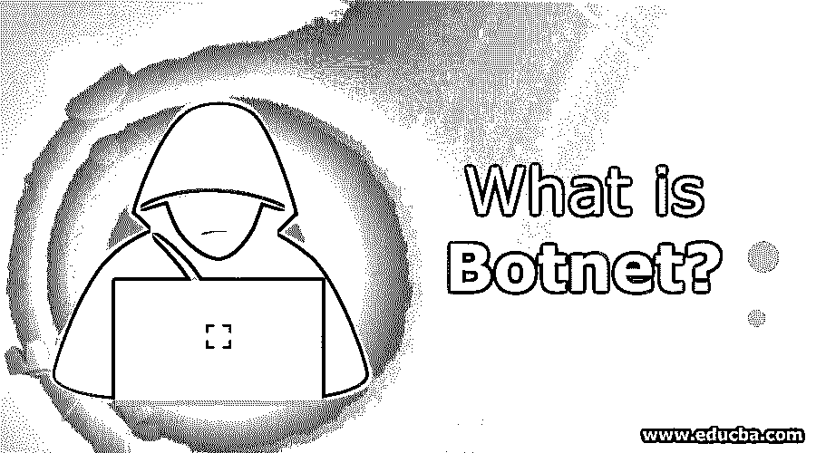

# 什么是僵尸网络？

> 原文：<https://www.educba.com/what-is-botnet/>

## 僵尸网络简介

僵尸网络是一种恶意软件，黑客利用它对与互联网连接的系统进行拒绝服务 DOS 攻击。僵尸网络使用机器人和网络组成一组易受攻击的服务，试图突破安全层来访问应用程序数据。它使用多种方式，如带有垃圾邮件链接的虚假电子邮件、虚假互联网流量和弹出广告。有一些预防措施需要采取，以保护僵尸网络，如更新操作系统，避免打开不明来源的电子邮件附件，使用防火墙，并安装适当的杀毒软件。

### 僵尸网络会如何影响我们？

让我们看看僵尸网络会如何影响我们:

<small>网页开发、编程语言、软件测试&其他</small>

*   僵尸网络使用我们的机器来协助分布式拒绝服务(DDoS)攻击，以关闭网站。
*   他们向数百万用户发送垃圾邮件。
*   僵尸网络被用来在第三方网站上产生虚假的互联网流量以获取金钱利益。
*   僵尸网络取代了我们网络浏览器中的广告，使它们专门针对我们。
*   他们部署弹出式广告，旨在让我们下载一个虚假的反间谍软件包，并通过它付费删除僵尸网络。

现在很明显僵尸网络可以被恶意使用，保护我们的个人信息和设备的问题出现了。实现这一目标的第一步是了解这些机器人是如何工作的，然后我们就可以采取预防措施来对付它们。

### 僵尸网络是如何工作的？

为了更好地了解僵尸网络是如何工作的，让我们考虑一下“僵尸网络”这个词，它是“机器人”和“网络”两个词的组合。这就是僵尸网络，一个执行恶意任务的机器人网络。

为了创建一个僵尸网络，演讲会需要尽可能多的“僵尸程序”(被入侵的设备)在他们的控制之下。将许多僵尸网络连接在一起将创建一个更大的僵尸网络，这有助于产生更大的影响。想象一下下面的场景。你让你的十个朋友在同一天的同一时间给警察局打电话。除了电话铃声和员工从一部电话跳到另一部电话的喧闹声之外，什么也不会发生。现在想象你的 100 个朋友做同样的事情。如此大量的电话和请求的瞬时流量会使警察局的电话系统超负荷运转，很可能会完全关闭。

网络罪犯利用僵尸网络在互联网上制造类似的骚动。他们指示被入侵的机器人给网站增加负担，使其停止运行，并拒绝访问该网站。这种攻击称为拒绝服务(DDoS)攻击。

### 僵尸网络感染

这种病毒通常不会只感染一台电脑。相反，它们是为危及数百万设备而设计的。这通常是通过给系统[注入特洛伊木马病毒](https://www.educba.com/what-is-trojan-horse-virus/)来实现的。这种策略要求用户通过打开伪造的电子邮件附件、点击随机弹出广告和/或从风险网站下载不安全的软件来感染自己的设备。感染设备后，僵尸网络可以自由访问和修改个人信息，并感染其他设备。

复杂的僵尸网络可以自己找到并感染设备。这些独立的机器人执行搜索和感染任务，不断在网络上搜索缺乏防病毒软件或系统更新的易受攻击的设备。僵尸网络很难检测。它们不会中断正常的计算机功能，从而避免警告用户。一些僵尸网络的设计甚至可以防止网络安全软件的检测。此外，僵尸网络的设计继续增长，使得新版本更加难以检测。

### 结构

僵尸网络的结构通常被设计成给予僵尸主宰者尽可能多的控制。

*   **客户端-服务器模式:**在这种模式中，一个主服务器控制来自每个客户端的信息传输。
*   **点对点模式:**在这种模式中，每个机器人充当客户端和服务器，而不是依赖于中央服务器。这些机器人有一个其他机器人的列表，以帮助它们在自己内部传输信息。

### 预防

既然我们已经了解了僵尸网络是如何工作的，我们可以看看防止僵尸网络入侵的预防措施。

*   更新操作系统:这是阻止僵尸网络或任何其他[恶意软件](https://www.educba.com/what-is-malware/)的首要技巧。软件开发人员在早期检测到威胁，并发布带有安全补丁的更新。因此，我们应该将我们的操作系统设置为自动更新并运行最新版本。
*   **避免打开来自未知来源的电子邮件附件:**除了避免打开来自未知来源的附件，我们还应该检查来自已知来源的电子邮件，因为机器人使用联系人列表来发送受感染的电子邮件。
*   **使用防火墙:**上网时使用防火墙。这对于 Mac 电脑来说很容易，因为它们预装了防火墙软件。对于基于 Windows 的系统，请安装第三方软件。
*   **避免从文件共享网络下载:**如果没有其他选择，请确保在打开或运行下载的文件之前扫描它。
*   **不要点击未知链接:**在点击任何链接之前，将光标悬停在该链接上，以查看该 URL 指向的位置。恶意链接经常出现在 YouTube 评论、弹窗广告等。
*   **安装防病毒软件:**尝试为所有设备设计防病毒保护，而不仅仅是电脑。随着技术的发展，僵尸网络的潜力也在增加。在 2016 年总统大选中，脸书的虚假广告争议和 Twitter bot 惨败让许多政客非常担忧。麻省理工学院的研究表明，自动账户和社交媒体机器人在传播假新闻方面发挥了重要作用。除此之外，僵尸网络是危险的，因为它们窃取个人信息。网络罪犯倾向于寻找唾手可得的果实。现在采取预防措施可以保护您的设备、数据和身份。

### 推荐文章

这是一个什么是僵尸网络的指南？在这里，我们讨论了僵尸网络的工作，以及详细的解释，预防和结构。您也可以浏览我们推荐的其他文章，了解更多信息——

1.  [可执行的命令](https://www.educba.com/ansible-commands/)
2.  [PowerShell 是什么？](https://www.educba.com/what-is-powershell/)
3.  [Python 是什么？](https://www.educba.com/what-is-python/)
4.  [什么是 Apache Web 服务器？](https://www.educba.com/what-is-apache/)

