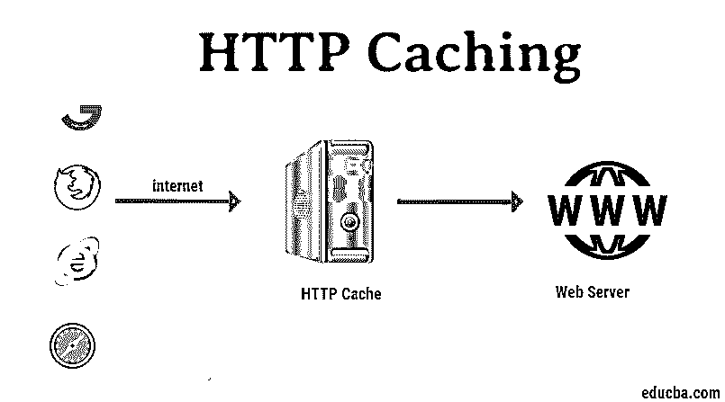

# HTTP 缓存

> 原文：<https://www.educba.com/http-caching/>

## HTTP 缓存简介

我相信你已经注意到，当你第一次打开一个网站时，加载需要一些时间。然而，当你一段时间后再次打开它时，网站的加载速度要快得多。想象一下，如果一个网站每次都花相同的时间来加载，浏览起来会有多慢。这都要归功于一个叫做 HTTP 缓存的绝妙想法。

### 什么是 HTTP 缓存？

HTTP 缓存是指将一些常用或频繁使用的数据存储在某个可以快速访问的地方。有了这个，最需要的数据就很有可能被更快地访问，因为计算机不需要太远就能得到它。在网页浏览的情况下，当你的网页浏览器，如 Chrome，在本地存储上存储一个网站或网页应用程序的副本时，就要考虑缓存。一旦网站被缓存，网络浏览器就不必重新下载所有的服务器数据，这将使浏览速度大大加快。

<small>网页开发、编程语言、软件测试&其他</small>

例如，一旦网站的 CSS 文件被下载，浏览器就不必为会话的每个页面都下载它。对于许多 JavaScript 文件、图像(如网站的徽标和社交媒体图标)，甚至一些动态内容也是如此。通过使用缓存头来启用缓存。

### HTTP 中的缓存头

HTTP 缓存有两个主要的缓存头，第一个叫做“Cache-Control”，第二个叫做“Expire”。

#### 1.缓存控制

您可以将 Cache-Control 视为在用户浏览器中打开缓存的开关。一旦添加了这个头，它就可以为所有支持的 web 浏览器启用缓存。如果这个头不存在，即使浏览器支持缓存，也不会保存网页内容的缓存。缓存控制有两种类型的隐私设置，第一种是公开的，第二种是私有的。

在公众的情况下，资源可以由任何中间代理缓存，例如内容交付网络(CDN)。带有私有响应的 Cache-Control 报头将告诉浏览器，缓存将只为单个用户进行，而不为任何中间代理进行。

缓存控制报头中的值“max-age”设置内容将被缓存的时间。这个时间以秒为单位。

`Cache-Control:public, max-age=31536000`

#### 2.期满

当代码中存在 Cache-Control 时，使用 Expires 头。这是一个简单的 HTTP 缓存头，设置任何缓存资源被视为无效的日期。一旦缓存过期，用户加载网站，web 浏览器将再次请求页面的所有内容。

### 条件请求

上面讨论的标题只是告诉浏览器何时从 web 服务器检索数据。另一方面，条件请求告诉浏览器如何检索它们。条件请求告诉浏览器如何询问服务器缓存中的数据副本是否过期。

在这个过程中，浏览器发送一些关于它缓存到内存中的资源的数据，在读取这些数据后，服务器决定这些数据是否过时。

#### 1.基于时间的请求

在基于时间的请求中，检查请求的资源是否在服务器上被改变。如果浏览器中缓存的副本是最新的，服务器将返回代码 304。

要基于时间设置条件请求，可以在响应头中使用“Last-Modified”。

`Cache-Control:public, max-age=25998579
Last-Modified: Fri, 08 Jul 2018 15:25:00 GMT`

#### 2.基于内容

在基于内容的请求中，会针对服务器副本和缓存副本检查 MD5 哈希(或任何其他可行的选项)。这表明数据是否相同；如果数据不同，MD5 校验和将不匹配，服务器将发送资源的新副本。

这是通过标题中的“ETag”完成的。它的价值是资源的消化。

`Cache-Control:public, max-age=25998579
ETag: "496d7131f15f0fff99ed5aae”`

### 能见度

几乎所有的现代浏览器都包括一些与开发相关的工具，可以让您检查资源、源代码和网页的其他方面。其中，你可以找到一个工具来查看任何应用程序返回的头。

在谷歌 Chrome 上，要看到这些标题，你可以右击网页的空白区域，点击“Inspect”或者按 CTRL+SHIFT+I 打开 DevTools。在此工具中，单击网络选项卡，然后按 CRTL+R 重新加载，以查看页面的所有标题。

### HTTP 缓存中的用例

以下是 HTTP 缓存的一些使用案例:

#### 1.对于静态资产

对于页面的静态资产，比如图像、JS 文件和任何 CSS 文件，您可以选择主动缓存内容。不必加载这些文件将导致令人印象深刻的性能提高。对于这个用例，选择最大年龄值超过一个月甚至一年的缓存控制头。

`Cache-Control:public; max-age=31536000`

#### 2.对于动态内容

对于页面的动态内容，您需要自己考虑浏览器应该缓存哪些文件以及缓存多长时间。如果内容经常变化，您需要确保您选择的缓存持续时间不会给用户带来任何问题。

#### 3.私有内容的缓存

正如我们在 Cache-Control 一节中讨论的，如果页面的内容本质上是私有的，您可以通过在标题中添加“Cache-Control: private”来防止它被 cdn 等中间代理缓存。另一种更安全的方法是根本不缓存任何私有内容。

### 实现 HTTP 缓存

现在你已经知道了什么是 HTTP 缓存以及它是如何工作的，让我们来看看如何在你的网站上实现它。对于不同的服务器类型，HTTP 缓存的实现略有不同。在我们的例子中，让我们看看如何通过？htaccess 文件。

要启用现场缓存，可以在。htaccess 文件，例如:

`FilesMatch "\.(ico|pdf|flv|jpg|jpeg|png|gif|js|css|swf)$"
Header set Cache-Control "max-age=31536000, public"
/FilesMatch`

上述将缓存所有的 pdf，Flv，jpg，和其他提到的格式中提到的“文件匹配”一年。

### 结论

HTTP 缓存是最重要的技巧之一，它可以让访问者更快地浏览您的网站，现在您可以看到它是如何工作的，您可以在您的网站和 web 应用程序上实现它，使它们对您的用户更快，并节省您的服务器带宽。

### 推荐文章

这是 HTTP 缓存的指南。这里我们讨论 HTTP 的实现、条件请求、缓存头和用例。您也可以浏览我们推荐的其他文章，了解更多信息——

1.  [Python HTTP 服务器](https://www.educba.com/python-http-server/)
2.  [HTTP 方法](https://www.educba.com/http-methods/)
3.  [HTTP cookie](https://www.educba.com/http-cookies/)
4.  [烧瓶 HTTPS](https://www.educba.com/flask-https/)

