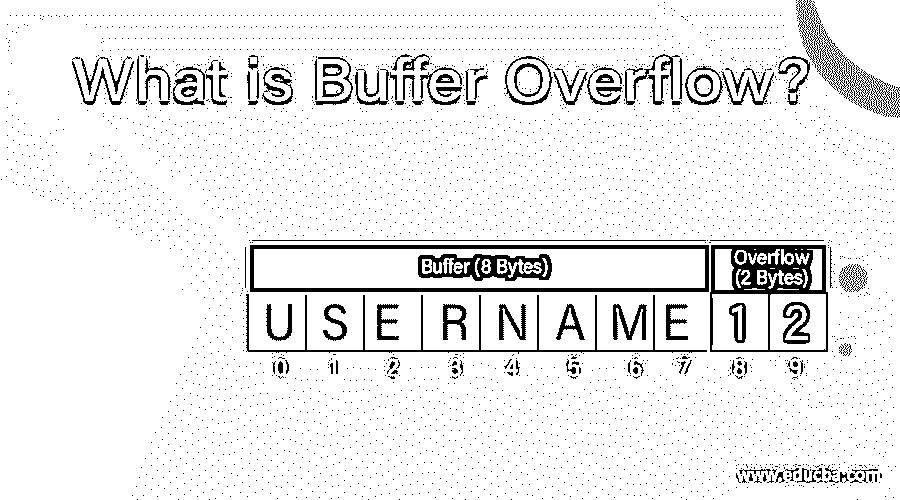
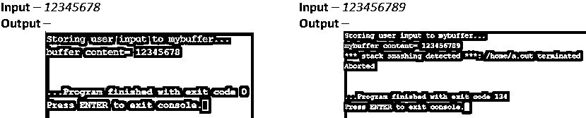

# 什么是缓冲区溢出？

> 原文：<https://www.educba.com/what-is-buffer-overflow/>

## 缓冲区溢出简介

缓冲区溢出也称为缓冲区溢出，是计算机的一种状态，应用程序试图在缓冲区内存中存储比内存大小更多的数据。这导致数据被存储到相邻的存储器中，这有时可能会覆盖现有的数据，从而导致潜在的数据丢失，有时还会导致系统崩溃。这是大多数开发人员在不知不觉中犯的常见编程错误。黑客最常利用这一点来获取未经请求的数据。

### 什么是缓冲存储器？

问得好。缓冲存储器(或称缓冲器)是 RAM 中的一个序列部分，用于在数据从一个地方传输到另一个地方时临时保存数据，这个地方通常是一个输入或输出设备。这样做是为了补偿设备运行速度的差异。

<small>网页开发、编程语言、软件测试&其他</small>

例如，当您要打印一些文档时，您最新的 i7 处理器足够快，可以在纳秒内执行打印命令，而可怜的旧打印机却没有配备这样快的处理器。因此，文档被保存在缓冲存储器中，并以打印机可接受的速度传送到打印机。这将释放你的 CPU 的内存用于其他任务。

### 缓冲区溢出攻击

既然已经发现了计算机的漏洞，黑客们必然会利用它，并试图通过缓冲区溢出攻击来攻击各种系统。现在问题来了，黑客如何执行这样的攻击，会有什么后果？

在缓冲区溢出攻击中，额外的数据包括旨在触发破坏性活动的指令，如破坏文件、更改数据、通过互联网发送私人信息等。攻击者可以简单地利用任何等待特定用户输入的程序，并将多余的数据注入缓冲区。

缓冲区溢出攻击主要分为两种类型:

*   **基于堆栈:**攻击基于堆栈的内存分配时。这更容易被利用，因此更容易受到攻击。
*   **基于堆:**攻击基于堆的内存分配时。这不太容易利用，因此不太常见。

最容易受到缓冲区溢出攻击的语言是 C、C++、Fortran 和 Assembly，因为它们使用基于堆栈的内存分配技术。

### 解药

一旦数据损坏，根本没有办法恢复原始数据。而且，发作的强度很大程度上决定了治愈。如果攻击是轻微的，并且只影响孤立机器的一部分内存，那么简单的系统格式可能是解决方法。然而，如果攻击是广泛的，并且已经损害了几台机器上的数据，格式化整个网络将无济于事，除非注入恶意代码的程序被修复。

### 防胜于治

作为开发人员，检查代码中的缓冲区溢出是我们的责任。如果在代码本身中处理缓冲区溢出，系统的安全性就不会受到缓冲区溢出攻击的影响。

以下是一些有助于防止缓冲区溢出的简单预防措施:

*   必须利用异常处理来检测缓冲区溢出，并在发生缓冲区溢出时阻止代码执行。
*   为缓冲区分配足够大的空间，以便正确处理非预期的大量数据。
*   避免使用没有对缓冲区溢出进行绑定检查的库函数或第三方方法。要避免的这类函数的常见例子有 gets()、scanf()、strcpy()这些主要是在 [C/C++语言](https://www.educba.com/c-vs-c-plus-plus/)中。
*   代码测试应该考虑这样的漏洞，严格测试代码并修复可能导致溢出的错误。
*   现代编程语言、操作系统和代码编译器已经发展到在缓冲区溢出的情况下停止命令执行。这已经成为自动检测缓冲区溢出的最可靠的方法。

### 你自己试试

关于缓冲区溢出和缓冲区攻击，我已经了解了这么多；为什么不试着自己编写一些恶意代码呢？

免责声明–以下程序仅用于说明目的，不应用于造成任何形式的伤害。与恶意代码的任何相似之处都只是巧合。此外，现在的操作系统足够智能，可以进行缓冲区攻击预防检查。

下面是可能导致潜在缓冲区溢出的 C 程序。为什么选择 C 语言？这是因为开发更高级的编程语言只是为了处理编译时的缓冲区溢出。虽然现在 C 的编译器也有一定的检查来避免检测缓冲区溢出。因此，您只会看到一条错误消息，指示检测到缓冲区溢出。

**代码:**

`#include <stdio.h>
#include <string.h>
#include <stdlib.h>
int main(int argc, char *argv[])
{
char mybuffer[8];
// copy the user input to mybuffer, without any bound checking
printf("Storing user input to mybuffer...\n");
strcpy(mybuffer, argv[1]);
printf("mybuffer content= %s\n", mybuffer);
return 0;
}`

**输出:**

当 123456789 作为程序的命令行参数时会发生什么？当编译器检测到缓冲区溢出时，程序生成一个抛出的错误。现在的编译器和操作系统有一个额外的保护层。这一层只不过是被称为金丝雀的变量，它们在编译时被初始化为特定的值。然后，这些变量被存储在缓冲区的相邻存储单元中。因此，每当缓冲区溢出时，额外的数据就会流入相邻的内存，破坏金丝雀的值。一旦检测到任何损坏的金丝雀，系统就中止执行。

**c++语言中的另一个例子:**

**代码:**

`#include <iostream>
using namespace std;
int main()
{
char buf[8];
cin>>buf;
return 0;
}`

**输入:** 123456789

**输出:**

### 结论–什么是缓冲区溢出？

到目前为止，我们确信你已经理解了程序中缓冲处理的重要性。包括在编写和测试代码时检查缓冲区边界的实践。这将帮助您编写安全的代码。

### 推荐文章

这是一个什么是缓冲区溢出的指南？这里我们讨论了缓冲区溢出的定义、预防、内存、攻击。您也可以浏览我们推荐的其他文章，了解更多信息——

1.  [JavaScript 是什么？](https://www.educba.com/what-is-javascript/)
2.  什么是 Django？
3.  [什么是 SQL Developer？](https://www.educba.com/what-is-sql-developer/)
4.  [什么是 Azure？](https://www.educba.com/what-is-azure/)

