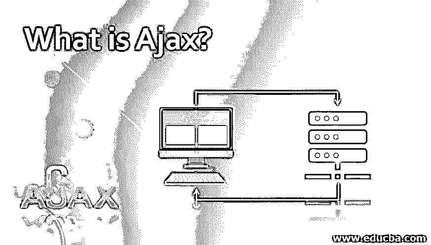
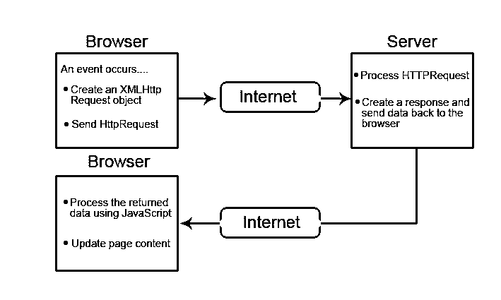

# 什么是 Ajax？

> 原文：<https://www.educba.com/what-is-ajax/>

## 什么是 Ajax？

异步 JavaScript 和 XML 可以定义为构建网站和 web 应用程序中的一组用户。识别 web 开发应用程序中的特定用途是理解 Ajax 的最佳方式。Ajax 的主要工作是异步更新内容，也就是说在用户的网页中不需要重新加载全部内容，只需要重新加载所需的字段。XML 是一种标记语言，这意味着它们是注释部分 web 文档的编码语言，为 web 浏览器提供关于理解和显示用户内容的指令。

它结合了各种编程工具，如 JavaScript、HTML、DHTML、XML(可扩展标记语言)、CSS(级联样式表)、DOM(文档对象模型)和 Microsoft object

<small>网页开发、编程语言、软件测试&其他</small>

Ajax 是由 Microsoft outlook web applications 在 1999 年开发的，但 Ajax 的完整使用是在 6 年后才出现的。杰西·詹姆斯·加勒特在 2005 年 2 月命名为 Ajax。在 Ajax 命名之前，XML HttpRequest 脚本对象作为 MSXML 库运行。

Ajax 的首字母缩写是 Asynchronous JavaScript and XML。它可以定义为用户使用 JavaScript 与 web 服务器通信以获得查询生成的响应并在 web 服务器上提供该响应而无需离开当前页面的路径。

让我们了解 Ajax 的每一个细节，它的用途，它是如何工作的，优点和缺点如下。

### 谅解

要了解 Ajax 的 JavaScript 和 XML 基础知识， [HTML 是必修](https://www.educba.com/html-attributes/)。现在让我们看看 Ajax 操作中需要的主题是什么。

*   理解同步和异步，了解经典的 web 应用程序模型
*   了解 Ajax 如何操作数据库

它主要与其他应用程序一起使用，因为它不能是独立的软件。

### 它是如何工作的？

通过使用 JavaScript、XML、CSS 和 HTML，它为更快更有效的 web 应用程序创造了更多的交互技术。对于各种 web 应用程序，Ajax 使用了各种这样的技术。

*   在 Ajax 中，当用户需要创建内容时，使用 XHTML，而 CSS 用于呈现用户请求的目的；文档对象模型(DOM)和 javascript 都将用于动态显示内容。
*   通过在 web 应用程序中使用同步方法，可以有效地传输和接收信息，例如，当您填写表单并提交它时。您将被自动定向到带有该页面信息的新服务器。
*   在后台点击提交按钮后，javascript 发送一个请求，并生成响应，它将更新到当前屏幕。在这个过程中，用户不会意识到后台的 XML 代码请求。
*   XML 被用作生成和接收任何格式的服务器数据的格式。
*   虽然大多数 web 浏览器依赖于 web 服务器技术，但它独立于 web 服务器软件。

### 用在哪里？

下面提到的是使用 Ajax 的地方。

**登录表单:**例如:用户可以在原始页面表单中键入他们的登录凭证；他们的软件会向服务器发送登录请求，页面会根据需要进行更新。

**自动完成:**在自动填充设置的帮助下，当你在谷歌搜索栏中运行查询时，建议会显示在下面的下拉列表中

评级和投票:投票可以决定网站的主要内容在网页中，如 Digg 和 Reddit，通过书签标记。

**更新用户内容:**当用户发布一条推文时，它将被添加到他们的 feed 中，所有内容都会更新。

现在它被 tweeter 用来运行他们的趋势话题页面

*   表单提交和验证
*   它使 web 应用程序更快，响应的数量也减少了。
*   现在用灯箱代替弹出式广告
*   在 flash 应用程序中使用 Ajax

### 为什么要用 Ajax？

Ajax 是 web 开发人员的长期梦想，因为用户可以做以下事情:

1.无需重新加载页面，就可以更新用户请求

2.页面加载后，它从服务器生成数据。

3.页面加载后，从服务器接收数据。

4.在后台，向服务器发送数据

### Ajax 应用程序示例

下面列出了经常使用 Ajax 的 web 应用程序

*   谷歌建议，当用户在谷歌搜索栏中输入搜索查询时，将提供自动完成选项。谷歌给出的建议可以使用操作键导航。
*   雅虎地图操作更简单，用户体验更有趣。这个地图使用 Ajax 通过鼠标拖动整个地图，而不需要使用按钮，这对用户来说很方便。
*   谷歌地图是使用 Ajax 的通用应用程序。这是一个实时应用程序，用户可以在其中操作数据和更改视图设置。Ajax 直接在网络浏览器上工作，不需要安装任何插件。首先，只有微软的 ie 浏览器使用 Ajax，但是由于它的可靠性，更多的网络应用程序像 chrome，Mozilla 等等。利用这个。

Ajax 应用程序使用一个中间引擎作为浏览器和服务器之间的桥梁。Ajax 不是一种编程语言。

### Ajax 的优点和缺点

每个软件都有它的优点和缺点，如果处理得当，会产生好的结果。

#### 优势

*   减少服务器流量并提高速度
*   它响应迅速，花费的时间也更少
*   表单验证
*   可以减少带宽的使用
*   可以进行异步调用；这减少了数据到达的时间。

#### 不足之处

*   开源
*   Active x 请求仅在 internet explorer 和新创建的 web 浏览器中创建。
*   出于安全原因，您只能从提供网页的 web 主机访问信息。使用 Ajax 不可能从其他服务器获取信息。

### 结论

尽管 Ajax 为开发人员和用户提供了与 web 页面进行通信的新方法和新技术，但要记住的最重要的一点是，这是关于产品或数据，以及如何与产品或数据进行交互，减少生成的请求的持续时间和数量，而不是关于技术。我们希望这篇文章将有助于轻松地学习和使用它。

### 推荐文章

这是一个什么是 Ajax 的指南。这里我们讨论了 Ajax 的例子、工作、用途、优点和缺点。您也可以浏览我们推荐的其他文章，了解更多信息——

1.  [JSON vs AJAX](https://www.educba.com/json-vs-ajax/)
2.  [什么是吉拉软件？](https://www.educba.com/what-is-jira-software/)
3.  [硒是什么？](https://www.educba.com/what-is-selenium/)
4.  [ASP.NET 的阿贾克斯](https://www.educba.com/ajax-in-asp-dot-net/)

