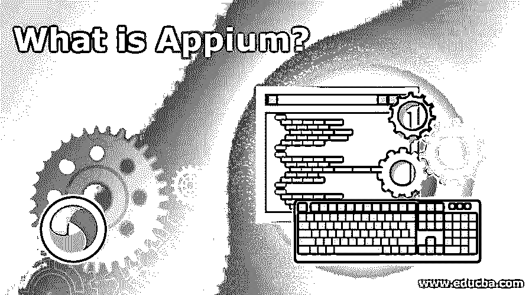

# 什么是 Appium？

> 原文：<https://www.educba.com/what-is-appium/>

## Appium 简介

大家好！我们都生活在第 21 代，每件事都在使用手机。一个令人欣慰的事实是，手机已经成为我们生活中最重要的一部分。随着移动的使用越来越多，对移动应用的需求也越来越高。由于移动应用程序很方便，Android 和 IOS 中几乎有 200 万个应用程序。

将当前的软件测试转换成移动版本出现在在移动软件中创建应用程序的画面中，并且测试这些应用程序的需求已经出现。这是一个测试手机 app 的重复性工作；因此，如果有一个自动化测试系统来测试这些[移动应用](https://www.educba.com/mobile-applications/)就更好了。因此阿皮乌姆开始描绘。市场上有许多自动化工具，但 appium 是使用最广泛的工具。

<small>网页开发、编程语言、软件测试&其他</small>

让我们不要拖延，一步一步地学习 appium automation 工具。

### 什么是 Apppium？

它可以被定义为 2012 年推出的所有移动应用自动化的开源工具。在 appium automation 的帮助下，这种自动化可以轻松完成

*   当地的
*   混合物
*   网

这可以在以下操作系统上运行

*   苹果手机操作（iOS：iPhone OS 的缩写）
*   机器人
*   火狐操作系统

它也是跨平台的。这意味着我们可以使用相同的应用程序编程接口在任何平台上编写测试。这意味着我们可以在 IOS 中编写测试代码，同样的测试也可以用于 windows phones，android app。这反过来会产生大量可重用的代码，从而节省时间。

appium 的另一个漂亮的特性是，重新编译不涉及应用程序的自动化。这意味着无法访问自动化代码；这个可以用。

### 谅解

让我们深入了解一下 appium。appium 最重要的方面是客户端/服务器特性。理解 appium 可以通过 appium 架构轻松理解。

**服务器**:在使用 selenium RC 的时候，我们一般会发现 appium 的工作原理与 selenium RC 中的 selenium 服务器类似；它提供移动设备和客户端之间的通信。它是在 Node.js 中脚本化的，所以不需要重新安装。

**客户端:**app ium 中的客户端是指 java、ruby、python、PHP、Javascript 之类的客户端库可用。除了标准的 [selenium 命令](https://www.educba.com/selenium-commands/)之外，它们还支持特定于移动设备的命令。

一旦 Appium 服务器对客户机启动，REST API 就公开了。客户端使用 JSON“所需功能”对象启动会话。在客户端和服务器之间建立连接。

### Appium 是如何工作的？

在使用它之前，我们需要遵循必要的步骤来使它正常工作。

安装 JDK，Android SDK Studio

接下来，必须安装 Eclipse，并安装 TestNg

必须安装 Selenium 服务器 JAR、Appium 库客户端和 Appium 桌面。

一个 HTTP 服务器被称为 Appium，用户可以在平台 node.js 上编写该服务器，使 iOS 和 Android 操作系统能够利用 JSON wire 协议工作。

一旦安装了 Appium，我们的机器就必须安装一个发布 REST API 的服务器。

然后，客户端将接收连接和命令请求；Appium 开始在 Android 或 iOS 等各种移动操作系统上执行该命令。

响应是 HTTP 响应；为了执行 HTTP 响应，它利用了移动测试自动化框架来产生用户界面输出。

### 为什么选择 Appium？

市场上有大量的移动自动化工具，Appium 有自己独特的功能，可以驱动 Android/iOS 系统，为用户提供友好的灵活性。它可以在本地和混合移动应用程序中工作。它可以用任何语言编写，可以用于自动化目的，无需修改任何东西。Appium 代码可以在各种设备上运行，这是移动自动化的最佳选择。

### 利弊

下面以详细的格式给出了利弊

#### 赞成的意见

*   它是免费和开源的
*   这些为本地和混合应用提供了跨平台的解决方案
*   它与 JSON 网络驱动和网格兼容
*   基于云的测试支持使用 testdroid
*   appium 支持 C#、Java、PHP、Python、Ruby 等编程语言
*   使用 appium 可以实现应用程序自动化
*   它支持评估跨平台移动应用，无需重新编译代码。
*   它同时支持模拟器、仿真器和真实设备
*   测试人员可以使用检查器进行回放和记录工具
*   支持 JSON 有线协议
*   独立于移动设备的装置可以用于任何移动设备
*   有一个活跃的谷歌群
*   出色支持 android 以上版本

#### 骗局

*   通过使用模拟器，它加快了 ios 应用测试的速度。这种行为使得测试人员更容易理解和控制底层 ios 设备的内部行为，但是它不允许一次在多个模拟器中运行多个脚本。
*   不允许对 4.2 android 版本以下的应用进行测试
*   对混合应用测试的支持是有限的
*   手势支持尚未实现，就像双击访问 java 库一样。
*   没有教程形式的详细文档
*   图像识别很差；我们必须通过使用图像处理技术来做到这一点
*   在 Microsoft Windows 中，不支持 appium inspector

### 结论

它是一个语言无关的支持 web 驱动程序的应用程序接口，允许跨平台测试。应用高效、准确、快速、无 bug，节省了大量的时间和成本。记住所有这些，学习 appium 将是值得的。

### 推荐文章

这是一个什么是 Appium 的指南。在这里，我们讨论了 Appium 的概念、工作原理以及利弊。您也可以浏览我们推荐的其他文章，了解更多信息——

1.  [Linux 中的 Docker 是什么？](https://www.educba.com/what-is-docker-in-linux/)
2.  [什么是 PowerShell](https://www.educba.com/what-is-powershell/)
3.  [Python 是什么](https://www.educba.com/what-is-python/)
4.  [什么是阿帕奇](https://www.educba.com/what-is-apache/)

