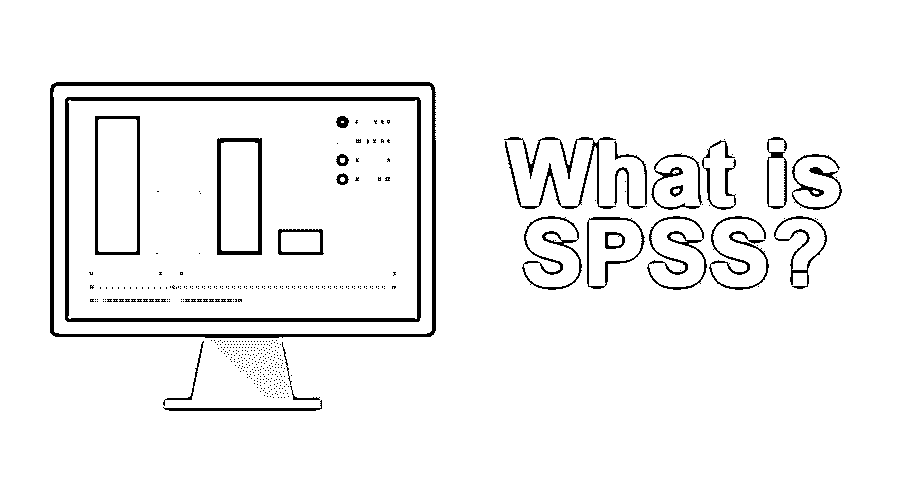
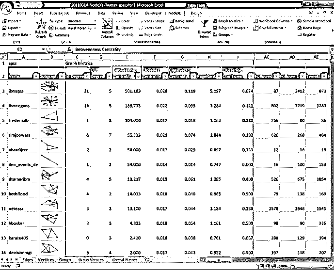

# SPSS 是什么？

> 原文：<https://www.educba.com/what-is-spss/>

## SPSS 是什么？

SPSS 代表“社会科学统计软件包”。它是一个 IBM 工具。这个工具于 1968 年首次推出。这是一个软件包。这个软件包主要用于数据的统计分析。

SPSS 主要用于以下领域，如医疗保健、市场营销和教育研究、市场研究人员、健康研究人员、调查公司、教育研究人员、政府、营销组织、数据挖掘人员和许多其他人员。

<small>网页开发、编程语言、软件测试&其他</small>

它为描述性统计、数字结果预测和识别组提供数据分析。该软件还提供数据转换、绘图和直接营销功能，以顺利管理数据。

### 为什么用 SPSS？

它们归入 IBM SPSS 统计中，大多数用户只称之为 SPSS。

它是直接的，它的类似英语的命令语言帮助用户通过流程。

SPSS 介绍了以下四个程序，帮助研究人员处理复杂的数据分析需求。

**统计程序**

SPSS 的统计程序给出了大量的基本统计功能；有些包括频率、交叉列表、双变量统计等。

**建模程序**

研究人员能够在高级统计程序的帮助下建立和验证预测模型。

**调查程序的文本分析**

它提供了强大的反馈分析。进而获得实际计划的远景。

**可视化设计器**

研究人员发现这种视觉设计数据可以创建各种各样的视觉效果，如密度图和径向盒图。

### SPSS 的特点

*   通过 Survey Gizmo 收集的任何调查数据都可以很容易地导出到 SPSS 中进行详细的分析。
*   在 SPSS 中，数据存储在。SAV 格式。这些数据大多来自调查。这使得操纵、分析和提取数据的过程非常简单。
*   SPSS 可以很容易地访问带有[不同变量类型](https://www.educba.com/python-variable-types/)的数据。这些可变数据很容易理解。SPSS 帮助研究人员很容易地建立模型，因为大部分过程是自动化的。
*   在获得数据后，SPSS 的魔力就开始了。我们可以利用这些数据做很多事情。
*   SPSS 有一种独特的方法从关键数据中获取数据。趋势分析、假设和预测模型是 SPSS 的一些特征。
*   SPSS 便于您学习、使用和应用。
*   它有助于方便地获得数据管理系统和编辑工具。
*   SPSS 为您提供深入的统计能力，用于分析确切的结果。
*   SPSS 帮助我们设计，绘图，报告和演示功能更加清晰。

### SPSS 的统计方法

SPSS 中可以使用许多统计方法，如下所示:

*   对各种数据进行预测，以识别群体，包括聚类分析、因子分析等方法。
*   描述性统计，包括 SPSS 的方法论，有频数，交叉制表，描述性比率统计，这些都是非常有用的。
*   此外，双变量统计，包括方法学，如[方差分析(ANOVA)](https://www.educba.com/anova-in-r/) 、均值、相关性和非参数检验等。
*   数字结果预测[，如线性回归](https://www.educba.com/linear-regression-in-r/)。

它是一种自我描述的工具，自动认为你想打开一个现有的文件，并随之打开一个对话框，询问你想打开哪个文件。如果我们打开一个文件，SPSS 的这种方法使得在 SPSS 中导航界面和窗口变得非常容易。

除了数据的统计分析，SPSS 软件还提供数据管理功能；这允许用户进行选择、创建派生数据、执行文件整形等。另一个特征是数据文档。此功能将元数据字典与数据文件一起存储。

### SPSS 的类型

它有两种类型的视图，即变量视图和数据视图:

#### 可变视图

1.  **Name:** 这是一个列字段，接受唯一 ID。这有助于对数据进行分类。例如，不同的人口统计参数(如姓名、性别、年龄、教育资格)是对数据进行排序的参数。
    唯一的限制是这种类型中不允许的特殊字符。
2.  **标签:**名字本身就暗示了它给了标签。这也提供了添加特殊字符的能力。
3.  **Type:** 这在插入不同种类的数据时非常有用。
4.  **宽度:**我们可以测量字符的长度。
5.  **小数:**在输入百分比值时，该类型帮助我们决定需要定义多少小数点后所需的位数。
6.  **数值:**帮助用户输入数值。
7.  **缺失:**这有助于用户跳过分析过程中不需要的不必要数据。
8.  **对齐:**对齐，顾名思义，有助于左对齐或右对齐。但在这种情况下对于前任来说。左对齐。
9.  **测量:**这有助于测量在序数、基数、名义等工具中输入的数据。

数据必须输入到名为“变量视图”的表中。它允许我们根据分析的需要定制数据类型。

要分析数据，需要填充不同的列标题，如名称、标签、类型、宽度、小数、值、缺失、列、对齐和度量。

这些标题是不同的属性，有助于相应地描述数据的特征。

#### 数据视图

数据视图由行和列构成。通过手动导入文件或添加数据，我们可以使用 SPSS。

### SPSS 安装指南

首先，我们需要在 SPSS 统计系统需求处查看最低系统需求。

然后，该选项选择您的系统上加载的操作系统，并找出先决条件。

打开 SPSS 网站的浏览器；这将导致下载软件应用程序。从 SPSS 免费试用版开始。

**以下是将 Excel 文件导入 SPSS 的步骤。**

第一步是点击文件

= >打开

= >选择数据

= >对话框

= >文件类型

=> .xls 文件。

在选择了将被导入用于执行数据分析的 excel 文件之后，我们需要确保在我们选择的对话框中是“从数据的第一行读取变量名”。

最后，单击确定。您的文件现已导入 SPSS。

### 结论

底线是，尽管 Excel 提供了一种很好的数据组织方式，但 SPSS 更适合于深入的数据分析。这个工具在数据的分析和[可视化方面非常有用。](https://www.educba.com/data-visualization-tools/)

### 推荐文章

这是一个什么是 SPSS 的指南？.这里我们讨论了特性、类型、统计方法和安装指南。您也可以浏览我们推荐的其他文章，了解更多信息——

1.  [数据可视化工具](https://www.educba.com/data-visualization-tools/)
2.  [什么是数据分析师？](https://www.educba.com/what-is-data-analyst/)
3.  [什么是 OLTP？](https://www.educba.com/what-is-oltp/)
4.  [SAS vs RapidMiner](https://www.educba.com/sas-vs-rapidminer/)

