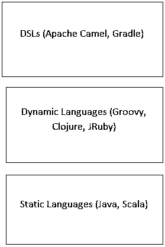

# 什么是 Groovy？

> 原文：<https://www.educba.com/what-is-groovy/>

## Groovy 简介

Groovy 是一种面向对象的编程语言，由 Apache 软件基金会管理。它与 java 环境兼容，并被用作脚本语言。它支持通过 JVM 实现的 XML 和 JSON 数据的函数编程、元编程和高效处理。Groovy 的语法与 Java 语法相似。Groovy 代码可以与现有的 Java 代码集成，以获得更好的可用性。这种语言在 Java 社区中很流行，因为它非常适合静态和动态编程。在大多数用例中，Groovy 被认为是 Java 编程的替代品。Groovy 是轻量级的，对开发者来说是用户友好的。

### 理解 Groovy

*   面向对象的语言。
*   具有静态和动态功能。
*   提供高级编程概念。
*   被认为是另一种 Java 语言。

### 备选 Java 语言的示例

*   **Scala:** 是一种静态类型的、面向对象的函数式语言，
*   Clojure: 这是 Lisp 语言的一种方言，专门为在 JVM 上运行而创建。
*   Kotlin: 这是一种运行在 JVM 上的静态类型语言，可以编译成 JavaScript 或 JVM 字节码。

<small>网页开发、编程语言、软件测试&其他</small>

多语言编程是近年来出现的一个概念，它真正利用了不同框架的替代语言的爆炸。概念很简单。我们可以在盒子的底部考虑更稳定、可预测的语言，或者在我们的情况下，框架。对于 JVM 世界，这可能包括静态语言，如 Java 或 Scala。随着我们逐步深入到实际的应用程序代码中，我们可能会想到更动态、更灵活的语言。对于我们的例子，这可能是 Groovy、Clojure，甚至是 JRuby。在盒子的顶部，我们可能会使用轻量级的 DSL(领域特定语言)来将关键的业务逻辑构建到 JVM 上的应用程序中，包括 Apache Camel DSL 或 Gradle(构建工具),但是我们也可以构建我们自己的特定于业务的 DSL 来真正捕获我们业务领域的规则。

### Groovy 的安装过程

**第一步。**首先安装 SDKMAN 工具。在 [Linux 或者 OS X](https://www.educba.com/os-x-vs-linux/) 上支持哪个。但是，如果您在 Windows 机器上工作。您仍然可以首先安装 Cygwin UNIX 模拟器。可以在 www.Cygwin.com 找到

**第二步。**打开终端，键入下面的命令，然后按回车键

**第三步。**一旦执行脚本完成，我们将获取 SDKMAN 初始化脚本，以确保 SDKMAN 需要操作的所有内容都已在当前会话中初始化。

**第四步。**最后，我们将通过向 SDKMAN 询问其当前版本，键入命令 sdk version 并按回车键来验证 SDKMAN 安装成功。

**第四步。**一旦成功安装了 SDKMAN，就可以继续安装 Groovy 了。您可以使用 SDKMAN install 命令来完成此操作。

它实际上依赖于 JVM，这意味着您还需要确保安装了 Java 并且 Java 可用，以便 Groovy 能够正常工作。

### 为什么用 Groovy？

它的语法与 Java 非常相似；Java 开发人员很容易访问 Groovy。事实上，大多数 Java 语法实际上是合法的 Groovy 语法，因为它只是简单地采用了现有的 Java 概念并在它们的基础上进行构建。这为可能已经熟悉 Java 语言的开发人员提供了一条非常平滑的学习曲线。当一个团队考虑扩展到一种新的语言时，最大的担忧之一是他们将失去他们多年来建立的大量专有代码的投资。

然而，鉴于 Groovy 与 JVM 的紧密集成，您可以很容易地从 Groovy 中使用现有的 Java 库。

最后，Groovy 对象实际上扩展了相同的 java.lang.Object 基本对象，因此它非常适合您的团队可能已经知道的 java 面向对象模块。总的来说，对于 Java 团队来说，Groovy 会感觉非常熟悉，尤其是与 Scala 或 Clojure 等其他替代语言相比。

### 为什么我们需要 Groovy？

Groovy 在应用程序开发层工作得非常好，尤其是 web 开发。基于 Groovy 的框架(如 Grails)是基于 Java 的 web 框架(如 Stripes 或 Spring MVC)的优秀替代品，因为 Groovy 的动态特性使其非常适合处理 web 上的概念。

它非常适合在 Java 或 Groovy 框架上构建 DSL。虽然您也可以用 Java 构建这些 DSL，就像我们在 Apache Camel 中看到的那样，但是 Groovy 的表达性和灵活的语法允许您创建比 Java 语言更具可读性的 DSL。

Groovy 灵活的语法允许您创建可读性很强的测试，并且可以很容易地与业务涉众共享，以确保您的应用程序交付预期的功能。

流行的基于 Groovy 的测试框架 Spock 是 Groovy 语法创建这些高度可读测试的一个很好的例子。

它是轻量级的、类似脚本的语法，与 Java APIs 的紧密集成使它成为在 JVM 环境中编写小脚本的绝佳选择。

### Groovy 的优点和缺点

让我们探讨一下 Groovy 的一些众所周知的优点和缺点。

#### 优势

*   动态类型(使您能够更快地编程，至少主要是这样)。
*   Currying/partial 软件(使您能够复制具有多个参数集的函数)。
*   应用@DelegatesTo 获得有用的 API 的工具支持。
*   本机关联数组/键值映射支持(您可以生成关联数组文字)。
*   字符串插值(在显示值的字符串中更好地构建)。
*   Regex 有一流的住院医生。

#### 不足之处

*   Eclipse 周围的 Groovy 插件(程序结论、语法着色)仍然漏洞百出。
*   Groovy 没有基本代码格式:这可能是目前 Groovy 的一个实际缺点。如果你在一个小组中工作，这可能是一个令人头痛的问题:阅读基于格式的程序，CVS 评估可能很难，举几个例子。
*   你应该学习新思想，更喜欢:闭包——一旦你理解了它们，你就会受益匪浅！没有闭包，您就无法在 Groovy 中应用主要是编写单元测试的内部类。

### 这项技术将如何帮助你发展事业？

Groovy 框架广泛应用于大多数跨国公司，如网飞、三星(通过 Smart Things)、奥马哈互惠银行(Mutual of Omaha)、塔吉特(Target)等等。

谈到利用率，Groovy 有自己好的特别的地方；例如，我们遇到了大量嵌入 Groovy 的项目和产品，它们以一种非常容易理解的方式传达它们的组织协议或简单的业务逻辑，许多主题专家也有能力自己编写协议，而不需要程序员的太多支持。

### 结论

当你用 Java 或其他 OOP 语言编码了很长一段时间后，这看起来像是美好的回忆。

它让事情变得更简单，也不那么冗长。更多的特性更喜欢脚本和简单的领域特定语言特性，将 Groovy 推向新的高度，并为它提供旧语言所缺乏的新外观。

### 推荐文章

这是一本关于什么是 Groovy 的指南？.这里我们讨论了 Groovy 的概念、需求、理解、优缺点和安装过程。你也可以浏览我们推荐的其他文章来了解更多信息-

1.  [什么是 JMS？](https://www.educba.com/what-is-jms/)
2.  [tensor flow 简介](https://www.educba.com/introduction-to-tensorflow/)
3.  [Python 是脚本语言吗？](https://www.educba.com/python-scripting-language/)
4.  什么是 Web 应用程序？

