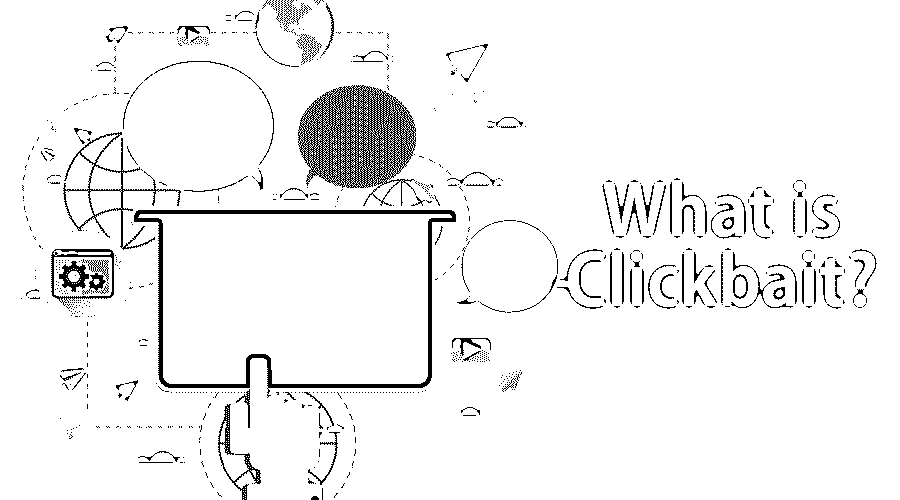

# 什么是 Clickbait？

> 原文：<https://www.educba.com/what-is-clickbait/>

## 什么是 Clickbait？

我知道你碰到 clickbait 这个词后一定会很惊讶，但是知道它的意思你会很惊讶。互联网上的任何内容，如果其主要和唯一的动机是吸引注意力并鼓励访问者点击特定网页的链接，则被称为 Clickbait。它是一种吸引用户阅读、观看和收听链接的在线内容的媒介。这是许多组织利用好奇心缺口的唯一方法，使用点击诱饵标题。它导致价值或内容可疑的内容。这些是吸引眼球的标题，用于网络或移动内容，吸引读者点击通常不感兴趣的内容。许多网站或组织或新闻期刊，以及更多，使用点击诱饵作为一种机制或盈利工具，通过更高的点击率来获得知名度。它是由一个非常吸引人的标题和一个超链接指定的，当点击这个超链接时，描述了一个网站，其内容远不如标题有趣或吸引人。这是增加特定网页、网站或链接门户的浏览量的唯一方法。更简单地说，我将通过一个例子来解释 clickbait，

让我们考虑任何非点击诱饵标题，比如“看看这个名人上个月是如何减掉 10 磅的”。那么，同样的标题，当写成 clickbait 标题时，可以重新设计，写成如下方式:

<small>网页开发、编程语言、软件测试&其他</small>

*   名人减肥秘笈终于揭晓！
*   你绝对不会相信这位名人一个月内瘦了多少！
*   这位名人最新饮食的惊人细节！

你一定已经差不多理解了当用户看到那个链接时，点击诱饵标题所产生的好奇心差距。因此，[网站为用户或访问者放置](https://www.educba.com/drive-organic-traffic-to-your-website/)实际上是一种引诱。它是社交媒体营销和新闻营销最赚钱的媒介。他们只是通过有利可图的标题来吸引用户观看不感兴趣的内容，这也是客户的回报。

### 为什么要用 Clickbait？

在让你理解了 clickbait 到底是什么之后，我还想让你知道为什么使用它，或者为什么它对任何组织如此重要。以下是与此相关的原因:

*   这是不言自明的
*   诱饵和开关太容易操纵游客或用户
*   停滞不前，没有真正实现预期的产出
*   许下空洞的承诺
*   给鱼钩上饵——这是目前使用的最有前途的点击诱饵工具之一。使用这个工具，你可以简单地结合一半的实际想法和一个普通的挑衅来编写 clickbait 标题。例如，你可以考虑:
*   “就做这一件事，你就再也不用去厕所了。 . . "
*   “这些你从未听说过的完全匿名的人现在几乎认不出来了。 . . "
*   “把这些家用清洁剂和苏打水一起喝可能会致命。#8 会让你震惊。 . . "
*   “这家伙在他的埃尔卡米诺后面安装了一个喷气发动机。你永远也猜不到他们从他身上剥下了什么。 . .
*   “这个人在他的洗衣机里装满了小狗和地毯钉。接下来发生的事情很可怕。 . . "
*   真实与虚构之间的重定向
*   不是点击诱饵，但绝对是“点击诱饵”

现在我可以假设你已经理解了 clickbait 的真正含义。不幸的是，如今它被使用得如此之多，以至于不必要地在任何地方使用 clickbait，仅仅通过吸引人的标题来吸引访问者到一篇无趣的文章或链接或网站，这已经成为一种趋势。

我们可以说，点击诱饵标题正在改变在线新闻、出版商、社交媒体或数字营销的面貌。因此，让我们来发现 clickbait 背后的一些心理学原理:

*   情感和悬疑的语言
*   空的或未解决的代词
*   数字的过度使用
*   动作词
*   逆向叙事
*   带有情感负荷的不协调图像

不仅仅是这些出版商使用了 5 种 clickbait 心理学策略来吸引访问者:

1.  幽默地使用 Clickbait 风格的内容
2.  适度使用 Clickbait 功能
3.  确保你的内容多样化
4.  使用点击诱饵策略链接到你网站上的其他相关文章
5.  BuzzFeed 标题窃取技巧

### 利弊

几乎可以说，点击诱饵策略弊大于利，因此我们讨论一下点击诱饵的利弊是非常重要的。下面是 clickbait 的优点或好处:

*   更多浏览量
*   更高的社交分享潜力
*   提高品牌认知度

而 clickbait 的缺点或黑暗面是:

*   误导性点击诱饵会损害品牌并侵蚀信任
*   浏览量甚至不是那么重要——在这一点之下是以下因素:
*   现场的全部注意力
*   每件作品的总关注度
*   哗众取宠已经过时了

[内容营销](https://www.educba.com/content-marketing/)就是产生流量。如果你不能吸引或引诱访问者到你的网站，你在网上成功的机会实际上是不存在的。但是使用 clickbait 对我们来说也是非常危险或有害的，这是因为:

*   网页跳出率增加，降低了你的网站评级
*   这可能是假新闻的邀请，所以人们可能看不到
*   一个新的算法更新可以错误地管理一切。
*   网站或门户网站的更新减少。

### 分析点击诱饵

以下是分析 clickbait 的 7 种方法:

*   标题是列表吗？
*   标题中有提到“你”或“我”或个人故事吗？
*   有提到动物吗？
*   这个话题最近受到了媒体的关注吗，还是一条新闻？
*   有没有流行文化或饮食文化的参考？
*   题目中是否提到了未知或新概念？
*   有震惊或兴奋的成分吗？

所以，最后，我想说，我们必须非常积极地分析点击一篇点击诱饵文章是否会使我们受益，或者它会成为我们现在和未来的一个可降解的方面。我想补充的最后一句话是，我们应该能够区分好的或坏的点击诱饵标题。

### 推荐文章

这是一个关于什么是点击诱饵的指南。这里我们讨论了为什么使用 Clickbait，它的优缺点，以及对它的分析。您也可以浏览我们推荐的其他文章，了解更多信息——

1.  [软件开发人员的职业生涯](https://www.educba.com/career-as-a-software-developers/)
2.  [什么是吉拉软件？](https://www.educba.com/what-is-jira-software/)
3.  [什么是 VMware？](https://www.educba.com/what-is-vmware/)
4.  [什么是 DBMS？](https://www.educba.com/what-is-dbms/)

