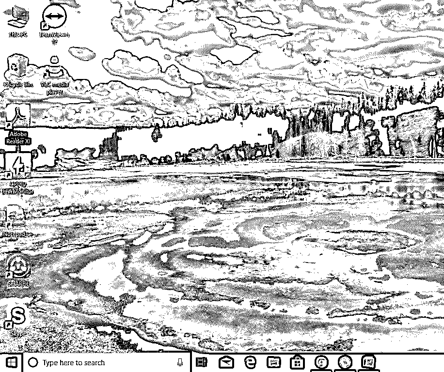
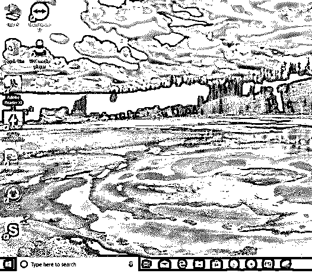
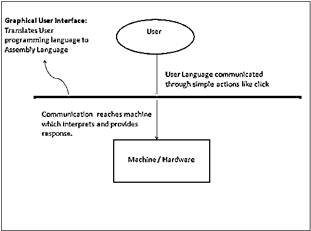

# 什么是 GUI？

> 原文：<https://www.educba.com/what-is-gui/>

## GUI 简介

GUI 是一个图形界面，它是呈现给用户的通信的可视化表示，便于与机器进行交互。GUI 是指图形用户界面。它是通用的用户界面，包括像按钮和图标这样的图形表示，并且可以通过与这些图标交互来执行通信，而不是通常的基于文本或基于命令的通信。

**了解**

<small>网页开发、编程语言、软件测试&其他</small>

*   GUI 的一个常见例子是微软操作系统。
*   考虑使用 MS-DOS 和 Windows 7。
*   现在，最重要的启示是 Windows 7 带来的易用性。
*   毫无疑问，Windows 7 是普通用户的首选，因为他们很难像 MS-DOS 那样通过命令与机器交流。
*   为什么 Windows 7 对于普通用户来说更容易使用？答案是 GUI。
*   是的，GUI 通过图形图标帮助用户理解计算机的功能。点击图标启动动作和用户期望的通信。
*   因此，GUI 通过抽象每个组件/模块的难以理解的技术细节来提供功能，并提供系统的无障碍使用。

### GUI 是如何工作的？

使用指针作为导航，与不同的视觉上吸引人的图形图标进行交互。抽象是 GUI 操作系统中使用的一个主要概念。用户可以使用指针单击图标，这将启动一系列操作。通常情况下，应用程序或功能会启动。然后，用户将必须提供输入或任务，以从机器生成期望的动作。GUI 实际上将用户语言(包括简单的一行命令、单击和双击)翻译成[机器语言或汇编语言](https://www.educba.com/assembly-language-vs-machine-language/)。机器理解机器语言，因此机器响应启动的任务，该任务被翻译成使用语言并通过 GUI 传达给用户。

### 例子

*   GUI 屏幕的一个例子如下。

*   如果你想在上面的屏幕中访问或启动一个应用程序，比如说一个视频播放器，那么我们需要做的就是用鼠标点击 VLC 媒体播放器图标。

*   双击图标打开应用程序。
*   这使得用户只需点击一个按钮就可以打开像 VLC 这样的视频播放器。
*   现在，如果没有 GUI 呢？
*   如果没有 GUI，我们必须打开命令提示符，添加应用程序命令行界面，并提供启动应用程序、运行视频播放器等指令。
*   这是非常不方便的，因为你必须为每一个动作输入命令。
*   但是，切入正题，我们有 GUI。我们想打开 VLC 媒体播放器。我们看到了图标。一旦我们双击它，应用程序打开。我们可以选择我们想要的文件，然后单击打开。视频开始播放。
*   对于不是计算机专家的普通人来说，这就是图形用户界面如何使使用计算机的生活变得更简单。
*   这就是图形用户界面帮助计算机走向大众，并使使用计算机变得如此有趣的唯一原因。

### 优点和缺点

以下是图形用户界面的优点和缺点:

#### 优势

*   简单。
*   它在视觉上很吸引人，让每个人都参与到机器的工作中来。
*   即使一个没有计算机知识的人也能使用计算机并完成基本功能。GUI 对此负责。
*   搜索变得非常容易，因为 GUI 提供了文件的可视化表示，并提供了有关它的详细信息。
*   来自计算机的每一个响应都通过图形用户界面进行可视化交流。
*   没有计算机知识的用户可以真正开始学习该机器，因为 GUI 为用户提供了探索的范围并提供了可发现性。
*   例如，如果一个用户开始使用一台没有界面的计算机，那么他/她必须向机器提供命令来执行每一项任务。在某种程度上，用户必须具备某种编程知识。

#### 不足之处

*   一个人只能做已经被其他开发者预先编程好的事情。
*   您不能更改系统的基本功能。
*   系统运转需要更多的能量。
*   与简单的基于命令的界面相比，它很慢。
*   它会占用更多的内存空间。
*   GUI 对消费者来说可能很简单，但对程序员来说就不那么简单了，他们必须设计和实现每一个功能，并应用抽象来感受其优势。
*   如果用户需要的功能不存在，那么用户必须知道继续这个流程所必需的命令，否则他们就只能停留在这个点上。

### 用户如何与图形用户界面交互？

1.用户通过点击等简单的功能与 GUI 交互，这将触发 GUI 理解用户的需求，并迅速将其翻译成汇编语言，如下图所示。

2.除了翻译成机器语言之外，GUI 还有助于显示正在进行的实际过程、机器的响应、正在使用的内存量、文件大小、处理器速度、计算机使用的功率、正在执行的任务以及许多其他功能。

3.用户使用单击来选择特定的过程。

4.用户可以双击来启动应用程序。

5.用户可以右键单击以了解应用程序的属性和其他详细信息。

6.用户可以使用指针来获取信息和继续多任务所需的操作。

### 为什么要用 GUI？

关于如何使用图形用户界面有一些标准。

*   可见性和抽象必须是统一的，至少对于由一家公司开发的 GUI 是如此。
*   每一个 GUI 都有自己的特性和功能，但是系统的图形元素和术语以及它的架构必须得到很好的维护。
*   一个好的图形用户界面给用户提供了很多自由，比如回溯到上一步。撤消功能必须为用户提供。
*   还有很多。

如上所述，对于程序员来说，设计和开发 GUI 有很多标准和 GUI 描述。

*   他们投入开发 GUI 的全部精力帮助用户只需点击几下鼠标就能完成播放视频这样的任务。
*   简单是我们绝对应该使用它的原因。

### 为什么我们需要图形用户界面？

1.人们实际上可以开始使用图形用户界面来使用计算机。

2.但是，人们实际上可以开始学习和解开计算机中存在的几种选项。

3.此外，一个人也可以开始了解计算机及其语言，并对其产生浓厚的兴趣，以至于他自己可以学习甚至创造一种编程语言，使计算机及其产品在未来工作起来更加简单。

### 这项技术将如何帮助你的职业发展？

*   无论你做什么工作，图形用户界面肯定会对你的职业生涯有所帮助。
*   任何工作需要计算机的人都需要一个图形用户界面。
*   对于开发人员来说，在其职业生涯的每个阶段，开发 GUI 总是一个光明的前景。
*   人们可以学习 Python、Ruby、Java、Dot Net 等编程语言来开发不同类型的应用程序。

### 结论

在 GUI 开始之前，有 CLI(命令行界面)。在那个时候，没有人认为正常人可以使用电脑。但是，现在每个人都拥有一台电脑，并对如何使用它有了基本的了解。这就是图形用户界面所实现的。它没有向用户要求更多。相反，它为用户实际开始使用计算机提供了更多。信息技术蓬勃发展，一些设计和开发 GUI 的工作机会出现了。未来的语言已经适应了自己，并被用来开发图形用户界面。它将永远在就业市场中占有一席之地，并将继续改进和更新自己，使其成为更有用、更简单的用户界面，并像过去一样改变世界。

### 推荐文章

这是一个什么是 GUI 的指南？这里我们讨论了它是如何工作的。需求和优势使用和职业与图形用户界面的例子。您也可以浏览我们推荐的其他文章，了解更多信息——

1.  [什么是 MongoDB？](https://www.educba.com/what-is-mongodb/)
2.  [什么是开源？](https://www.educba.com/what-is-open-source/)
3.  [HTML 简介](https://www.educba.com/introduction-to-html/)
4.  [什么是 Teradata？](https://www.educba.com/what-is-teradata/)

