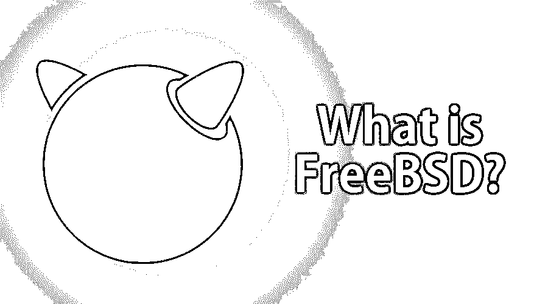

# 什么是 FreeBSD？

> 原文：<https://www.educba.com/what-is-freebsd/>

## FreeBSD 概述

今天我们将讨论 FreeBSD 这个术语。那么什么是 FreeBSD 呢？基本上，让我们从一个很基础的来理解。如果我们试着深入，试着把“FreeBSD”这个术语拆分，就拆分成两个术语:免费，另一个是 BSD。让我们先理解每个术语，然后尝试将它与术语“FreeBSD”联系起来。

这里的自由一词基本上指的是自由和开放源码，也就是指可以自由使用和修改的东西。此外，后一个术语是伯克利软件分发的缩写。因此，合并意味着 FreeBSD 是免费使用的开源软件。它是从基于研究 Unix 的 Berkeley 软件发行版继承而来的。FreeBSD 非常类似于类 Unix 操作系统。

<small>网页开发、编程语言、软件测试&其他</small>

### 了解 FreeBSD

FreeBSD 最初发布于 1993 年。然而，2005 年是 FreeBSD，BSD 类别中最流行或最著名的开源操作系统之一。FreeBSD 捕获了超过 75%安装了 BSD 系统的系统。

FreeBSD 与 Linux 有非常相似的地方。然而，FreeBSD 在许可和范围方面有两个主要的不同。

让我们来看看 FreeBSD 与典型的 [Linux 操作系统](https://www.educba.com/introduction-to-linux/)有什么不同。我们先从范围上来理解。FreeBSD 通常维护一个完整的系统。这里，完整的系统意味着项目交付了内核、设备驱动程序和文档，而 Linux 只交付了驱动程序和内核。Linux 一般依赖第三方强制系统软件。

如果我们讨论许可，那么 FreeBSD 在许可的 BSD 许可下被监控，而 Linux 在 copyleft GPL 下被监控。

如果你深入了解，那么值得知道的是所有 FreeBSD 项目都包含一个安全目的，即监控所有基础发行版下的软件。此外，值得一提的是，在这种情况下，可以通过编译源代码或使用 FreeBSD 端口或使用软件包管理系统来安装大量额外的第三方应用程序。

现在，转到我们的下一个主题，即 FreeBSD 的使用，任何开发或发布的实用程序或软件都有其主要用途。让我们深入研究一下，看看它的一些主要用途。

### FreeBSD 有什么用？

FreeBSD 的第一个也是最大的优势是它可以作为通用操作系统使用。到目前为止，我们知道它可以作为一个操作系统，因此可以用于各种原因。让我们一个一个来看。

**1。作为一个服务器**——FreeBSD 通常包含大量与基础系统和端口集合中的服务器相关的软件。许多重要软件的可用性使我们能够轻松地配置 FreeBSD，并将其用作 web 服务器、防火墙、 [FTP 服务器](https://www.educba.com/what-is-ftp-server/)、 [DNS 服务器](https://www.educba.com/what-are-the-types-of-dns-servers/)、邮件服务器或路由器。

**2。作为嵌入式系统**—[可以作为嵌入式系统](https://www.educba.com/what-is-embedded-systems/)使用，因为它可以很容易地扩展以支持 PowerPC、MIPS 和 ARM

**3。在网络方面**–FreeBSD 的 TCP/IP 协议栈极大地促进了这些协议的广泛应用。它支持广泛的网络，如 [IPSec](https://www.educba.com/ipsec/) 、SCTP、IPv6，而无线网络则优于其他网络。甚至 FreeBSD 也支持传统协议，如 IPX 和 AppleTalk。另外，到目前为止，FreeBSD 支持 CARP，它代表通用地址冗余协议。公共地址冗余协议是从 OpenBSD 导入的。CARP 帮助我们允许多个节点共享一组公共的 IP 地址。这样做的基本优点是，如果一个节点崩溃，那么其他节点会继续服务于请求。

FreeBSD 的下一个优势是它与存储相关的重要功能。它通常发布能够保护 UFS 文件系统一致性的软更新。在这里，UFS 代表 Unix 文件系统。UFS 文件系统的这种维护在系统崩溃的情况下帮助了我们；文件系统快照允许在其他有用的过程中立即创建文件；这些快照允许我们对实时文件系统进行可靠的备份。名为 GEOM 的模块化框架目前提供 0 级、1 级和 3 级 RAID、缓存、串联、全磁盘加密和对网络支持存储的访问。GEOM 还允许用这些机制构建复杂的存储解决方案链。

下一个大优势是便携性。让我们看一看。

**4。可移植性**——通常，FreeBSD 项目将完整的架构分成不同的层。这些层描述了所提供的不同级别的支持。第 1 层体系结构得到了充分的支持，也是最成熟的，而第 2 层体系结构有了很大的发展。如果我们讨论第三层架构，它们是实验性的，现在还没有经过开发；此外，第 4 层体系结构也不支持。

有了 FreeBSD 的这种用法，让我们在下一节知道我们可以用它做什么。

### 你能用 FreeBSD 做什么？

以下是我们通常使用 FreeBSD 的事物列表。让我们看一看。

*   对于 NAT 防火墙和包过滤
*   将其用作家庭媒体服务器
*   Web 内容过滤代理
*   作为 NAS–4x1TB，带 ZFS
*   因为家庭用于存储不同扩展名的文件
*   对于动态 DNS 服务
*   从 Apache web 服务器开始
*   关系型数据库
*   它可以帮助教育工作者创建高效地在线学习社团。
*   作为 DNS

### 优点和缺点

现在让我们来看看它的优点和缺点。

**优点**–以下是 FreeBSD 的优点。

*   FreeBSD 是一个非常干净和可预测的操作系统。
*   它可以作为传统 UNIX 平台的一个很好的替代品
*   它是一个单片内核，主要关注的是安全性
*   它是稳定的
*   良好的文档
*   许可证

缺点现在，让我们来看看它的一些缺点。

*   截至目前的硬件兼容性问题
*   此外，开发者支持也较少
*   理解起来有点复杂
*   这需要大量的练习

### 为什么要用 FreeBSD？

当然，选择 FreeBSD 有几个原因。正如其优点部分所提到的，使用 FreeBSD 有几点是不言自明的。它是高度可定制的，你可以按照你的要求定制它。

### 这项技术将如何帮助你的职业发展？

这是即将到来的技术之一，它或多或少会取代传统的基于 UNIX 或 LINUX 的操作系统。人们可以选择它来学习更多的知识，因为它的需求会随着对一个好的安全操作系统的需求的增加而自动增长。

### 结论

我们可以肯定地说，它有许多优点；人们当然可以尝试学习它，以便更好地接触这个奇妙的操作系统。

### 推荐文章

这是一个什么是 FreeBSD 的指南。这里我们讨论了 FreeBSD 的理解、使用、职业、优点和缺点。您也可以浏览我们推荐的其他文章，了解更多信息——

1.  [什么是 SSL？](https://www.educba.com/what-is-ssl/)
2.  [如何安装 FreeBSD？](https://www.educba.com/install-freebsd/)
3.  [什么是软件开发？](https://www.educba.com/what-is-software-development/)
4.  [什么是 SoapUI？](https://www.educba.com/what-is-soapui/)

