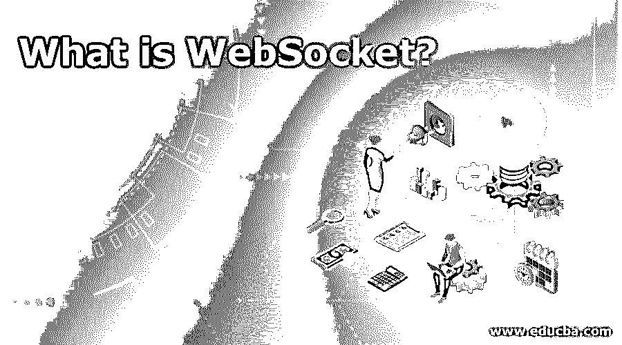
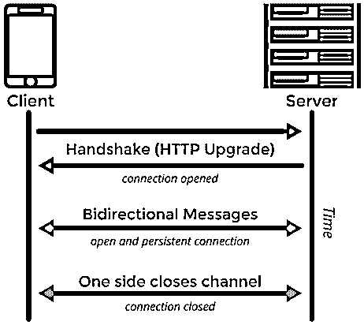
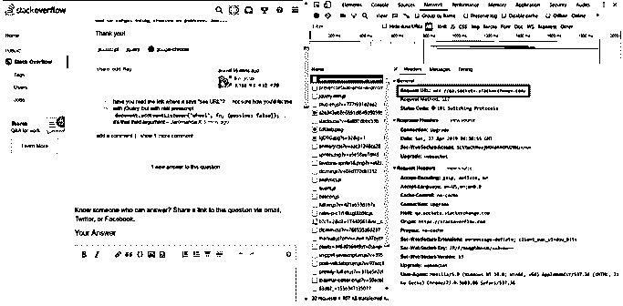

# 什么是 WebSocket？

> 原文：<https://www.educba.com/what-is-websocket/>

## 什么是 WebSocket？

想象你给朋友或同事写一封电子邮件。你总是以 Hi <friend>开头，然后是上下文，最后是一句谢谢<name>。现在想象同样的你和你的朋友/同事进行面对面的对话。你还会在每条短信的开头用嗨，结尾用谢谢吗？一个大大的不，对吗？这实际上总结了 HTTP 和 WebSocket。</name></friend>

### 技术理解

这是一种双向通信协议。它提供全双工连接。

<small>网页开发、编程语言、软件测试&其他</small>

*   回顾我们的电子邮件和面对面交谈的例子，电子邮件表示 HTTP 协议，而面对面交谈表示 WebSocket 协议。这并不意味着电子邮件是通过 HTTP 协议发送的，不。电子邮件大多使用 SMTP 协议，但我们现在不用担心这个。这个例子的要点是交换信息的双方之间的基础连接的打开和关闭。
*   HTTP 通过在每个请求-响应周期打开一个新连接来交换信息。因此，每次发送请求或接收响应时，HTTP 都会建立一个新的连接。把连接想象成简单的传输信息的安全线路。一旦您的信息被发送，HTTP 就会关闭连接。它为您保持连接打开，以便您可以在同一条线路上交换信息，直到其中一方关闭连接。

### 更专业一点

好吧，我明白为什么连接一直开着。它对我有什么帮助？我觉得不管是发邮件还是发聊天信息都没什么区别。你是对的。作为最终用户，您看不到这种差异。让我们像应用程序开发人员一样思考。我说的开通一条安全线路进行信息交换，这里面涉及到一个过程。这通常被称为握手。在这个过程中，参与对话的两台机器都同意打开一个端口来发送和接收信息。现在，这些端口相互封锁，不能用于第三台机器。

对于握手，HTTP 协议发送和接收一些额外的字节，只是为了确认端口在两台机器上是否空闲，并获取端口的详细信息。当需要频繁交换信息时，这些额外的字节是一种开销。因此，WebSocket。

### 什么时候用 WebSocket，什么时候不用？

到目前为止，很明显，只有在需要频繁交换信息时，它才有用。这是因为它提供了双工连接。这意味着信息可以同时发送和接收。这显然是以在信息交换之前阻塞端口为代价的。因此，使用 WebSocket 是在节省关键字节和以更长时间阻塞端口为代价实现更快对话之间的权衡。

WebSocket 的最佳用例是当你需要实时数据时，比如股票价格。股票价格每秒都在变化。因此，使用 HTTP 会在不必要的握手中浪费重要的时间，并且引用会变得陈旧。相反，使用它，更快地完成它。相反，如果你能承受几毫秒的信息搜索延迟，你必须选择 HTTP。

### WebSocket 是如何产生的？

在最初的日子里，互联网是一个巨大的包含文本信息的网页网络。这些页面大多是静态的，这意味着信息是恒定的，不会随着后续的检索而变化。随着时间的推移，图像等丰富的内容成为网页不可或缺的一部分。页面也变得动态化，这意味着现在页面上的信息可以基于查询生成。

这导致了动态 HTML、JavaScript 等技术的进步。它们都非常先进，但是使用 HTTP 协议。HTTP 协议的问题–连接不是双工的。这种交流是单向的。在任何时候，客户端都可以向服务器发送请求或做出响应。这让位于 WebSocket 协议，允许全双工连接来增强用户体验。

### 理解术语“全双工”

我们经常遇到全双工这个术语。这实际上意味着什么？在 HTTP 中，请求总是由客户端发起的。这意味着除非客户端发送请求，否则服务器不会响应。这使得交流是单向的。

而在 WebSocket 中，客户端和服务器可以同时向对方推送消息。客户端不需要在每次需要响应时都发出请求。这使得连接是双向的。现在为了实现双向，我们必须认为在每个时间点都有两个连接保持着。这就是 WebSocket 与众不同的地方。它通过单个 TCP 连接来实现这一点。这被称为全双工连接，意味着在单个通道上进行双向通信。

### WebSocket 属性、事件和方法

让我们创建一个 WebSocket 连接。

**代码:**

`var Socket = new WebSocket(URL, [protocal] );`

新的 WebSocket 方法是公开的 API 方法，它使用指定为第一个参数的 URL 返回已建立的连接，并遵循可选的协议参数。

#### 1.属性

一旦建立了连接，我们的 Socket 对象中就有了以下属性:

**a. Socket.readyState:**

告知连接状态的只读属性。
0–尚未建立连接。
1–连接已建立，可以通信。
2–联系是通过握手来实现的。
3–连接已关闭或无法打开。

**b. Socket.bufferedAmount:** 一个只读属性，告诉使用 send()方法排队的字节数。

#### 2.事件

**a. Socket.onOpen:** 连接打开时触发事件。

**b. Socket.onMessage:** 客户端收到服务器发来的消息时触发事件。

**c. Socket.onError:** 事件触发通信出错。

**d. Socket.onClose:** 连接关闭时触发事件。

#### 3.方法

**a . socket . send(data):**send 方法使用连接传输数据。

**b. Socket.close():** 这个方法终止现有的连接。

**举例:**

**代码:**

`var socket = new WebSocket(“ ws://echo.websocket.org ”);
if (socket.readyState === WebSocket.OPEN){
socket.send(“Hello World”);
}
if (socket.readyState === WebSocket.OPEN){
socket.close( );
}`

### 真实世界的例子

StackOverflow 是一个非常受欢迎的网站，它使用 WebSocket 在问题有新答案时推送通知。

### 推荐文章

这是一个什么是 WebSocket 的指南？在这里，我们讨论了基本概念、属性、事件，以及 WebSocket 的一个真实例子。您也可以浏览我们推荐的其他文章，了解更多信息——

1.  [Hadoop 是开源的吗？](https://www.educba.com/is-hadoop-open-source/)
2.  [什么是 Java 继承？](https://www.educba.com/what-is-java-inheritance/)
3.  [c#中什么是多线程？](https://www.educba.com/what-is-multithreading-in-c-sharp/)
4.  什么是 ASP.Net 网络服务？

