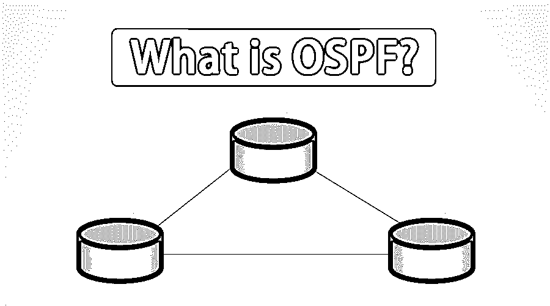

# 什么是 OSPF？

> 原文：<https://www.educba.com/what-is-ospf/>

## OSPF 简介

开放式最短路径优先(OSPF)是内部网关协议(IGP)的一种，它使用自己的最短路径优先(SPF)算法帮助找到源路由器和目的路由器之间的最佳路由路径。它是一种链路状态路由协议，用于在大型自治系统中分发数据包的路由信息。

### OSPF 地区

一个自治系统可以分成几个区域；这有助于减少链路状态通告和其他将被发送到网络的开销流量。

<small>网页开发、编程语言、软件测试&其他</small>

让我们来看看:

*   **骨干区:**又称 area0 或 Area 0 . 0 . 0 . 0；它构成了 OSPF 网络的核心，网络的所有其它区域都连接到主干区域。它负责在非主干区域类型的区域之间分发路由信息。
*   **Stub 区域:**对于 Stud 区域，该区域的布线完全基于默认布线。这是一个不接收自治系统(AS)外部广告的区域
*   不那么短的区域: NSSA 是一种短桩，它能够作为外部路由导入，并将其发送到任何其他区域。但是，它无法从网络的其他区域接收外部路由。
*   **中转区:**有 2 个或 2 个以上 OSPF 边界路由器的区域，可用于将网络流量从一个相邻区域传递到另一个相邻区域。它不是流量的来源，也不是任何此类流量的目的地。

### OSPF 是如何运作的？

配置完成后，它会监听网络中的邻居，并收集所有可用的链路状态数据。然后，使用这些数据来制作包含网络中所有可用路径的拓扑图。这个数据库被保存以备使用，我们称之为链路状态数据库。

一旦建立了链路状态数据库，就可以使用 Edsger W Dijkstra 开发的称为“最短路径优先”的算法来计算到子网/网络的最短路径。OSPF 创建了 3 个表:

*   **路由表:**它包含当前工作的最佳路径，将用于在两个邻居之间转发流量。
*   **邻居表:**这包含所有发现的开放最短路径第一邻居。
*   **拓扑表:**这一张包含了整个网络的路线图。该路线图包括所有可用的开放最短路径优先路由器，并保存关于最佳和备选路径的计算数据。

### OSPF 的路由器类型

*   **内部路由器:**这个路由器包含了所有在同一个区域内属于彼此的接口。
*   **区域边界路由器:** ABR 用骨干网连接一个或多个区域。ABR 被认为是它所连接的所有区域中的一员。它在内存中保存多个链路状态数据库，每个区域一个。
*   **骨干路由器:**具有到骨干区域的接口的路由器称为骨干路由器。
*   **自治系统边界路由器:** ASBR 是一种通过多种路由协议连接到网络的路由器。ASBR 与路由器自治系统交换路由信息。这些路由器运行外部路由协议，使用陈述路由，甚至两种方法都使用。

### 开放最短路径优先的应用

OSPF 是第一个被广泛部署的路由协议。它可以在几秒钟内与网络收敛，是可以提供无环路径的协议之一。除了这些功能之外，开放最短路径优先允许在网络中实施路由传播策略。

与其他 IGP 相比,“开放短路径优先”在外部链路上的负载分担方面更好。考虑到这些好处，它可以被广泛使用。

### 开放最短路径优先的实现

*   微软的 Windows NT 4.0 服务器、Windows 2000 服务器和 Windows Server 2003 在路由和远程访问服务中都有 OSPF v2。微软取消了该公司对 Windows Server 2008 和更高版本的服务器操作系统的支持。
*   OpenBSD 操作系统有 OpenBGPD 协议的实现，该协议有 OpenOSPFD 实现。
*   BIRD 同时实现了 OSPFv2 和 OSPFv3。
*   GNU Zebra 是一个 GPL 路由套件，支持类 Unix 系统的 OSPF。
*   Netware 中的多协议路由模块支持 OSPF。

### OSPF 的优势和劣势

以下是优点和缺点:

#### 优势

以下是优点:

*   Open Short Path First 易于扩展，这意味着我们可以轻松地将其扩展到一个非常大的网络中。
*   开放式最短路径优先协议完全支持子网。
*   hello 数据包的使用:Open Short Path 首先发送小的 Hello 数据包来验证链路操作，并忽略传输大的表。
*   OSPF 支持路径标记:在开放最短路径优先中，可以标记路径以简化与任意值的互操作。
*   路由:开放最短路径优先能够根据数据包的服务类型字段来路由数据包。

#### 不足之处

以下是缺点:

*   这是一个使用处理器密集型的协议。
*   因为它维护多个路由信息副本，所以会消耗更多内存。
*   与其他互联网协议相比，它是一种更复杂的协议，需要理解和学习。

### 结论

开放最短路径优先作为一种路由协议，在互联网基础设施中占有重要地位。轻松快速地找到最短路径有助于减少不必要的网络负载，并且在最佳路径出错的情况下找到另一条路径的能力有助于提高网络的稳定性。

### 推荐文章

这是一本关于什么是 OSPF 的指南？这里我们讨论了工作原理、实现、应用、优点和缺点。您也可以浏览我们推荐的其他文章，了解更多信息——

1.  [Java 中的二叉树是什么？](https://www.educba.com/what-is-a-binary-tree-in-java/)
2.  [计算机网络概论](https://www.educba.com/introduction-to-computer-network/)
3.  [什么是贪婪算法？](https://www.educba.com/what-is-a-greedy-algorithm/)
4.  [什么是 IPv6？](https://www.educba.com/what-is-ipv6/)

