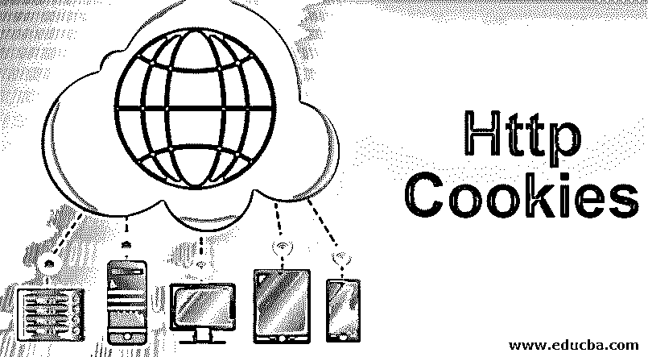
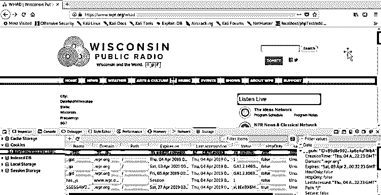

# HTTP Cookies

> 原文：<https://www.educba.com/http-cookies/>

## HTTP Cookies 介绍

*   在这里，我们将学习 Http cookies。在我们继续学习 cookies 之前，我们必须了解什么是 Http。Http 是一种促进客户端-服务器通信的协议。这是一个无连接的协议，这正是使用 cookies 的地方。
*   术语“无连接”的意思是，一旦数据在客户机和服务器之间交换，它们都不记得交换了什么；最后，网站管理员不能理解访问者的行为或冲浪性质。现在我们将看到 cookies 是如何实现的，以及它是如何工作的。
*   Cookies 可以定义为服务器存储在浏览器中的数据，通过该数据可以访问 [web 应用程序](https://www.educba.com/what-is-web-application/)。一旦在客户端和服务器之间建立了连接，客户端向服务器发送请求，并基于响应；一些数据已保存在浏览器中。在客户端的浏览器中存储 cookies 有几个目的；它可以确保认证，理解用户的行为，等等。
*   有时它也被称为浏览器 cookies。通常，它也被称为网络 cookie，但更好的是，人们只记得它的术语 cookie。在当今电子商务蓬勃发展的时代，饼干的重要性被放大了。它帮助企业了解用户在寻找什么，以及他们有多大可能购买某些东西。
*   社交媒体网站非常有效地利用 cookies 来加强良好的用户体验，并保护他们的系统不被滥用。

### 创建 HTTP Cookies

现在我们知道了什么是 HTTP cookies，以及它是如何缓解 HTTP 无连接问题的。本节将学习如何创建 cookies 并将其存储在用户的浏览器中。基于网站的要求，浏览器中存储的值可以用于各种目的。下面是创建 cookies 的代码。

`<?php
// to set the cookie name
$cname = "Web_user1";
//to set the cookies value
$cvalue = "Amit Roy";
// to set the cookies.
setcookie($cname, $cvalue, time() + ( 3600));
?>`

<small>网页开发、编程语言、软件测试&其他</small>

上述代码将在用户系统中设置 cookies。setcookie 是实际用来设置 cookie 的方法。setcookie 方法的语法如下:

`setcookie(cookieName, cookieValue, cookielife)`

在上述参数中，只有 cookieName 是强制的；否则，其余的都是可选的。Cookielife 是指 cookie 存储在浏览器中之前的时间。它是以秒计算的。在上面的例子中，它的值是 3600，这意味着它将在用户的浏览器中保留 1 小时。

现在让我们看看如何使用 cookie。

`<?php if(!isset($_COOKIE[$cookieName)) {
echo "Please set '". $cookieName;
}
else
{
}
?>
echo "Cookie name is '". $cookie_name;`

上面的代码将回显通过 setcookie 函数作为参数发送的 cookieName 值。issue 函数检查变量是否被赋值。对于上面的代码，下面将是输出。

饼干的名字是阿米特·罗伊。

### 用浏览器检查 HTTP Cookies

现在你很可能会想，如果 cookies 存储在浏览器中，那么在哪里可以看到它呢？嗯，我会告诉你，但在此之前，让我告诉你，没有你的同意，任何网站都不能在你的浏览器存储 cookies。现在让我告诉你在哪里可以找到饼干或有价值的商店。

在上图中，你可以看到网站在我的浏览器中存储了一些 cookies。这张图片是火狐浏览器的，我将告诉你如何在 Mozilla Firefox 中定位 cookies。您可以按照下面的步骤到达看起来像上面的屏幕。

**第一步**。点击页面右上角的三条平行线。

**第二步。**点击 Web developer 选项。

**第三步。**点击存储检查器。

**第四步**。单击您想要查看其 cookies 的网站名称。

### HTTP Cookies 路径

cookie 的路径是服务器中存储 cookie 的位置。为了让[网页访问](https://www.educba.com/web-page-design-layout/)cookie，网页必须位于子目录下。默认情况下，cookie 设置在全局位置，所有页面都可以从这个位置访问它。下面是可用于设置全局 cookie 的代码。

`document.cookie = 'foo=bar; path="/"’`

为了在任何子目录中设置 cookie，您可以使用下面的代码。我们在设置 cookie 路径时必须非常小心，因为文件夹上一级的页面将无法访问 cookie。

`document.cookie = 'foo=bar; path="/subfolder”’`

例如，页面 www.xyz.com/randompage1 将不能访问 cookie，而页面 www.xyz.com/subfolder/randompage1 可以访问它。如果你不设置路径，这将使 cookies 全局化，可以被每个页面访问。

### HTTP Cookies 安全性

*   Cookies 对于任何网站来说都是非常重要的数据，需要保密。HTTP 请求中有标头，通常称为 HTTP 数据包，用于为 cookie 提供安全性。
*   有一个属性 httponly，它使 cookie 只能从在浏览器中存储了 cookie 的主机上访问。它不能让 cookies 使用该文档。Cookie 和 javascript。
*   **document . cookie = ' foo = bar；安全；'** //不传输[数据且不加密的网站无法访问 cookie](https://www.educba.com/what-is-encryption/)。简单来说，浏览器和服务器之间的通信必须通过 SSL/TSL 加密。以 https 开头的 Url 可以使用它，而以 HTTP 开头的 URL 则不能。
*   **document . cookie = ' foo = bar；httponly** //通过使用 httponly 属性，可以使 cookies 无法在本地访问。它必须需要来自服务器的请求，以便传输 cookies 设置的值。

### 结论

简而言之，cookies 被认为是用来为浏览器设置一些值的一组代码，这些值可以用来收集信息或确保安全。出于安全考虑，cookies 的使用日益增加。所有现代网站都在用户系统中存储 cookies，这样他们就能理解用户是如何与他们互动的。

### 推荐文章

这是 HTTP Cookies 的指南。这里我们讨论一个简介，创建 cookie，cookie 路径，cookie 安全。您也可以浏览我们推荐的其他文章，了解更多信息——

1.  什么是网络攻击？
2.  [什么是网络安全？](https://www.educba.com/what-is-cyber-security/)
3.  [HTTP 缓存](https://www.educba.com/http-caching/)
4.  [JSP 中的 Cookies】](https://www.educba.com/cookies-in-jsp/)

