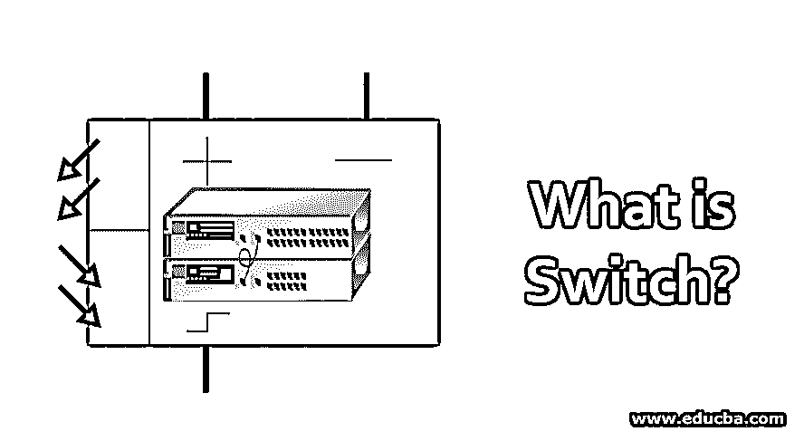
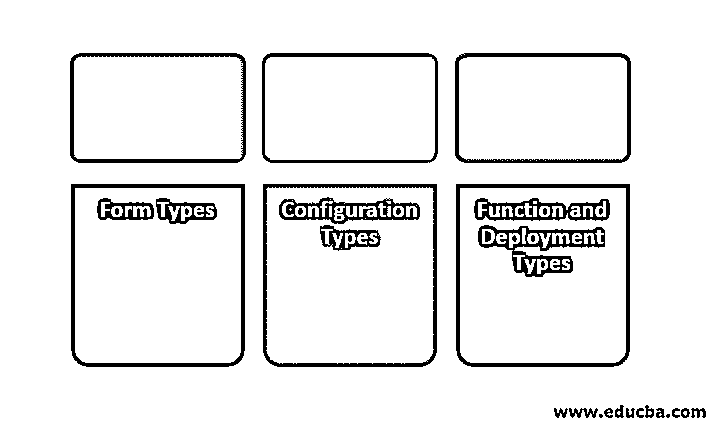

# 什么是 Switch？

> 原文：<https://www.educba.com/what-is-switch/>

## 什么是 Switch？

过滤网络数据包并将其从一台设备转发到另一台设备的硬件设备。交换机在网络层处理数据。它们接收数据并将其转发到目的设备。路由功能被合并到交换机的网络层，因此数据处理可以很容易地完成。这主要在局域网中进行，在局域网中接收和处理数据。交换机防止环路的形成，并且也完成了数据包的转发。它被用作控制器。

### 为什么选择开关？

它的特性、功能和性能远远优于网络中的其他外设。通过与同类产品 Hub 的比较，说明了它的优越性。

<small>网页开发、编程语言、软件测试&其他</small>

| **Sr 号** | **属性** | **集线器** | **开关** |
| **1。** | **数据传输速率** | 带宽是有限制的。最大速度为 10mbps。 | 带宽没有限制，最高可达 1Gbps。 |
| **2。** | **传送方式** | 它遵循广播模型。传入数据意外传输到所有节点，导致冲突。 | 进入的数据通过短时间创建的电子隧道使用 MAC 地址被发送到正确的预定节点。因此，根本不存在冲突。 |
| **3。** | **连通性** | 仅连接设备。 | 也连接设备和网络。 |
| **4。** | **网络层** | 在 OSI 模型中，数据在物理层(L1)以电信号的形式传输。 | 传输开放系统互连(OSI)模型中数据链路(L2)层的数据帧和网络层(L3)的数据包。 |
| **5。** | **类型** | 被动。不聪明。 | 活跃。软件启用。聪明。 |
| **6。** | **功能** | 没有特殊功能。 | 具有管理模块、处理器、维护 MAC 地址的表，用于管理节点之间的流量。 |
| 7 .**。** | **端口** | 4 到 12 个端口。 | 24 到 48 个端口。 |
| **8。** | **交通** | 由于向所有节点的多次传输而导致流量过大。 | 因为数据分组仅被传输到一个正确的节点。 |

### 利益

它为企业带来了以下好处:

1.  它使计算机/设备能够有效地利用网络带宽。
2.  由于通信只发送给接收方，因此其他节点上没有负载。
3.  它增强了网络的性能，并且延迟较低。
4.  冲突几乎为零，因为它只与接收节点建立连接。
5.  它与 Hub 的价格相同，但用户获得的价值明显更高。
6.  网络的可管理性/可扩展性变得简单易行。

### 三大开关类型

根据类别的形式、配置、功能和部署，类别可以分为几种类型。

#### 1.表单类型

*   它有多种物理形式，如主要用于家庭应用的独立桌面类型。
*   机架安装在工厂内部部署的机箱中或数据中心的设备中。
*   手机应用中安装在通信塔中的小开关。
*   在办公室环境中，它位于电缆管道和地板箱内。
*   虚拟交换机只是软件，主要用于虚拟机环境。

#### 2.配置类型

有 3 种类型的配置:

*   **非托管:**纯粹的普通不可配置交换机，仅充当网络分配或功能盒。这种类型主要用于家庭环境。
*   **被管理:**可以通过命令界面管理这些的操作。Telnet、安全外壳、串行控制台、嵌入式协议和 Web 界面是与这些交换机交互的方式。此外，端口带宽、VLAN 设置和端口镜像都是可以动态修改的功能。
*   **Smart:** 他们被分配管理交换机类，选项有限，如 Web 界面。只有端口带宽和 VLAN 设置可以通过该接口进行更改。这些交换机的价格介于非托管交换机和企业托管交换机之间。
*   **完全(企业)受管:**他们不仅拥有受管交换机的所有功能，还拥有额外的设施，如通过备份/恢复设施保护配置设置，以及更好的管理选项。虽然它比智能交换机贵，但它大大降低了管理成本。

#### 3.功能和部署类型

下面是功能和部署类型的列表:

*   **路由:**局域网通过这些交换机连接。除了使用 MAC 地址连接设备以传输数据帧(第二层)，这些交换机[支持路由协议](https://www.educba.com/routing-protocols-types/)并通过网络路由数据包(第三层)。
*   **边缘或接入:**它连接最终用户计算机和接入点，并管理网络的进出流量。
*   **分布:**这些放置在整个网络的中间层，它管理交换机之间的流量。
*   **核心:**这是连接边缘&分布交换机与数据中心网络的中央交换机。它还将局域网与互联网路由器连接起来，以便访问互联网。

### 它是如何工作的？

大多数交换机使用以太网协议，这些协议[提供数据链路层](https://www.educba.com/data-link-layer/)(第 2 层)功能，并且该协议能够在整个网络中实现从数据包(由网络层发送)创建的数据帧的[传输。如果 LAN 网络中的一个节点要与另一个节点通信，网络接口会创建一个数据帧，其中包含发送方和接收方设备的 MAC 地址以及要发送的数据包。数据帧通过网络发送。当它到达交换机时，它用 CAM 表扫描发送者的 MAC 地址(端口号对 MAC。内容可寻址存储器)，并且如果存在匹配，则数据帧被发送到该端口；否则，它将被填充到其所有端口。如果任何端口报告 MAC 匹配，该详细信息将在 CAM 表中更新以供将来使用。](https://www.educba.com/data-frames-in-r/)

有些具有执行其它层功能的能力，它们被称为多层交换机。

*   第 1 层(物理层)交换机被称为以太网集线器。
*   第 3 层(网络层)交换机被称为路由器交换机，它跨交换机传输数据。
*   第 4 层交换机依赖于供应商，如防火墙、VPN 集中器和安全网关。
*   第 7 层交换机可以基于应用层中的 URL 来分配负载。

### 结论

由于其高性能、智能特性和经济高效的操作，它们是企业网络中最受欢迎的网络组件。

### 推荐文章

这是一个什么是开关的指南？.在这里，我们将讨论交换机的三大类型，如形式、配置、功能、部署及其优势。您也可以浏览我们推荐的文章，了解更多信息——

1.  什么是 VLAN？
2.  [交换机 vs 路由器](https://www.educba.com/switch-vs-router/)
3.  [交换机 vs 路由器 vs 集线器](https://www.educba.com/switch-vs-router-vs-hub/)
4.  [网关 vs 路由器](https://www.educba.com/gateway-vs-router/)

