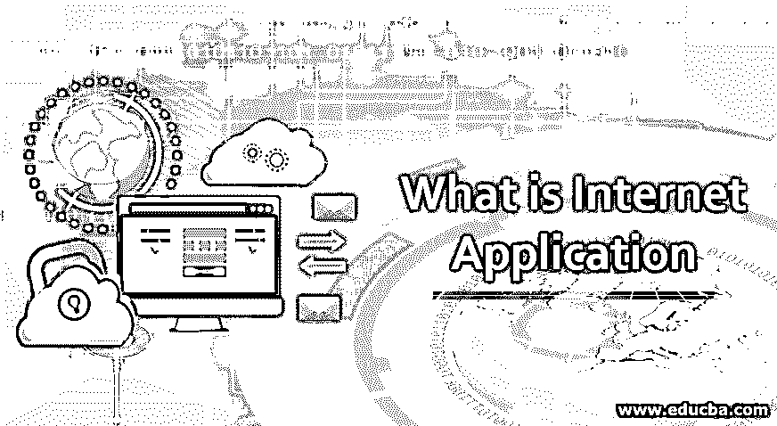
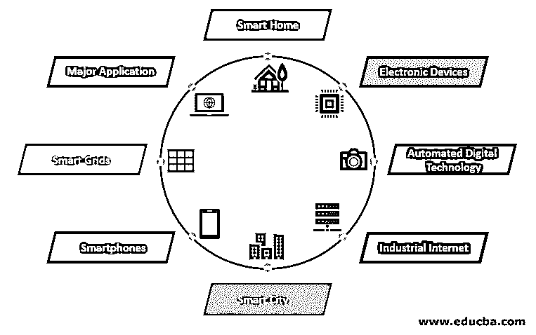

# 什么是互联网应用

> 原文：<https://www.educba.com/what-is-internet-application/>

## 互联网应用介绍

互联网应用可以被描述为使用互联网来成功操作的应用类型，也就是说，通过使用互联网来获取、共享和显示来自各个服务器系统的信息。只有在互联网设施的帮助下才能使用它，没有互联网它就无法运作。这些应用可分为基于电子设备、自动化数字技术、工业互联网、基于智能手机、基于智能家居、智能电网、智能城市和其他主要应用。

### 互联网应用服务

以下是一些互联网应用的详细解释:

<small>网页开发、编程语言、软件测试&其他</small>

*   互联网有许多主要的应用，如电子邮件服务、网络浏览、对等网络。电子邮件的使用增加了，因为它有几个特点，如附件、信息、数据使用。
*   由于多用途因特网邮件扩展，诸如 word 文档、excel 表格和图形媒体的附件特征是可能的，但是结果是邮件引起的通信量是根据网络中的数据包来校准的。
*   电子邮件服务成为个人和专业通信方法的重要组成部分，并且其耗费时间和成本。通过加密安全地传输和接收[数据。交通和体育的票价是通过邮件收到的。](https://www.educba.com/what-is-encryption/)
*   网络浏览器是互联网的一个关键应用，它在商业上由微软主导，并受万维网的影响很大。
*   网络浏览器是免费的，作为一种开源模式，丰富了未来几代人的思想。开放源代码是在模块化的基础上开发和部署的，因为只有很少的使用限制才能访问源代码。开源特性已经被整合到文件管理器和网络浏览器中。
*   互联网应用中的其他重要应用和潜在需求是对等网络。这种 P2P 网络是一种基于物理资源交换的动态方法，如硬盘、文件、处理器和其他智能特性。
*   每组对等网络都有相同的责任和功能。基于互联网的对等应用基于跨网络协议(如 SOAP 简单对象访问协议或远程过程调用 XML- [RPC 用户](https://www.educba.com/what-is-rpc/)更主动地进入互联网)将计算机定位在计算矩阵的焦点。

### 互联网的顶级应用

下面列出了 8 大互联网应用

#### 1.智能家居

智能家居已经成为住宅的进化阶梯，并像智能手机一样普遍发展。这是谷歌的一个特色，现在已经在很多领域部署，让生活变得方便和用户友好。智能家居旨在节省时间、金钱和能源。

#### 2.电子设备

像可穿戴设备这样的电子设备安装有不同的传感器和软件，这些传感器和软件收集用户的数据和信息，并对数据进行处理，以提供所需的用户信息。该设备主要用于监控健身、娱乐和健康。它们大多以超低功耗工作，尺寸很小。

#### 3.自动化数字技术

自动化数字技术集中于车辆及其内部功能的优化。自动驾驶汽车设计有特殊功能，通过车载传感器和互联网设施为乘客提供舒适区。像特斯拉、苹果、宝马、谷歌这样受欢迎的公司还没有通过安装出色的功能来加入他们在汽车行业的革命。

#### 4.工业互联网

工业互联网正在投资具有人工智能和数据分析的工业工程，以建造出色的机器。重要的是要制造精确的、与人类兼容的智能机器。它拥有良好的质量和可靠性，潜力巨大。部署这些应用程序是为了跟踪要交付的货物、关于零售和供应的实时数据，从而提高企业供应链的效率和生产率。

#### 5.智能城市

智慧城市是互联网的另一个主要实现，用于智能监控、水分配、自动运输、环境监测。人容易污染，物资供应不当，来源短缺，交通传感器的安装解决了交通流量不规律，开发了 app 举报市政系统。市民可以诊断电表中的简单故障，并可以通过电力局应用程序或网站向电力系统报告，他们还可以在传感器系统中轻松找到可用的停车位。

#### 6.智能手机

智能手机也用于零售商和客户在业务交易中保持联系，甚至在商店之外。他们已经使用信标技术来帮助商务人士向客户提供智能服务。他们可以跟踪产品，增强商店仪表板，并在预定日期前交付优质订单，即使在交通拥堵的地区也是如此。

#### 7.智能电网

智能电网应用的理念是以自动化的方式收集数据，以分析电力的属性。消费者提高使用的效率和经济性。智能电网可以很容易地快速检测到停电和电力短缺，并很快修复它们。

#### 8.主要应用

互联网的另一个主要应用是医疗保健，因为它是智能医疗系统，用于在早期诊断和治疗疾病。很多[机器学习](https://www.educba.com/machine-learning-algorithms/)算法用于图像处理和分类，在胎儿出生前就检测出胎儿的异常。医疗领域应用的主要目标是通过佩戴互联设备为所有人提供更健康的生活。收集的患者医疗数据使治疗变得更加容易，并且安装了一个监控设备来跟踪血糖和血压。

### 互联网的优势

*   互联网是一个通过即时通信与世界各地的人们一起工作的合适环境，可以更容易和更快地提供产品和服务。
*   互联网连接使员工可以在家创建虚拟办公室。
*   互联网连接将您的笔记本电脑或个人电脑连接到互联网辅助设备，以[访问云计算](https://www.educba.com/what-is-cloud-computing/)和云存储。
*   互联网可以建造一台超级计算机来执行和管理复杂任务。
*   结论

如上所述，互联网在所有领域提供了巨大的应用，以降低客户关系管理的复杂性和准时交付的高质量。社交媒体正在以更快的速度传播新闻，这使得人们更接近解决问题，而不受时间和地点的限制。

### 推荐文章

这是一本关于什么是互联网应用的指南。在这里，我们将讨论互联网的 8 大应用及其服务和优势。您也可以阅读以下文章，了解更多信息——

1.  [JavaFX 应用程序](https://www.educba.com/javafx-applications/)
2.  [人工智能应用](https://www.educba.com/artificial-intelligence-applications/)
3.  什么是 Web 应用程序？
4.  [什么是应用服务器？](https://www.educba.com/what-is-application-server/)

