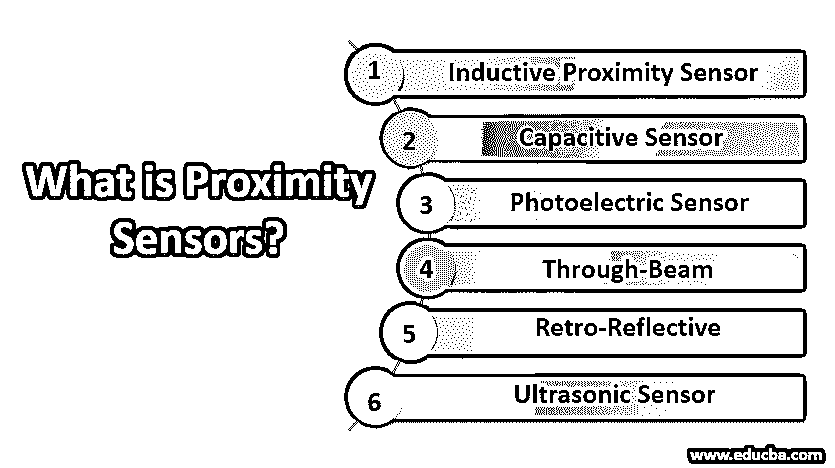

# 什么是接近传感器？

> 原文：<https://www.educba.com/what-is-proximity-sensors/>

## 什么是接近传感器？

这些传感器用于检测任何物体的存在，而不需要任何物理接触。发射电磁辐射，并检查物体和信号场的变化。威尔弗里德·格尔、沃尔特·佩珀尔和路德维希·富克斯发明了第一个接近传感器。这些应用于停车场、移动电话、传送带系统和许多其他地方。三种类型的接近传感器是磁性型、电容型和高频振荡型传感器。其原理是基于线圈和振荡器，在感应表面周围产生电磁场。

### 前 6 种接近传感器

接近传感器的类型如下:

<small>网页开发、编程语言、软件测试&其他</small>

#### 1.电感式接近传感器

该传感器被称为感应式，因为它是根据电感的电原理进行检测的。它能探测金属物体。它使用振荡器电路来产生高频电磁场。该传感器由一个感应线圈组成。当电缆从传感器出来时，它变成红色，金属被检测到，传感器被打开。当电缆断开时，传感器的输出关闭。

#### 2.电容式传感器

它可以检测液态、固态和颗粒状的金属和非金属物体。它作为一个开路电容器工作，因为它有两个导电板位于传感头处。当物体进入感应区域时，这两个板的电容增加，导致振荡器振幅改变，施密特触发状态改变，并产生输出信号。如果目标存在，电容传感器会振荡。充电板的频率范围为 10 至 50 赫兹。它可以检测任何类型的材料；传感器应远离非目标材料，以避免错误触发。

#### 3.光电传感器

它能感知直径 1 毫米以内的目标。这是一种迅速发展的传感器。它可以解决大部分工业传感对象。它有一个激光二极管，光电二极管接收器来检测发出的光。辅助电子设备用于放大接收器。使用发射器来检测接收器，因为它发射可见光或红外光。

#### 4.直通波束

它是最可靠的光电传感器。发射器提供恒定的光束。当物体通过光束的两个断点之间时，发生感应。它使用单独的外壳与接收器分离。使用起来很可靠。它可用于商业和工业领域。可以让车免于被砸。

#### 5.逆向反射

它具有最长的光电感应距离。它的传感器监控范围可达 10 米。它的工作原理与直通波束相同，但发射器和接收器位于同一外壳内，面向同一方向。发射器产生激光并将其射向反射器，反射器将光束反射回接收器。当光路发生或受到干扰时，检测就发生了。它节省了成本和时间。像罐子或镜子这样的反射物体对逆向反射传感器来说是一个挑战。这将导致错误的输出，因为目标反射光来欺骗接收器光束没有被中断。

#### 6.超声波传感器

它由三部分组成，如发射机、接收机和收发机。发射器将->电信号转换成超声波，接收器将->超声波转换成电信号，trans 接收器可以发射和接收超声波。它可以用来测量坦克的液位，通过水的速度。为了测量油箱的液位，传感器测量到液面的距离。它可以用于自动化生产过程。它可以通过测量传播时间在指定的传感距离内进行检测。这种传感器最适合需要检测连续物体的应用。

### 近程传感器的优势

下面给出了一些好处:

*   电感式接近传感器准确、开关速度快，可在恶劣环境中工作。
*   电容式传感器可以检测金属和非金属物体。它速度快，成本低。
*   超声波传感器比其他类型的传感器具有更大的感应距离。
*   光电传感器可以感应任何类型的材料，具有长寿命和快速响应时间。
*   它可用于移动设备，如:当我们处理电话时，它会检测到接听电话时屏幕应该是关闭的；这样可以避免拨号。
*   停车时可以使用；它将检测停车或泊车的安全区域。

### 结论

我们已经了解了什么是近程传感器，以及如何实时使用它们。它可以在不接触物体的情况下探测到物体；这让我们的生活更容易，因为如果传感器检测到物体，它会给我们一个警告。不同类型的传感器在不同的领域工作不同。它的工作原理是基于线圈和振荡器。

### 推荐文章

这是什么是接近传感器的指南？.在这里，我们讨论了近程传感器的介绍和类型以及优点。您也可以浏览我们推荐的其他文章，了解更多信息——

1.  [网络攻击的类型](https://www.educba.com/types-of-network-attacks/)
2.  [AWS 数据管道](https://www.educba.com/aws-data-pipeline/)
3.  [传感器的应用](https://www.educba.com/applications-of-sensors/)
4.  [什么是传感器？](https://www.educba.com/what-is-sensors/)

