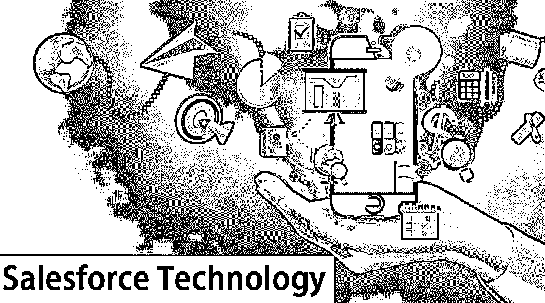
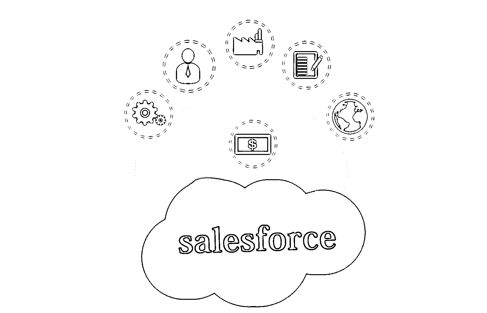
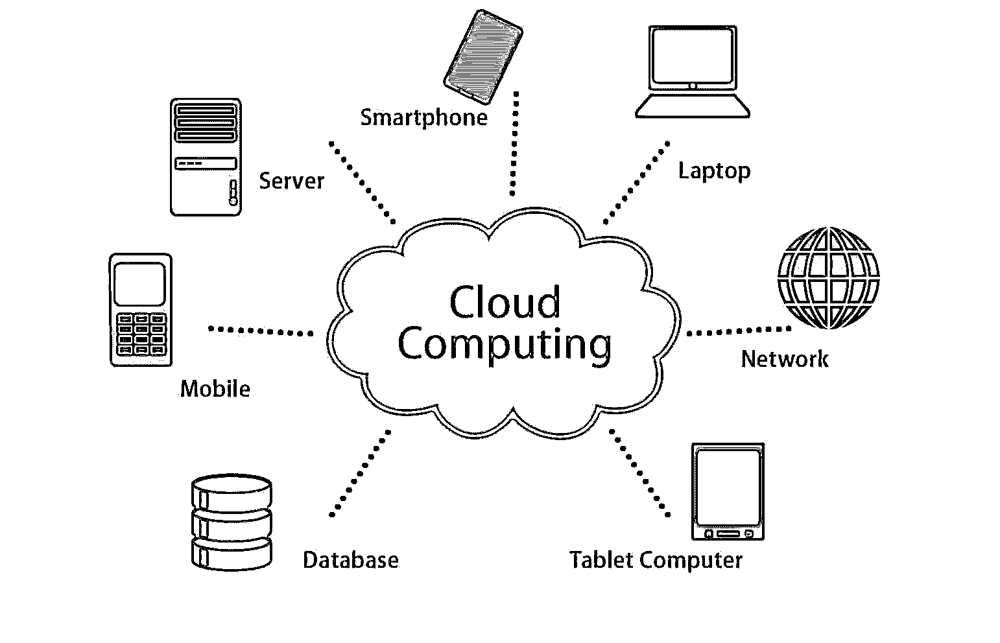
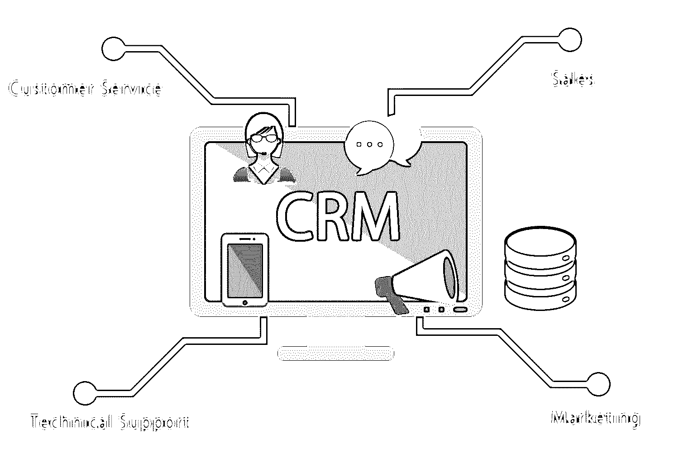
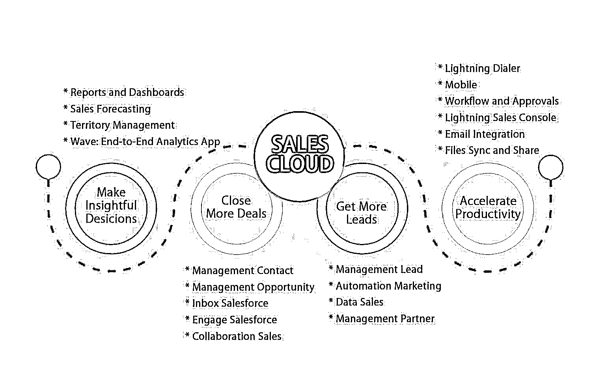
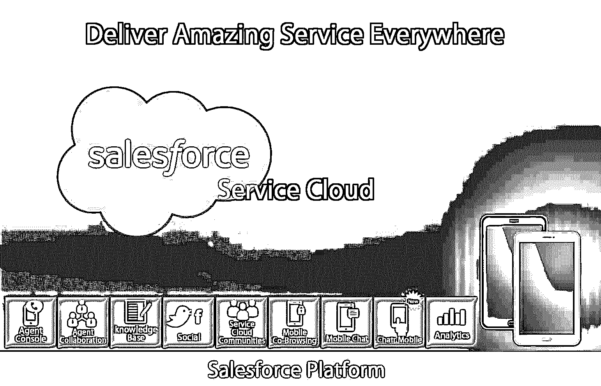
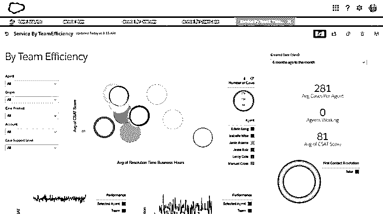
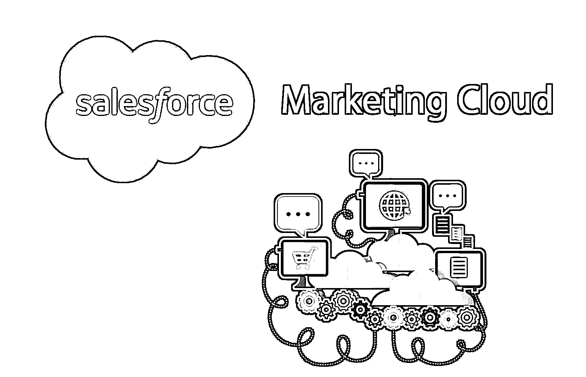
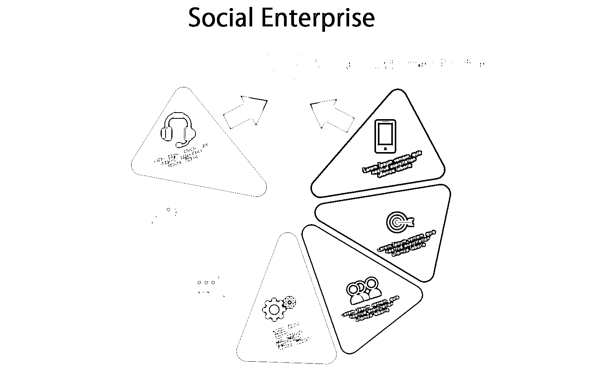
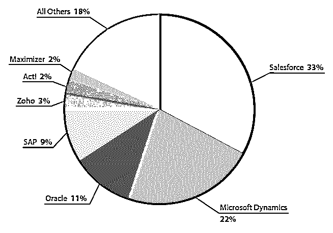

# 什么是 Salesforce 技术？

> 原文：<https://www.educba.com/what-is-salesforce-technology/>

## 什么是 Salesforce 技术？

专门研究客户关系管理的云计算服务叫做 Salesforce。salesforce 技术使用的云平台是[软件即服务](https://www.educba.com/what-is-software-as-a-service-saas/) (Saas)。这有助于联系现有和未来的客户和业务合作伙伴。利用这种技术可以很好地维持与客户的关系，并创造新的客户。此外，现有的客户保持忠诚，因为业务容易。该平台集成了所有领域，如营销、销售、客户服务、供应链、数据分析和许多其他领域，因此客户可以对业务有一个综合的看法。

<small>网页开发、编程语言、软件测试&其他</small>

### 那么云计算到底是什么？

云计算是一种存储数据和从互联网访问数据的方法，而不是存储在笔记本电脑或 PC 的硬盘上。考虑 Google drive 这个简单的例子。人们可以随时随地通过任何连接互联网的设备访问或存储数据。这是因为数据存储在云中。想象一下，因为有了云，生活变得多么简单。你不需要传统的沉重的硬盘或存储空间在你的笔记本电脑，个人电脑或手机上。

### 什么是客户关系管理？

客户关系管理(CRM)解释如下:

顾名思义，客户关系管理(CRM)是一种管理公司与客户关系的应用程序。换句话说，CRM 是一种工具，公司及其员工可以通过维护数据库来分析客户互动、流失率和购买模式。该数据库包含客户的独特属性，即他们的 id、过去的购买历史(订单)和许多其他详细信息。因此，这一应用程序有助于公司了解消费者行为，并分析在哪里投资以增加利润和减少损失。此外，它还有助于管理庞大的客户数据库，并与他们保持良好的关系。

所以现在，我们回到我们的问题。salesforce 技术到底是什么？结合云计算和 CRM，Salesforce.com 公司开发了一种技术，可以在云中存储和访问客户数据，并通过使用云数据理解客户交易来分析他们的销售。此外，Salesforce 技术管理客户的互动，而不仅仅是针对[销售和营销](https://www.educba.com/sales-vs-marketing/)的 CRM，从而帮助组织成长。此外，根据业务需求，还可以定制工具。换句话说，企业可以根据他们的业务问题对工具进行个性化设置，并增强功能以与其他工具和技术集成，如 IOT、区块链等。

https://www.quora.com/What-are-all-the-services-that-Salesforce-supports

Salesforce technology 提供的各种产品如下:

#### 1–销售云

它是 Salesforce CRM 中的一个模块，帮助销售团队主要通过云访问数据，包括联系人、地址、购买的产品以及从公司购买产品的各种客户的帐户。它帮助该公司的经理、领导团队和销售团队与客户联系，并引导他们努力实现更多的销售。

#### 2–服务云

现在，你有一个模块，它将帮助你与客户保持良好的关系。Salesforce CRM 中的服务云模块由客户、案例及其解决方案组成。它旨在让您支持过去、现在和未来客户对产品、服务、账单等方面的协助请求。

#### 3–分析云

https://www.zdnet.com/article/salesforce-revamps-service-cloud-with-lightning-design-analytics-tools/

分析云，也称为 salesforce wave [analytics，是一个商业智能](https://www.educba.com/business-intelligence-interview-questions/) (BI)模块，帮助组织进行[各种数据可视化](https://www.educba.com/careers-in-data-visualization/)和分析。这也是一款针对移动接入的优化应用。该应用程序支持图表、图形和其他可视形式的数据，以了解 B2C 或 B2B 业务的各个方面的属性。

#### 4–营销云

它是 Salesforce CRM 中的一个模块，帮助营销人员管理营销活动，并保持与客户或顾客的互动。它使用预测分析来吸引消费者或向符合条件的消费者推荐产品。与 Salesforce 中的服务和销售云模块相集成，可以更容易地避免反复致电潜在客户。[营销云整合了](https://www.educba.com/marketing-cloud-training/)社交媒体、电子邮件、广告等营销渠道或媒介。例如，决定给定产品宣传的传播源。

#### 5–社区云

社区云是 CRM 中的一个模块，用于处理合作伙伴、员工和客户的协作，以获得更好的客户体验。换句话说，通过这个模块，顾客可以就产品和品牌进行互动并给出反馈。它通过为客户提供一个了解消费者反馈和随机应变产品的媒介，增强了客户体验，丰富了组织。

### Salesforce 技术/使用的语言。

使用的 salesforce 技术/语言如下:

#### 顶点

[Apex 是一种类似 Java 的编程语言](https://www.educba.com/apex-interview-questions/)，用于开发和增强 Salesforce CRM 应用程序。它用于从 CRM 的数据库中访问数据，并通过使用 API(应用程序用户界面)来操作数据。开发人员还使用它来根据业务需求定制和个性化应用程序。控制和执行流程、添加业务逻辑、触发各种事件等非常容易。，通过使用简单的存储过程。

#### 视觉力量

Salesforce CRM 使用 Visualforce 为移动和 web 应用程序创建自定义交互式用户界面(UI)。它类似于 HTML，并像其他标记语言一样使用标签。它非常易于学习和执行，有助于增强 Salesforce 技术中的移动和 web 应用程序的外观和感觉。

### Salesforce 技术相对于其他 CRM 的优势

以下是一个优点:

https://www.capterra.com/customer-relationship-management-software/user-research

*   **云计算:**

Salesforce 技术最重要的因素和优势之一是它是完全基于云的技术。没有安装或维护的麻烦。

*   **定制/个性化:**

如前所述，基于业务的先决条件，可以修改应用程序，并且可以为特定组织的软件开发丰富的报告。

*   **集成:**

它可以很容易地与各种其他在线平台(如社交媒体、web 应用程序、IOT 等)集成，以分析客户行为和产品营销。以及移动和网络应用。

*   **多样性:**

Salesforce CRM 提供不同的模块，如销售、营销、分析等。根据需求，用户可以实现所需的模块，并将它们集成到 CRM 本身中。

*   **客户互动:**

与潜在客户和现有客户互动变得比以往任何时候都更加轻松。当客户的差异被听到时，他们的满意度就会提高，这就是 CRM 帮助组织的目的。

*   **分析:**

最后但同样重要的是，使用 RDBMS 跟踪客户行为和[反馈变得更加容易。这些历史数据有助于分析组织购买特定产品或服务的增长或下降。](https://www.educba.com/rdbms-interview-questions/)

总之，Salesforce 技术是最好的 CRM 工具和技术之一，并且还会有越来越多的改进。由于基于云的技术，这是一个方便的工具，用于更好的客户交互和维护数据。

### 推荐文章

这是什么是 Salesforce 技术的指南。在这里，我们学习了 Salesforce Technology 的语言、使用的语言以及 Salesforce Technology 相对于其他 CRM 的优势。您也可以阅读以下文章，了解更多信息——

1.  [sales force 中的职业](https://www.educba.com/careers-in-salesforce/)
2.  [sales force 的用途](https://www.educba.com/uses-of-salesforce/)
3.  [Salesforce 认证优势](https://www.educba.com/salesforce-certification-benefits/)
4.  [认证销售队伍管理员](https://www.educba.com/certified-salesforce-admin/)

