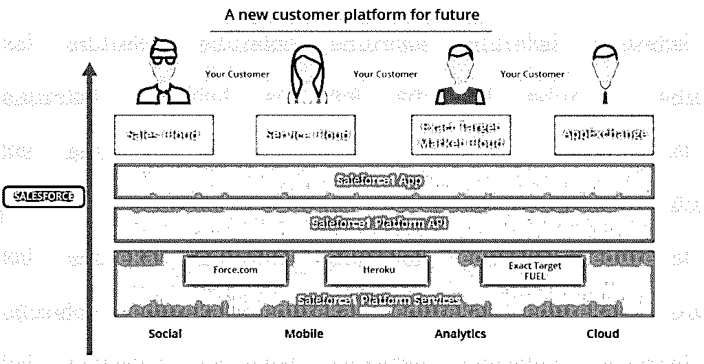
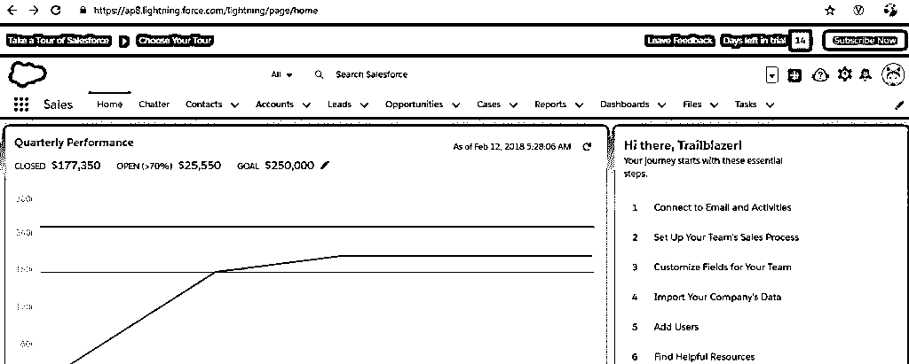
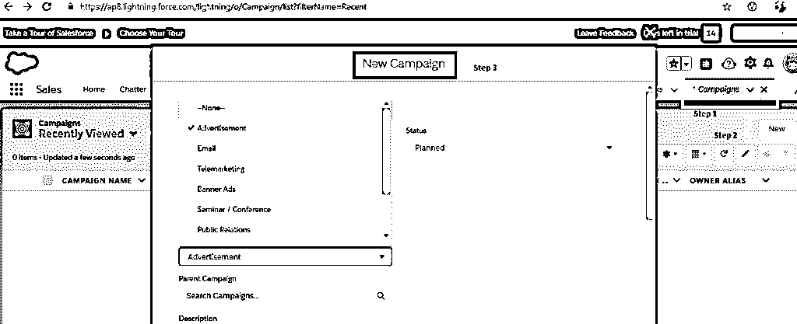
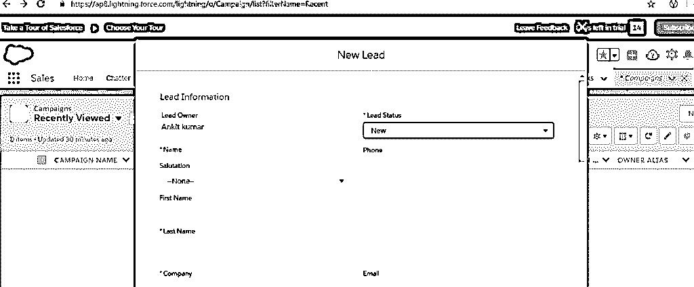
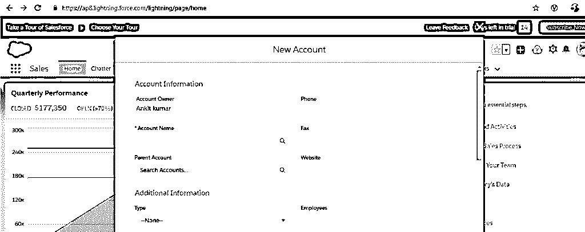
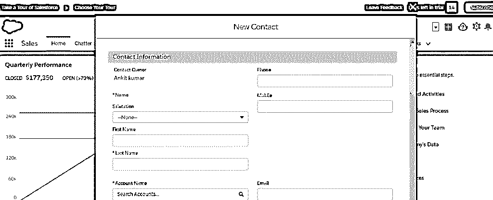
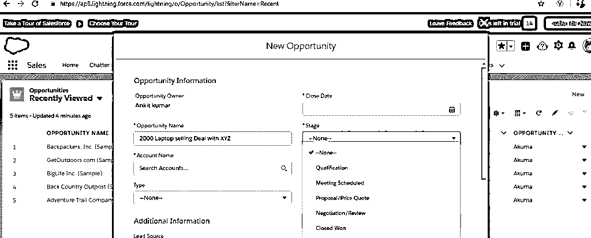
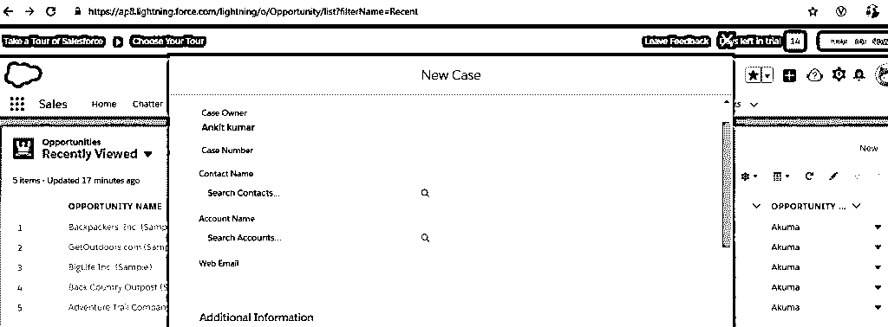
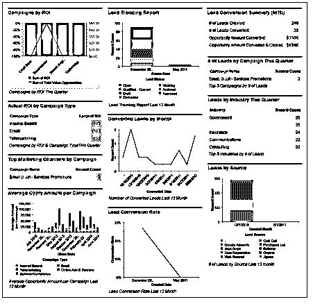

# 什么是 Salesforce 销售云？

> 原文：<https://www.educba.com/what-is-salesforce-sales-cloud/>

## Salesforce 销售简介

云 Salesforce 销售云是 Salesforce 提供的企业产品之一。首先，让我们看看什么是 Salesforce。Salesforce 是一个非常广泛使用的基于云的 CRM 平台，它在销售、营销、服务和许多其他领域提供 CRM 产品，可以轻松设置，无需深入了解用于构建应用程序的技术。

<small>网页开发、编程语言、软件测试&其他</small>

### Salesforce 产品

[Salesforce 提供各种](https://www.educba.com/what-is-salesforce-technology/)产品和服务，任何组织都需要这些产品和服务来促进和运行其业务和服务。salesforce 产品包括销售云、服务云、营销云、分析云、社区云、应用云等。在本帖中，我们将讨论销售云服务 Salesforce。

### 销售云

Sales Cloud from Salesforce 是一款企业产品，它为组织提供了一个出色的平台来管理销售部门的端到端功能，如记录产品信息(例如价格、订单 Id)、创建活动、管理客户联系人、触发电子邮件、报告和仪表板功能、根据与客户的交易进展创建订单和机会等。

### Salesforce 销售云的不同模块和重要功能

1.  活动管理
2.  销售线索管理
3.  账户管理
4.  联系人管理
5.  机会管理
6.  案例管理
7.  报告和仪表板

#### 1.活动管理

salesforce 中的营销活动管理有助于规划组织的营销计划，旨在代替其营销活动计划产生更好的收入。营销活动的例子有广告、电子邮件、研讨会、活动、电话营销(给客户打电话)等。

**如何创建营销活动？**

1.  如果您没有 salesforce 试用许可证，请在此处注册:

[https://www.salesforce.com/](https://www.salesforce.com/in/form/genfy16/freetrial-sales/)

寻找一个名为“campaign”的菜单，如果找不到，请单击主菜单，在那里您应该可以看到所有模块，找到“Campaign”菜单，然后单击它。

2.  单击“新建”创建新的活动。
3.  填写各自的详细信息。
4.  最后，点击保存。

**2。销售线索管理**

现在，让我们假设，由于你们的促销活动，很少有顾客对你们的促销活动感兴趣。例如，您发起了一项以折扣价销售笔记本电脑的活动，但很少有客户对该交易感兴趣，并登记了他们的姓名以便联系。销售云中的销售线索是一个潜在客户，他们由于活动或出于自身兴趣而对购买公司的产品或服务表现出兴趣，但他们可能还没有完全具备购买资格。他们可能是公司从未与之做过任何生意的客户，因此他们是潜在客户。

如何创建销售线索？

1.  如果您没有 salesforce 试用许可证，请在此处注册:

[https://www.salesforce.com/](https://www.salesforce.com/in/form/genfy16/freetrial-sales/)

2.  寻找其中一个名为“Lead”的菜单，如果找不到，请单击主菜单，在这里您会看到所有模块，找到 Lead 菜单，然后单击它。
3.  单击“新建”创建新的销售线索。
4.  填写各自的详细信息。
5.  最后，点击保存。

**3。账户管理**

现在很有可能的是，一个领导者可能不是唯一一个应该完全负责发起交易并推动交易完成的人；可能涉及许多人，包括财务和基础设施团队。客户是您将要与之进行业务交易的组织(或公司)。例如，有一家名为 DX 的公司，他们对你们的产品感兴趣。因此，您现在将使用该公司名称创建一个帐户。同样，如何创建客户与创建营销活动和销售线索非常相似。

1.  如果您没有 salesforce 试用许可证，请在此处注册:

[https://www.salesforce.com/](https://www.salesforce.com/in/form/genfy16/freetrial-sales/)

2.  寻找一个名为“Account”的菜单，如果找不到，请单击主菜单，在这里您应该可以看到所有模块，找到主菜单，然后单击它。
3.  单击“新建”创建一个新帐户。
4.  填写各自的详细信息。
5.  最后，点击保存。

**4。联系人管理**

开设账户后，我们还需要建立和维护相关关键业务人员的联系方式，并推动您的业务交易。还有一个选项可以将联系人标记到一个已经存在的帐户。

1.  如果您没有 salesforce 试用许可证，请在此处注册:

[https://www.salesforce.com/](https://www.salesforce.com/in/form/genfy16/freetrial-sales/)

2.  寻找其中一个名为“联系人”的菜单，如果找不到，请单击主菜单，在那里您应该可以看到所有模块，找到联系人菜单，然后单击它。
3.  单击“新建”创建新的联系人。
4.  填写各自的详细信息。
5.  最后，点击保存。

**5。机会管理**

当与客户的谈话处于这样一个阶段时，作为一个产品提供者，您认为这是为业务交易创造机会的恰当时机，那么就通过机会管理来完成，机会管理基本上就是业务交易的名称。例如“2000 膝上型电脑销售交易”。我们还需要提到这个机会目前处于哪个阶段。

**6。案例管理**

当业务交易完成后，大多数情况下，客户会遇到他们在使用您的产品时遇到的问题。例如，笔记本电脑的操作系统设置不正确、笔记本电脑存在缺陷等。案例用于记录和跟踪来自客户/顾客的问题。严重性、提出投诉的联系人、此问题所属的客户等。

**7。报告和仪表板**

此部分有助于创建报告和仪表板。通常，组织的高级成员使用此部分来深入查看是否正在进行常规活动，活动是否正在获得线索和客户，营销促销是否产生了良好的收入，等等。

### 推荐文章

这是关于什么是 salesforce 销售云的指南。.在本文中，我们讨论了 salesforce 销售云的概念、不同模块以及 Salesforce 销售云的重要功能。您也可以阅读以下文章，了解更多信息——

1.  [sales force 的用途](https://www.educba.com/uses-of-salesforce/)
2.  [Salesforce 认证](https://www.educba.com/salesforce-certification-benefits/)
3.  [认证销售队伍管理员](https://www.educba.com/certified-salesforce-admin/)
4.  [云计算职业](https://www.educba.com/career-in-cloud-computing/)

