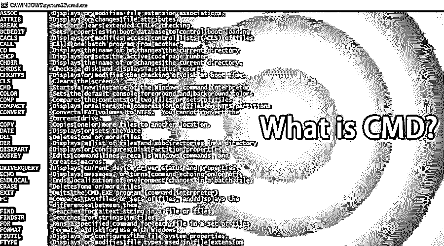

# CMD 是什么？

> 原文：<https://www.educba.com/what-is-cmd/>

## CMD 简介

CMD 是 Command 的缩写。命令提示符，或 CMD，是 Windows 操作系统的命令行解释程序。它类似于 DOS 和 Windows 9x 系统中使用的 Command.com，称为“MS-DOS 提示符”。它类似于在类 Unix 系统上使用的 Unix Shells。命令提示符是 [Windows 操作系统](https://www.educba.com/introduction-to-windows/)的原生应用程序，为用户提供了使用命令执行操作的选项。

命令提示符利用命令行界面与用户进行交互。在 Windows 操作系统中，此命令提示符界面是通过 Win32 控制台实现的。用户可以通过 CMD run 命令或转到其原始位置 C:\Windows\system32\cmd.exe 来打开该界面。

<small>网页开发、编程语言、软件测试&其他</small>

### 了解 CMD

使用命令 shell，您可以与操作系统直接交互。把命令提示符想象成一个解释器，它接受命令或用户输入，并把它们翻译成机器语言。这些命令是预定义的，执行特定的任务。这些命令也可以组合在一起执行一系列任务。此外，这些命令不需要手动输入，可以在批处理文件中编写，以自动执行一些手动任务，如进行预定的服务器备份、删除垃圾文件等。这些命令在网络故障排除或日常工作中非常方便。这些命令可以从许多[编程语言中调用，例如 Java](https://www.educba.com/java-programming-language-features/) ，这允许程序员通过命令提示符直接执行任务，否则将需要编写几行代码来执行相同的任务。

### Windows 命令和用法

让我们看看一些有用的[窗口命令](https://www.educba.com/windows-commands/)及其用法

| **命令** | **描述** |
| **乒** | 如果您想测试两个系统之间的[网络连接](https://www.educba.com/what-is-network-security/)，比如说源和目的地，那么您可以使用 ping 命令。它向目标系统发送一个 [ICMP 或互联网控制消息协议](https://www.educba.com/internet-control-message-protocol/)，并等待数据包形式的响应。 |
| **Netstat** | 它显示活动的 TCP 连接，即系统当前正在监听的端口。 |
| **Ipconfig** | Ipconfig 是最常用的命令之一。它显示网络配置值，如当前的 TCP/IP。它还允许您刷新域名系统和动态主机配置。 |
| **路径选择** | PathPing 用于确定任何路由器或子网中的网络问题。如果源系统和目标系统之间的多跳之间有任何数据包丢失，PathPing 可以根据从各个路由器或子网返回的数据包来确定并显示结果。 |
| **Tracert** | Tracert 命令跟踪接收信息包作为响应的目标系统的路径。 |
| **追加** | Append 类似于 MS-DOS 的 Path 命令。它允许您访问存在于不同目录中的文件，就像它存在于当前目录中一样。 |
| **get AC** | 如果您想知道物理地址或系统的 mac 地址，这个命令非常方便。它还可以确定远程系统的地址。 |
| **磁盘拷贝** | 顾名思义，它允许程序员将一张软盘的内容复制到另一张软盘上。 |
| **dir** | Dir 确实是所有命令中最有用的。它允许您填充文件夹中的所有文件和子文件夹。 |
| **驱动查询** | 它使管理员能够显示已安装的设备驱动程序及其属性的列表。 |
| **tasklist** | 您可以在本地桌面或远程机器上使用任务列表检查所有当前正在运行的进程。 |
| **密码** | 如果需要改变加密或显示现有的加密策略，可以使用的[密码。](https://www.educba.com/types-of-cipher/) |
| **PRN 乔布斯** | 它添加、删除和列出打印机驱动程序。 |
| **改变** | 它更改登录、COM 端口映射和安装模式的远程桌面会话主机服务器设置。 |
| **NSLookup** | Nslookup 显示可用于诊断 DNS 或域名系统基础架构的信息。只有在安装了 TCP/IP 协议的情况下，nslookup 命令才会起作用。 |
| **任务杀手** | 要终止任务管理器上出现的任何活动任务或进程，可以在此命令的帮助下终止。它利用进程 ID 来终止任务。 |
| **mstsc** | 使用 mstsc，您可以从本地系统建立与远程桌面的连接。 |
| **rdpsign** | 使用 rdpsign，用户可以对远程桌面上的 rdp 文件进行数字签名。 |
| **影子** | 使用 shadow，用户可以远程访问远程桌面会话。 |
| **tscon** | 通过 tscon，用户可以连接到远程系统上的另一个会话。 |
| **茨基尔** | 像 taskkill 命令杀死或删除本地桌面中当前运行的进程或任务一样，tskill 会杀死远程桌面中的处理器任务。 |
| **nfsadmin** | 它管理 nfs 服务器和 nfs 客户端 |
| **nfsstat** | 它显示或重置对 NFS 服务器[的呼叫计数](https://www.educba.com/nfs-in-linux/) |
| **rpcinfo** | 它列出了远程计算机上程序。 |

### 如何访问 CMD？

无论您使用的是什么版本，要访问命令提示符，请按照下列步骤操作。访问命令提示符的最快方法之一是使用运行窗口。要打开运行窗口，请按键盘上的 Windows 键。一旦你这样做，运行窗口将打开，然后写 cmd 并按下回车键。

只要你按下 ok，命令提示符窗口就会打开。

要在管理模式下运行命令提示符，请在任务栏的搜索栏中键入 cmd，然后右键单击 cmd。您将看到一个选项作为管理运行单击确定，然后命令提示符将在管理模式下打开。

### 结论

我们已经看到了一些有用的 windows 命令，它们在远程桌面或服务器上工作时非常方便。这些命令可以组合在一起，按顺序执行一系列任务，以自动执行一些冗余任务。Windows 命令可用于与网络文件系统(NFS)、远程桌面服务、windows 服务器以及外部和内部外围设备进行交互。

### 推荐文章

这是一个关于什么是 CMD 的指南。这里我们讨论了 CMD 的基本概念、windows 命令及其用法。您也可以浏览我们推荐的其他文章，了解更多信息——

1.  [Java 中的模板](https://www.educba.com/template-in-java/)
2.  什么是 ASP.NET？
3.  [什么是 ETL 测试？](https://www.educba.com/what-is-etl-testing/)
4.  [什么是流星？](https://www.educba.com/what-is-meteorjs/)

