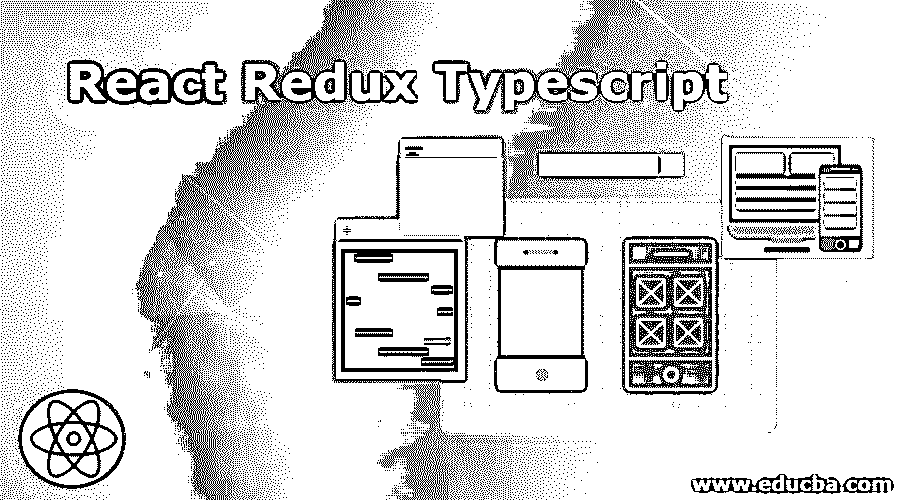
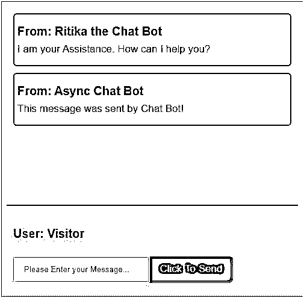

# React Redux 类型脚本

> 原文：<https://www.educba.com/react-redux-typescript/>

## React Redux 类型脚本简介

TypeScript 可以定义为 JavaScript 的高级子集。如果有人对统计类型的语言感兴趣，或者是 JavaScript 开发人员，那么 TypeScript 被认为是最好的选择。如果开发人员没有用静态类型的语言如 Go、JVM、C 等编写过。那么对于熟悉 JavaScript 的开发人员来说，使用 TypeScript 被认为是最好的合理选择。在本主题中，我们将学习 React Redux Typescript。对于 Redux 应用程序，TypeScript 提供了如下好处:

*   对于键入的代码，非常容易记录。
*   它为开发人员在一个良好的团队环境中提供了很好的体验。
*   UI 组件、动作和状态创建者以及还原者的类型安全。

### React Redux 是如何做到举例说明的？

**聊天机器人应用**

<small>网页开发、编程语言、软件测试&其他</small>

**src 文件夹内的组件**--

*   库存文件夹
*   应用程序. tsx
*   HistoryofChat.tsx
*   InterfaceofChat.tsx
*   index.tsx
*   maincontent.css
*   thunk.css

**库存文件夹内的组件-**

*   对话文件夹
*   结构文件夹
*   index.ts

**对话文件夹内的组件-**

*   活动. ts
*   conv _ 还原剂. ts
*   kind.ts

**结构文件夹内的组件-**

*   活动. ts
*   kind.ts
*   struc_reducers.ts

#### 1.activity . ts(*对话文件夹*)

`import { Message, SEND_MESSAGE, DELETE_MESSAGE } from "./kind";
export function sendMessage(newMessage: Message) {
return {
type: SEND_MESSAGE,
payload: newMessage
};
}
export function deleteMessage(timestamp: number) {
return {
type: DELETE_MESSAGE,
meta: { timestamp
}
};
}`

#### 2.conv _ reducers . ts(*对话文件夹*)

`import { ChatState, SEND_MESSAGE, DELETE_MESSAGE, ChatActionTypes } from "./kind";
const initialState: ChatState = {
messages: [] };
export function chatReducer(
state = initialState,
action: ChatActionTypes
): ChatState {
switch (action.type) {
case SEND_MESSAGE:
return {
messages: [...state.messages, action.payload] };
case DELETE_MESSAGE:
return {
messages: state.messages.filter(
message => message.timestamp !== action.meta.timestamp
)
};
default: return state;
}
}`

#### 3.kind . ts(*对话文件夹*)

`export interface Message {
user: string;
message: string;
timestamp: number;
}
export interface ChatState {
messages: Message[];
}
export const SEND_MESSAGE = "SEND_MESSAGE";
export const DELETE_MESSAGE = "DELETE_MESSAGE";
interface SendMessageAction {
type: typeof SEND_MESSAGE;
payload: Message;
}
interface DeleteMessageAction {
type: typeof DELETE_MESSAGE;
meta: {
timestamp: number;
};
}
export type ChatActionTypes = SendMessageAction | DeleteMessageAction;`

#### 4.activity . ts(*结构文件夹*)

`import { SystemState, UPDATE_SESSION } from "./kind";
export function updateSession(newSession: SystemState) {
return {
type: UPDATE_SESSION,
payload: newSession
};
}`

#### 5.kind . ts(*结构文件夹*)

`export interface SystemState {
loggedIn: boolean;
session: string;
userName: string;
}
export const UPDATE_SESSION = "UPDATE_SESSION";
interface UpdateSessionAction {
type: typeof UPDATE_SESSION;
payload: SystemState;
}
export type SystemActionTypes = UpdateSessionAction;`

#### 6.struc _ reducers . ts(*结构文件夹*)

`import { UPDATE_SESSION, SystemState, SystemActionTypes } from "./kind";
const initialState: SystemState = {
loggedIn: false,
session: "",
userName: ""
};
export function systemReducer(
state = initialState,
action: SystemActionTypes
): SystemState {
switch (action.type) {
case UPDATE_SESSION: {
return {
...state,
...action.payload
};
}
default:
return state;
}
}`

#### 7.index . ts(*股票文件夹*)

`import { createStore
, combineReducers
, applyMiddleware } from "redux";
import thunkMiddleware from "redux-thunk";
import { composeWithDevTools } from "redux-devtools-extension";
import { systemReducer } from "./structure/struc_reducers";
import { chatReducer } from "./conversation/conv_reducers";
const rootReducer = combineReducers({
system: systemReducer,
chat: chatReducer
});
export type AppState = ReturnType<typeof rootReducer>;
export default function configureStore() {
const middlewares = [thunkMiddleware];
const middleWareEnhancer = applyMiddleware(...middlewares);
const store = createStore(
rootReducer,
composeWithDevTools(middleWareEnhancer)
);
return store;
}`

#### 8.Application.tsx (*src 文件夹*)

`import * as React from "react";
import { connect } from "react-redux";
import { AppState } from "./stock";
import "./maincontent.css";
import { SystemState } from "./stock/structure/kind";
import { updateSession } from "./stock/structure/activity";
import { ChatState } from "./stock/conversation/kind";
import { sendMessage } from "./stock/conversation/activity";
import ChatHistory from "./HistoryofChat";
import ChatInterface from "./InterfaceofChat";
import { thunkSendMessage } from "./thunks";
interface AppProps {
sendMessage: typeof sendMessage;
updateSession: typeof updateSession;
chat: ChatState;
system: SystemState;
thunkSendMessage: any;
}
export type UpdateMessageParam = React.SyntheticEvent<{ value: string }>;
class App extends React.Component<AppProps> {
state = {
message: ""
};
componentDidMount() {
this.props.updateSession({
loggedIn: true,
session: "visitor_session",
userName: "Visitor"
});
this.props.sendMessage({
user: "Ritika the Chat Bot",
message: "I am your Assistance. How can I help you?",
timestamp: new Date().getTime()
});
this.props.thunkSendMessage("This message was sent by Chat Bot!");
}
updateMessage = (event: UpdateMessageParam) => {
this.setState({ message: event.currentTarget.value });
};
sendMessage = (message: string) => {
this.props.sendMessage({
user: this.props.system.userName,
message: message,
timestamp: new Date().getTime()
});
this.setState({ message: "" });
};
render() {
return (

<ChatHistory messages={this.props.chat.messages} />
<ChatInterface userName={this.props.system.userName}
message={this.state.message}
updateMessage={this.updateMessage}
sendMessage={this.sendMessage}
/>

);
}
}
const mapStateToProps = (state: AppState) => ({ system: state.system,
chat: state.chat
});
export default connect( mapStateToProps,
{ sendMessage, updateSession, thunkSendMessage }
)(App);`

#### 9.HistoryofChat.tsx (*src 文件夹*)

`import * as React from "react";
import { Message } from "./stock/conversation/kind";
interface ChatHistoryProps {
messages: Message[];
}
const ChatHistory: React.SFC<ChatHistoryProps> = ({ messages }) => {
return (

{messages.map(message => (

<h3>From: {message.user}</h3>

{message.message}

))}

);
};
export default ChatHistory;`

#### 10.InterfaceofChat.tsx (*src 文件夹*)

`import * as React from "react";
import { UpdateMessageParam } from "./Application";
interface ChatInterfaceProps {
message: string;
userName: string;
sendMessage: (message: string) => void;
updateMessage: (event: UpdateMessageParam) => void;
}
const ChatInterface: React.SFC<ChatInterfaceProps> = ({ userName,
message, updateMessage, sendMessage
}) => {
function keyPress(e: React.KeyboardEvent<any>) {
if (e.key === "Enter") { send();
}
}
function send() {
sendMessage(message);
}
return (

<h3>User: {userName} </h3>
<input
value={message}
onChange={updateMessage}
onKeyPress={keyPress}
className="chat-input"
placeholder="Please Enter your Message..."
/>
<button onClick={send}>Click To Send</button>

);
};
export default ChatInterface;`

#### 11.index.tsx (*src 文件夹*)

`import * as React from "react";
import { render } from "react-dom";
import { Provider } from "react-redux";
import configureStore from "./stock";
import Application from "./Application";
const store = configureStore();
const Root = () => (
<Provider store={store}>
<Application />
</Provider>
);
render(<Root />, document.getElementById("root"));`

#### 12.maincontent.css (*src 文件夹*)

`html,
body,
#root {
padding: 1;
margin: 1;
height: 99%;
line-height: 1.6;
font-size: 17px;
font-family: sans-serif, Helvetica;
color: #333330;
background-color: #c3ed74;
}
.parent {
height: 99%;
display: flex;
flex-flow: column;
}
.chat-history {
flex: 2;
overflow-y: auto;
}
.chat-interface {
border-top: 2px solid #5f6357;
background-color: #fff987;
padding: 11px;
}
.chat-interface h3 {
margin: 0.1;
}
.chat-interface input {
width: 41%;
padding: 11px 16px;
}
.chat-interface button {
cursor: pointer;
padding: 11px 16px;
font-size: 1em;
border: 1;
user-select: none;
outline: none;
color: #f0efeb;
background-color: #d11f72;
border-bottom-right-radius: 6px;
border-top-right-radius: 6px;
}
.message-item {
background-color: #f5e9ee;
margin: 11px 11px;
border: 2px solid #99878e;
padding: 13px 5px;
border-radius: 6px;
}
.message-item h3,
.message-item p {
margin: 0;
}`

#### 13.thunks.ts (*src 文件夹*)

`import { Action } from "redux";
import { ThunkAction } from "redux-thunk";
import { sendMessage } from "./stock/conversation/activity";
import { AppState } from "./stock";
export const thunkSendMessage = (
message: string
): ThunkAction<void, AppState, null, Action<string>> => async dispatch => {
const asyncResp = await exampleAPI();
dispatch(
sendMessage({
message,
user: asyncResp,
timestamp: new Date().getTime()
})
);
};
function exampleAPI() {
return Promise.resolve("Async Chat Bot");
}`

**输出:**

### 结论

在上述讨论的基础上，我们了解了 TypeScript、TypeScript 提供的好处以及何时以及由谁使用 TypeScript。上面已经成功开发了基于 React Redux TypeScript 的聊天应用程序。

### 推荐文章

这是 React Redux Typescript 的指南。在这里，我们讨论 React Redux 是如何与示例一起完成的，以及提供的好处和谁使用 TypeScript。您也可以阅读以下文章，了解更多信息——

1.  [还原备选方案](https://www.educba.com/redux-alternatives/)
2.  [反应工具](https://www.educba.com/react-tools/)
3.  [反应原生架构](https://www.educba.com/react-native-architecture/)
4.  [Redux 面试问题](https://www.educba.com/redux-interview-questions/)

