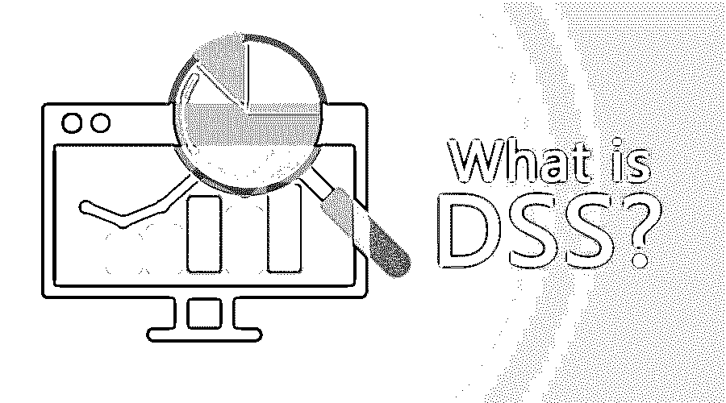
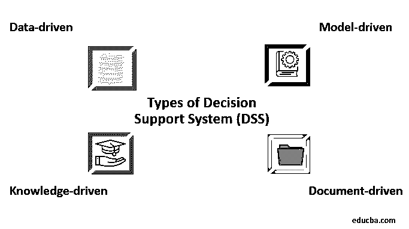

# 什么是 DSS？

> 原文：<https://www.educba.com/what-is-dss/>

## 决策支持系统概述

决策支持系统(DSS)是一种计算机化的信息系统，用于通过分析大型数据集来帮助组织或企业进行决策活动。它汇集了可用于解决问题和做出更好决策的信息。

它建议通过将决策支持系统应用于一类决策场景，使用期权理论来系统地分析、理解和量化灵活性。这种应用带来的灵活性被认为是期权组合价值的变化。将 MIS 文献中报告的 DSS 价值的轶事证据与期权理论化提供的信息进行比较。向支持残疾学生的大学成员提供教育和支持。

<small>网页开发、编程语言、软件测试&其他</small>

### 决策支持系统的组成

有 3 个主要的基础架构组件，如下所示:

#### 用户

决策支持系统的主要组成部分是用户。因为 DSS 的用户通常是经理、决策者等。，谁可能不是合格的计算机专家；因此，DSS 应该提供易于使用的界面和一些使用 DSS 的指导，以及与模型的交互，例如从模型中获得建议。

决策支持系统的主要目标是确保用户使用决策支持系统并从中受益。

#### 数据库管理系统

数据库管理系统充当决策支持系统的数据库。它存储了从不同来源收集的大量数据。它为用户交互提供了[逻辑数据结构](https://www.educba.com/data-structure-interview-questions/)。输入和输出存储在数据库中。所有的处理都在数据库中完成。

DBMS 应该通知系统用户如何访问数据库以及可用的不同类型的数据。

#### 基于模型的管理系统(MBMS)

该系统的功能是从 DBMS 中获取数据和[，并将数据转换成有助于正确决策的信息。它还应该为用户的模型开发提供适当的帮助。](https://www.educba.com/what-is-dbms/)

### 决策支持系统的组成

DSS 的组成部分可以分为:

1.  **输入**:用于分析的记录、数据因子、数字、特性。
2.  **用户知识和专业技能**:要运行正常功能并提供输入，用户必须知道如何使用系统。
3.  **用户界面** : DSS 应该通过提供一个结构良好的用户界面来支持模型构建和模型分析。
4.  **决策**:基于用户需求，由决策支持系统生成结果。

### 决策支持系统的类型

有各种类型的决策支持系统，它们被分类为:

#### 1.数据驱动

决策支持系统包括文件抽屉系统、数据分析系统、分析信息系统、数据存储系统，并强调大型结构化数据数据库的访问和操作。

#### 2.模型驱动的

决策支持系统模型来自多个领域或专业，可以包括会计模型、[财务模型](https://www.educba.com/types-of-financial-model/)、代表性模型、优化模型等。

#### 3.知识驱动

这种知识驱动侧重于知识，并建议管理者在一定的知识库分析的基础上采取行动。预定义的事实、存储过程、规则和限制也被用来解决问题。它还拥有解决问题的特殊专长，并且与数据挖掘密切相关。

#### 4.文档驱动

该系统通过集成一系列存储和处理技术来提供文档和分析的完整审查，从而帮助管理人员获取和管理非结构化文档和网页。

#### 5.沟通驱动

这也被称为群体决策支持系统(GDSS)。沟通驱动的决策支持系统包括多个致力于解决复杂问题的人。它有助于高管和经理共同努力，找到解决问题的最终方案。技术可用于通信驱动的决策支持系统，如微软的 NetMeeting、Groove 等。

### 决策支持系统的优势

*   它通过加快决策过程来节省时间。
*   它通过会议、[头脑风暴会议](https://www.educba.com/brainstorming-sessions/)等方式改善人们之间的交流。
*   决策支持系统生成的报告可以作为证据。
*   它有助于自动化流程。
*   降低成本

### 决策支持系统的缺点

*   霸王信息
*   地位的降低
*   意想不到的影响
*   货币成本
*   过多的 DSS 依赖

### 我们可以在哪里使用 DSS？

我们可以在很多方面使用 DSS。我们可以使用临床决策支持系统进行医疗诊断。银行信贷员可以使用 DSS 来验证贷款申请人或从事各种项目的工程公司的信用，并确定他们的支出是否具有竞争力。决策支持系统主要用于商业和管理，有助于识别负面趋势，更好地分配业务

随着技术的不断进步，DSS 不再局限于庞大笨重的大型计算机。DSS 基本上是一个软件应用程序。因此，它可以加载笔记本电脑，标签。此外，一些 DSS 应用程序可以通过移动设备访问。对于经常出差的用户来说，DSS 的灵活性是非常有益的。这让你总是消息灵通，让你在任何时候都能为你的业务和客户做出最好的决定。理想的系统能够使用和分析信息，让用户做出选择。DSS 包括以目标或预测收入和销售、时间段、销售数字和其他库存为重点的数据。

### 结论

DSS 对任何组织的整体绩效都非常有用。然而，决策支持系统也可能导致巨大的混乱、误解，甚至不准确的分析。决策支持系统为系统如何在公司中工作以及如何提高管理者的决策质量提供了基础。

### 推荐文章

这是什么是 DSS 的指南？.在这里，我们讨论了 DSS 的组件和各种类型的 DSS 及其优缺点。您也可以阅读以下文章，了解更多信息——

1.  [什么是数据泄露？](https://www.educba.com/what-is-data-breach/)
2.  [什么是大数据分析？](https://www.educba.com/what-is-big-data-analytics/)
3.  有哪些待办事项？
4.  [数据库管理系统中的数据模型](https://www.educba.com/data-models-in-dbms/)

