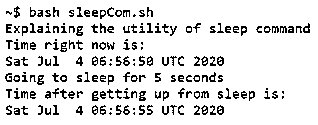
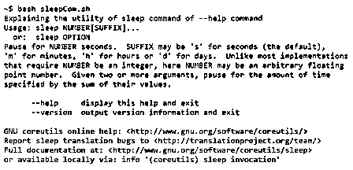
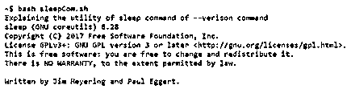

# Bash 睡眠命令

> 原文：<https://www.educba.com/bash-sleep-command/>

## Bash 睡眠命令简介

Sleep 作为一个命令在我们希望暂停代码执行一段时间的应用程序中被大量使用。现在问题来了，为什么我们需要暂停代码？答案很简单:在某些场景中，可能需要硬件之间的通信，这会导致时间的损失，而这些交互的结果将进一步用于代码流中。那么就必须暂停代码执行，以免遇到任何错误。它就像一个在指定时间内运行的虚拟执行。在这个主题中，我们将学习 Bash Sleep 命令。

### 句法

首先，我们先看一下语法是什么:

<small>网页开发、编程语言、软件测试&其他</small>

`sleep <number appropriate>{Suffix}`

现在让我们把它们分解成不同的元素，这个语法就是建立在这些元素上的。这里，sleep 是调用命令来执行间歇暂停代码的实用程序的关键字。接下来，<number appropriate="">只是代码暂停的时间。我们需要注意的是，这只是一个数字，不包括任何单位。现在我们想知道代码如何知道它是否必须暂停几秒、几小时、几天、几个月或几年！这就是{后缀}发挥作用的地方；{后缀}就是跟在数字后面的单位。使用这个命令可以知道代码需要暂停的时间。这个 bash 命令的后缀是根据代码需求的效用使用的，不同后缀选项的列表如下:</number>

这是单位秒。

M: 这是单位分钟。

这是单位小时数。

**D:** 这是单位天数。

任何超过天数的都只需要按照天数计算。Linux 的早期实现要求<number appropriate="">是一个整数，但是现在，这些甚至可以是浮点数。还有，万一有多个数字，这是非常不现实的，Linux 保证把它们加起来，用单个数字！现在，{Suffix}是添加到睡眠命令中的可选功能。在没有指定单位的情况下，默认情况下，它将假定{后缀}为秒。</number>

使用的另一种语法是:

`sleep OPTION`

同样，sleep 是一个外部命令，它调用暂停代码的工具，OPTION 是帮助开发人员使用 sleep 命令。在接下来的时间里，在另一个部分，我们将查看此罩下可用的所有选项！

### Bash 中的 Sleep 命令是如何工作的？

既然我们知道了 sleep 命令的语法，那么理解该命令背后的工作原理就变得更加重要了。所以，我们想回答的下一个问题是 sleep command 在 bash 中做什么，这将最终帮助我们回答 sleep command 是如何工作的。

睡眠命令有助于在指定的时间内暂停代码执行。这个代码执行只不过是管道中的 net 命令执行。从今以后，创建一个虚拟程序，运行指定的时间没有任何意图，除了消磨时间！它可以被设置成一个类似于我们的闹钟的系统，在指定的通知时间后响起。假设这是一个闹钟，让你在工作中小睡 15 分钟！

本质上，这种设置有助于通过具有睡眠命令效用的调度程序来调节重复性任务。例如，假设一个人需要每天将文件备份到另一个系统中。现在，人们可以编写代码来备份那些封装在 sleep 命令中的文件，这将使代码暂停一天！简单！如果您听说过 cron 作业，那么 sleep 实用程序正是它所利用的实用程序！

### 睡眠命令选项

正如我们在关于不同睡眠命令选项的语法中提到的，让我们一个一个地看它们:

#### 1.睡眠<number appropriate="">{后缀}</number>

**代码:**

`echo "Explaining the utility of sleep command"
echo "Time right now is:"
date=echo date
echo "Going to sleep for 5 seconds"
sleep 5s
echo "Time after getting up from sleep is:"
date=echo date`

**输出:**

我们可以看到，在执行睡眠命令之前，时间是 6:56:50，睡眠 5 秒后，时间是 6:56:55，这实质上意味着代码暂停了 5 秒！为了方便实用，我们不显示其他选项(如分钟、小时)的效用，但强烈鼓励学习者使用这些效用，并理解它们与第二个选项没有什么不同，可以在需要实现效用的情况下使用。

#### 2.睡眠——帮助

**代码:**

`echo "Explaining the utility of sleep command of --help command"
sleep --help`

**输出:**

该选项最终描绘了睡眠命令实用程序的文档或帮助文件。一旦命令被执行，它将退出 bash 脚本。

#### 3.睡眠-版本

**代码:**

`echo "Explaining the utility of sleep command of --version command"
sleep --version`

**输出:**

这个选项最终描绘了包含版本号、版权细节、许可证和作者等细节的版本。因此，从使用的角度来看，用户可以不受任何法律限制地使用这些命令，因为它们甚至可以根据许可条款和条件进行商业使用。

### 结论

本模块研究了业内广泛使用的睡眠属性的所有方面。到目前为止，我们可以很容易地将 sleep utility 的一个类似场景设置为一个在延迟执行时创建的虚拟作业。但是，对于上面的语法和示例，我们强烈建议您自己尝试一下，以便有信心在现实世界的示例中使用它们。

### 推荐文章

这是一个 Bash 睡眠命令的指南。这里我们讨论 Sleep 命令在 Bash 和 Options 中是如何工作的，以及代码和输出。您也可以看看以下文章，了解更多信息–

1.  [Linux tr 命令](https://www.educba.com/linux-tr-command/)
2.  [外壳脚本睡眠](https://www.educba.com/shell-script-sleep/)
3.  [JavaScript 睡眠功能](https://www.educba.com/javascript-sleep-function/)
4.  [Linux 触摸命令](https://www.educba.com/linux-touch-command/)

