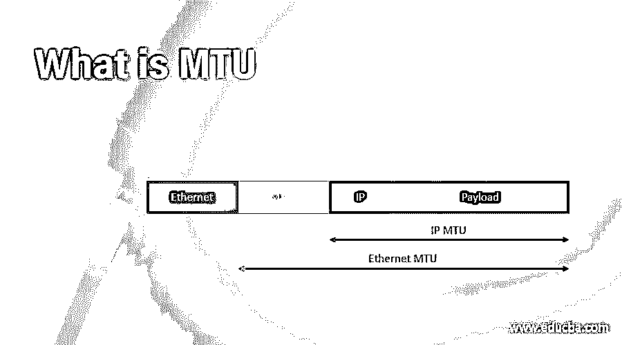

# 什么是 MTU

> 原文：<https://www.educba.com/what-is-mtu/>

## MTU 简介

对于网络，MTU(最大传输单位)是一个指标，反映了网络系统确认的最大数据包。例如，想象达到高度限制的汽车和卡车不能达到高速公路通道或隧道的高度限制，就像超过网络 MTU 的数据包不能通过该网络一样。但超过 MTU 的数据包被分解成更小的部分，以适应汽车和卡车。这个过程被称为分段。当数据包到达目的地时，会被重组。

### MTU 的工作

假设 MTU 大小(TCP)是由互联网传输控制协议(TCP)定义的，那么 350 B 是可以分配的协议的最大数据单元大小。在这种情况下，可能发生以下情况:在这种情况下，如果系统发送大于 MTU 的分组，分组大小> 350 B，则系统分组被分成更小的分组，以确保不超过分组的最大大小。将一个大数据包分成多个小数据块，使每个数据块都不会达到最大帧大小的过程称为碎片化。这些稍后在最终的客户目的地被重新组装。在 MTU 大小中，系统在网络连接中将数据包作为单个帧发送。然而，比 MTU 小得多的数据包会导致网络延迟和低效率。在这种情况下，重组数据包是不合适的。如果系统发送 MTU 大小的数据包，它们将作为单个帧在网络连接中传输。然而，比 MTU 小得多的包会导致延迟和网络故障。在这种情况下，不需要重组数据包。

<small>网页开发、编程语言、软件测试&其他</small>

### 什么是数据包？

所有通过互联网传输的信息都被分成更小的部分，称为数据包。例如，当网页从 web 服务器发送给膝上型电脑用户时，一系列数据包通过互联网传输网页的组件数据。然后，这些数据包被放在笔记本电脑上的原始网站上。数据包有两个主要部分，即报头和有效载荷。报头包含关于分组的源地址和目的地址的信息，而有效载荷是分组的实际内容。把头部和有效载荷想象成包裹的内容，就像运输标签一样。(与数据包不同，网络上的数据包附有多个网络协议报头。)

### 碎片化是如何工作的？

所有网络路由收到的每个 IP 数据包的大小将根据接收该数据包的下一个路由器的 MTU 进行检查。当数据包到达下一个路由器的 MTU 时，第一个路由器会将有效负载分成两个或三个带有自己报头的数据包。具有复制的报头(包括源和目的 IP 地址等)。)与原始包的不同之处在于每个包中有许多主要的修改。此外，路由器还会编辑 IP 头中的一些字段，使数据包分散并需要重新组装，剩余多少个数据包，发送多少个数据包。

假设一家运输公司运送的货物达到了他们某个仓库的重量要求。运输公司将箱子里的东西分成三个更小的包，而不是拒绝包裹递送。它还复制了每个包裹的运输标签，并添加了一条注释，暗示每个包裹是必须一起到达的序列的一个组成部分—第一个包裹是 3 的 1，第二个是 3 的 2，等等。(航运公司的这种做法会侵犯隐私，因此这种情况不会发生在现实世界中。)

### 什么是 MSS？

最大分段大小代表 MSS。TCP 是传输层，而不是第 3 层，用于互联网第 4 层中的 MSS。对于 MSS，只关心每个分组中的有效载荷大小。来自 MTU 的 TCP 和 IP 报头的长度通过减去它来确定。

### MTU 发现的路径是什么？

路径 MTU 发现(或 PMTUD)是发现网络路径上所有计算机、路由器和交换机的 MTU 的方法。例如，如果计算机 A 和服务器 A 使用 PMTUD，则路由器 B 的 MTU 要求将被识别，并且分组大小被调整以确保碎片不会被实现。

### 推荐文章

这是一个什么是 MTU 的指南。在这里，我们将讨论分段如何与 MTU 一起工作，以及什么是数据包；我们希望这篇文章对您有所帮助。您也可以看看以下文章，了解更多信息–

1.  [路由算法](https://www.educba.com/routing-algorithms/)
2.  [什么是 TCP/IP？](https://www.educba.com/what-is-tcp-ip/)
3.  [TCP/IP 模型](https://www.educba.com/tcp-ip-model/)
4.  [什么是 IP？](https://www.educba.com/what-is-ip/)

