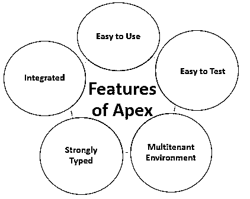

# 什么是 Apex？

> 原文：<https://www.educba.com/what-is-apex/>

## Apex 概述

在了解 Apex 之前，我们应该对 Salesforce 有一个基本的了解。所以我们来看看，了解一下什么是 Salesforce。虽然我们都在一家 IT 公司工作，但我听说过“销售力量”这个词，但不知道它到底是什么？因此，Salesforce 是全球使用的头号 CRM ( [客户关系管理](https://www.educba.com/customer-relationship-management-tools/))平台，它允许其客户在线开发和使用他们的应用程序，而无需购买基础架构、进行设置和管理一切。在 Salesforce 出现之前，公司通常将其 CRM 解决方案托管在自己的服务器上，并且需要几个月甚至几年的时间来设置一切，所有这一切的成本变得太高，无法承受。Salesforce 随后推出了 Saas(软件即服务)解决方案，取代了漫长的安装过程和昂贵的许可合同，只需允许设备在云上维护一切，并且只需支付几美元的月订阅费。它的 lightning 平台允许客户只专注于快速、简单和有效地创建应用程序。

了解了什么是 Salesforce 之后，你一定在思考 Apex 以及它在 Salesforce 中的作用。所以 Apex 基本上就是一种类似 Java，Python 等的编程语言。Apex 是强类型的(这意味着我们必须显式定义数据的数据类型，编译器将考虑指定类型的数据，而不考虑其他类型的数据)，面向对象的(基于像 Java 这样的对象的概念)编程语言，开发人员在 Flow.com 服务器上创建应用程序时使用这种语言。开发人员可以执行流和事务控制语句，同时使用 Apex 对 Flow.com API 进行 API 调用。Apex 革新了开发人员创建按需应用的方式。它允许客户向他们的应用程序添加业务逻辑。

<small>网页开发、编程语言、软件测试&其他</small>

### Apex 的特征

apex 的特征如下所示:

*   **易于使用:** Apex 非常易于使用，因为它使用类似 Java 的语法，非常易于理解和编码。Apex 使用简单的循环语法、块和条件语句语法、对象和数组注释，这与 Java 语法非常相似。
*   **集成:** Apex 内置 DML 操作支持，如插入、删除、更新和内置 DML 异常处理。它支持允许一次处理多个记录的循环。它支持 SOQL 和 SOSL 查询处理，后者返回一组主题记录。
*   **强类型:** Apex 是一种强类型语言，这意味着用户需要定义每个变量的数据类型，这不会在编译时造成任何混乱。
*   **多租户环境:** Apex 像其他照明平台一样运行在多租户环境中，这意味着只有一个实例运行在服务器上，为多个租户服务。
*   **易于测试:** Apex 提供了创建和运行单元测试的内置支持。它包括测试结果，这样用户就可以知道覆盖了多少代码。它确保在任何平台升级之前执行整个代码。

### 我们应该什么时候使用 Apex？

Apex 允许其开发人员创建复杂的 CRM 应用程序，提供对 Salesforce 数据库和客户端-服务器界面的访问，以创建第三方 SaaS 应用程序。它还允许根据复杂的业务需求定制预构建的应用程序。Apex 提供了如此多的工具来创建应用程序。以下是选择 Apex 开发应用程序的一些重要原因:

1.  开发人员可以使用 Apex 创建与不同系统集成的 web 服务。使用 API 调用与不同应用程序交互的应用程序很容易使用 Apex 开发。
2.  创建需要复杂业务逻辑且不受工作流支持的应用程序。
3.  创建电子邮件服务。
4.  使用复杂事务逻辑的应用程序，其中必须维护整个事务记录，而不仅仅是单个记录。
5.  在需要更新记录的地方执行一些逻辑，比如触发器。(当某些情况发生并且记录被更新时，事件被注入)。

### Apex 是如何工作的？

Apex 完全运行在按需照明平台上，所有的数据(代码)都保存在云上。因此没有存储和维护代码的开销。

**对于开发人员:**当开发人员编写代码并保存到平台应用服务器时，服务器首先将代码编译成一组可以被 Apex 运行时解释器理解的指令，然后将这些指令保存为元数据。

**对于最终用户:**当最终用户触发执行 Apex 代码时，平台应用服务器检索那些编译后的指令，这些指令被保存为元数据，并发送给运行时解释器，然后将结果发送给客户端。

开发人员和最终用户在 Apex 上工作就像在标准平台应用程序中工作一样简单。

### 优势

*   无需购买基础架构和雇佣 IT 人员，因为 Salesforce 提供了所有设施。
*   性价比高，作为应用的维护成本，各种软件的授权成本相当高，比买 Salesforce 的包月还高。
*   Salesforce 为访问应用程序的最终用户提供应用程序安全性、完全身份验证和授权。
*   对于开发人员来说，在 Salesforce.com 平台上开发应用程序很容易，因为开发人员可以使用现有的应用程序，或者根据业务需要对现有的应用程序进行更改。
*   提供按需和多租户平台。此外，Apex 允许其开发人员访问第三方 Saas 应用程序的 Salesforce.com 后端数据库。

### 不足之处

虽然 Apex 没有什么大的缺点，但也有一些限制，如下所述:

*   与其他编程语言不同，不能在 Apex 中创建线程。
*   如果需要，开发人员不能更改标准功能。它只能阻止代码中包含的功能或添加一些新功能。
*   不能在 Apex 中创建临时文件。
*   开发人员需要记住，他们正在创建的应用程序应该处理多个记录(更新、插入),因为所有 apex 请求都从数据库返回大量记录。
*   它不能在用户界面上显示元素。

### 这项技术将如何帮助你的职业发展？

随着每个行业都从 it 和 CRM 转向云，IT 在帮助公司减少基础设施开销方面发挥了巨大作用，并且更专注于扩展业务。Apex，Salesforce 开发中使用的语言，正在被 AWS、U.S. Bank、Dell、Accenture、Deloitte、farmers insurance 等大型组织接受。，因为这有助于提升他们的业务。为了转向按需多租户平台，组织正在寻找在 Salesforce 开发(如 Salesforce 开发、Salesforce 管理、变更管理、区域管理、产品目录、部署策略等)方面具有丰富知识的人员。学习 Salesforce 如何改变整个职业道路并为 It 专业人员开辟新的工作机会，这一点非常清楚。

### 结论

随着 IT 的日益进步，新的平台正在出现，使组织能够减少开销，只关注主要的业务目标。Apex 是随着 IT 领域的繁荣而出现的，它允许人们提升他们的业务，并为专业人士创造新的就业机会。

### 推荐文章

这是什么是 Apex 的指南？.这里我们讨论了 Apex 的特性及其优缺点。您也可以阅读以下文章，了解更多信息——

1.  [Java 中的 API 是什么？](https://www.educba.com/what-is-api-in-java/)
2.  [什么是缓冲区溢出？](https://www.educba.com/what-is-buffer-overflow/)
3.  [什么是 JVM？](https://www.educba.com/what-is-jvm/)
4.  [Linux 中 Raid 是什么？](https://www.educba.com/what-is-raid-in-linux/)

