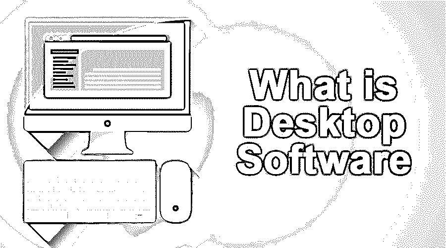
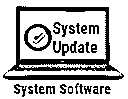
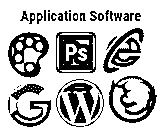
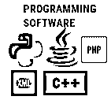
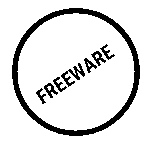
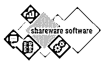
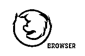

# 什么是桌面软件？

> 原文：<https://www.educba.com/what-is-desktop-software/>

## 桌面软件介绍

要理解桌面软件的概念，首先需要熟悉软件的概念。软件被定义为一个计算机程序或一组指令，使计算机能够相应地运行；计算机需要此软件来执行特定任务；软件可以定义为在计算机或任何其他可编程设备上运行的应用程序、程序、脚本的统称。根据不同的标准，软件被分为许多种类。根据软件的可用性或程序的预期用户，软件被分为应用软件和系统软件。

### 了解桌面软件

桌面软件或应用程序可以被认为是服务或 web 应用程序的本地版本，它们提供应用程序处理和用户之间的交互选项，而不直接与 web 服务连接。这种桌面软件获得了巨大的欢迎，因为它们为相当庞大的 web 服务提供了跨平台的解决方案，并具有在出现故障时不会影响架构的额外优势。

<small>网页开发、编程语言、软件测试&其他</small>

### 解释桌面软件

桌面应用程序安装在个人或工作计算机上，这些安装在每台计算机上都是必要的；桌面应用程序的主要缺点是这类应用程序的更新非常困难，需要在每台单独安装应用程序的计算机上推送。桌面应用程序受限于物理位置，因此面临可用性限制，桌面应用程序的最大优势在于其速度和性能击败了 [web 应用程序，因为它独立于互联网连接，桌面应用程序本质上是独立的，因此限制在桌面软件上无效。除此之外，web 应用程序没有带宽限制，因为它独立于任何互联网需求。](https://www.educba.com/what-is-web-application/)

### 桌面软件如何工作？

桌面应用程序是运行在独立桌面上的二进制可执行文件。桌面应用通常可以同时支持多种功能。一大组执行职责的同时任务或任务序列被赋予桌面应用程序。在 Windows 操作系统中，桌面应用程序以基本的有限权限运行，默认情况下这是应用程序运行所必需的，但用户可以授予这些权限以提升管理权限。例如，如果没有提升的权限，一些应用程序可能无法正确运行，因为这些程序能够更改基于操作系统的文件。反病毒程序就是这类程序的例子。

桌面应用程序可以并行运行多个实例。桌面应用可以在任何版本的 Windows 上运行。某些应用可能与旧版本的 Windows 不兼容；基本的编程特性决定了应用程序源代码中的这一点。这些桌面应用程序需要为基于 [Windows 的服务](https://www.educba.com/introduction-to-windows/)安装额外的配置设置，这些设置授予它们使用各种系统资源的权限，并使它们能够根据客户要求执行相关任务，例如防病毒[和 VPN 应用程序](https://www.educba.com/vpn-applications-for-pc/)。

桌面应用程序可能包含与其功能相关的任何内容，列在 PC 控制面板选项的 windows 部分，也可以通过列表选项从该目录中卸载。桌面应用程序为用户提供了手动更新的机会，或者通过使用开发人员批量发布的更新服务或更新应用程序或服务来自动执行更新。桌面应用程序可以根据许可类型分为专有和开源。

### 解释不同类型的桌面软件

根据软件的功能，桌面应用程序可以分为:

#### 1.系统软件

它们在硬件之间进行协调，并提供另一个软件平台；从某种意义上来说，它就像一个母体软件，为它们提供赖以生存的环境和资源。它是任何计算机操作中最原始的软件，对计算机的正常运行至关重要。

#### 2.应用软件

应用软件，或者用通俗的语言称为应用程序，是那些使用户能够执行他们选择的任务的软件。这些是非必要的软件，由用户根据他/她的要求安装在系统软件提供的环境中。

#### 3.编程软件

编程软件是 studio 框架应用程序，旨在编写、测试、故障排除和开发软件程序和应用程序。许多编程语言编辑器，如 Eclipse for Java、Visual studio for dotnet 都属于这一类。它们用于创建系统和[应用软件](https://www.educba.com/what-is-application-software-its-types/)，并为运行继承框架编程特性的基于编程的代码提供平台。

#### 4.免费软件

该软件可供用户免费下载和安装，不需要任何许可。

#### 

5。共享软件

共享软件是免费试用的。它们可以与每个人共享，并防止主要功能；但是，它们可以洞察父软件的工作情况，并在试用期到期时停止工作或通知用户购买完整版本。

#### 6.浏览器

这些应用程序用于查看和访问网站及其内容。它们是设计用来呈现标记语言的应用程序，这些标记语言用于设计任何网站的 web 界面。

### 结论

最后，让我们总结一下桌面应用程序的优点

任何桌面应用最大的优势就是效率高。这是一个独立的安装程序，一次只能满足一个用户的需求；独立于服务器端连接，最大限度地利用资源和事件处理来满足用户需求。桌面应用程序具有很高的界面灵活性，因为它们的设计考虑到了平台和界面。桌面应用程序更加用户友好、反应灵敏、可定制。与 web 伙伴相比，本机桌面应用程序的稳定性也更高。因为任何桌面应用程序都是可执行的程序，所以它们独立于任何互联网要求，并按照开发人员设计的方式运行。

### 推荐文章

这是一个什么是桌面软件的指南。这里我们讨论了桌面软件的概念、工作原理和类型。您也可以浏览我们推荐的其他文章，了解更多信息——

1.  [什么是模糊逻辑？](https://www.educba.com/what-is-fuzzy-logic/)
2.  [什么是 CMD？](https://www.educba.com/what-is-cmd/)
3.  [什么是 Appium？](https://www.educba.com/what-is-appium/)
4.  [安卓 VPN 应用](https://www.educba.com/vpn-applications-for-android/)

