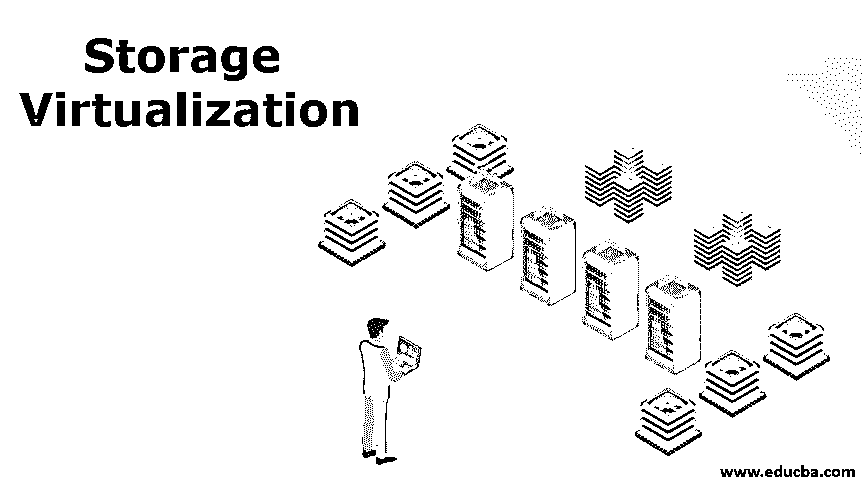
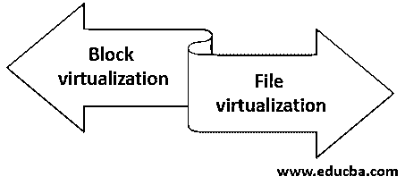
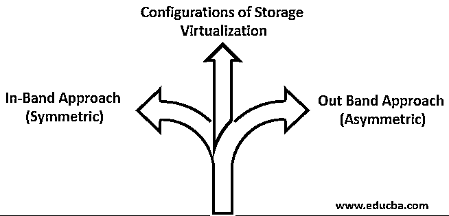

# 存储虚拟化

> 原文：<https://www.educba.com/storage-virtualization/>

## 存储虚拟化简介

存储虚拟化基本上是将各种设备中可用的存储组合/池化，并将其作为单个存储。通过利用软件并聚合它们以在虚拟系统/环境中使用，可以识别可用存储。实际上，该软件会持续监控来自任何虚拟/物理系统的各种 I/O 请求，并拦截这些请求，然后将其发送到适当的位置，在虚拟环境中维护组合存储。这种存储虚拟化技术实际上有助于管理员以有效和高效的方式进行任何数据恢复、备份或归档，所用时间比平时相对较少。

### 存储虚拟化的类型

这些存储系统通常为我们的系统提供两种访问方式，即基于数据块的访问或基于文件的访问。

<small>Hadoop、数据科学、统计学&其他</small>

因此，我们可以将存储虚拟化大致分为:

#### 1.块虚拟化

在数据块虚拟化中，我们基本上将逻辑存储与物理存储分开，以便用户/管理员可以访问而不必访问物理存储，基本上这样做有助于管理员在管理不同存储时获得很大的灵活性。

#### 2.文件虚拟化

在文件虚拟化中，它基本上消除了在文件级别访问数据时对数据实际所在位置的依赖性。这基本上有助于克服网络连接存储面临的挑战，还有助于优化存储利用率，并帮助我们以无中断的方式进行一些文件迁移。

### 虚拟化方法

虚拟化通常是指将不同的可用存储汇集在一起，并在虚拟环境中的单个存储中维护它们，超融合基础架构等最新技术不仅利用虚拟存储，还利用电力和网络。

让我们看看在虚拟环境中使用这些存储的不同方式:

#### 1.基于主机的虚拟化方法

在这种方法中，虚拟化是在主机级别完成的，在这种情况下，我们为用户提供具有不同容量集的虚拟存储，其中有多个主机，无论终端用户使用的是虚拟机还是访问云存储的个人计算机。虚拟化是在软件的帮助下完成的，对于我们的物理存储，我们可以使用任何设备。让我们看看这种方法的一些优点和缺点。它的主要优点是设计和编码简单，可以支持任何类型的存储，有助于提高存储利用率。一些顾虑是，每个操作系统都有独特的软件，主机的同步是一项困难的任务，优化只能在成本的基础上进行。

#### 2.基于阵列的虚拟化方法

在这种方法中，我们基本上将存储表示为代表物理存储的设备阵列，通常这些存储由 HDD(硬盘驱动器)和 SDD(固态驱动器)组成。我们利用不同的软件来处理这些存储阵列，并将它们隐藏在用户/来宾级别。这种方法的一些优点是，我们不需要任何类型的额外硬件/基础架构，并且在处理特定 I/O 时零延迟。一些缺点是，所有存储，如主存储、辅助存储等。将需要相同的带宽量，因此需要基础架构，这是特定于供应商的矩阵的，并且没有全面优化存储利用率

#### 3.基于网络的虚拟化方法

这是当今许多大企业广为使用的方法。在这种方法中，它利用光纤通道，其中任何网络设备(如专门构建的服务器或智能交换机)都连接到 SAN ( [存储区域网络](https://www.educba.com/what-is-storage-area-network/))，并将作为虚拟存储池呈现给来宾用户。这种方法的主要优势在于，它有助于实现真正的异构虚拟化，有助于提高性能，所有涉及的存储只有一个管理设备，并且可以轻松地跨所有设备复制服务。一些主要的缺点是很难解释所涉及的矩阵，增加了 I/O 的延迟，难以设计和编码，并且当我们处理快速元数据时很难实现。

### 存储虚拟化的配置

理想情况下，我们有两种不同的方式来配置存储虚拟化，它们是:

#### 1.带内方法(对称)

在这种方法中，我们将虚拟环境配置存储在数据路径本身中，就像存储在数据和控制流中一样。这种解决方案被认为易于实施，因为我们不使用任何类型的软件。我们在数据路径中进行不同层次的抽象。这些解决方案帮助我们大大提高了设备的性能，也延长了设备的使用寿命。带内解决方案的一个例子是 IBM 的总存储区域网络卷控制器。

#### 2.带外方法(不对称)

在这种方法中，虚拟环境的实施是在数据路径之外完成的，因为数据流和控制流是分开的，这可以通过将元数据与数据分开并将它们放在不同的位置来实现。这种虚拟化包括将所有的表转移到拥有所有元数据文件的元数据控制器。通过分离这两个流，我们实现了存储区域网络所提供的全部带宽的使用。

### 存储虚拟化的优势

现在，我们已经了解了什么是存储虚拟化及其类型，以及我们如何实施它们，现在让我们来看看转向存储虚拟化的一些好处:

*   即使主机出现故障，我们的数据也不容易被破坏，因为我们将数据存储在一个不同的、方便的地方。
*   当我们在存储中实现某种程度的抽象时，保护、提供和使用我们的数据是很容易的。
*   附加功能，如恢复、复制、复制等。可以轻松完成。

### 结论

到目前为止，从这篇文章中，您已经对存储虚拟化及其技术、优点和缺点有了相当多的了解。我们有必要采用这种虚拟化方法，因为它有助于降低数据存储方式的复杂性，也有助于存储管理员在更短的时间内轻松执行灾难恢复、数据备份或归档等任务。

### 推荐文章

这是存储虚拟化指南。在这里，我们将简要介绍存储虚拟化以及不同的类型、方法和优势等。您也可以浏览我们推荐的其他文章，了解更多信息——

1.  [云计算虚拟化的优势](https://www.educba.com/virtualization-in-cloud-computing/)
2.  [什么是云计算中的虚拟化？](https://www.educba.com/what-is-virtualization-in-cloud-computing/)
3.  [CPU 虚拟化的重要性和类型](https://www.educba.com/cpu-virtualization/)
4.  [五大虚拟化平台](https://www.educba.com/virtualization-platforms/)

