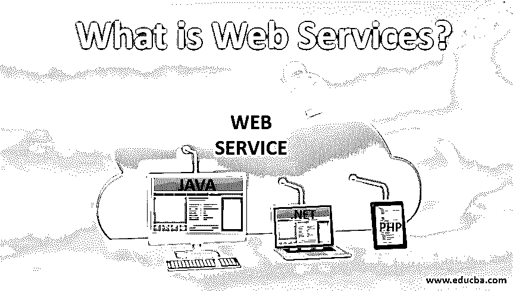
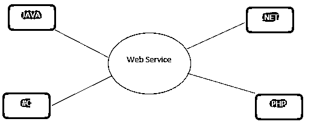

# 什么是 Web 服务？

> 原文：<https://www.educba.com/what-is-web-services/>

## Web 服务简介

尖端商业应用程序使用各种编程阶段来创建电子应用程序。一些应用程序可能是用 Java 创建的，其他的可能是用。Net，而[Angular JS](https://www.educba.com/what-is-angularjs/)，Node.js 中的其他一些等等。这就是 web 服务出现的原因。Web 服务提供了一个典型的平台，允许基于不同编程语言的不同应用程序能够相互交流。互联网的发展创造了网络服务的可能性。网络服务旨在推动互联网成为一个基于价值的设备，而不仅仅是一个视觉装置。本文将主要关注与 web 服务相关的三个 www(谁、为什么、何时)。

**关键词:**客户端-服务器，WSDL，交易数据，请求报文，响应报文

<small>网页开发、编程语言、软件测试&其他</small>

### 什么是 Web 服务？

以下方式可以描述 Web 服务的特征:

*   它是用于通信的客户机-服务器应用程序段。
*   系统中两个小工具之间的通信技术。
*   它是一个可互操作的机器对机器通信的产品框架。
*   它是两个小工具或应用程序之间数据交易的各种规范或惯例。

如图(图 1)所示，Java。net，PHP 等。应用程序可以通过系统上的 web 管理与不同的应用程序对话。例如， [Java 应用程序](https://www.educba.com/javafx-applications/)可以与 Java 合作。Net 和 PHP 应用程序。因此，web 管理是一种与语言无关的通信方法。

### Web 服务是如何工作的？

以下是对其工作原理的解释:

*   Web 服务作为一种请求-响应模式，通过利用开放的规范，例如 HTML、XML、WSDL 和 SOAP，来支持不同应用程序之间的通信。
*   一个元素将请求其合作伙伴的一些支持，以成为特定的专家服务提供者。根据要求，专业合作社将通过反应消息做出反应。因此，有两条消息，包括一条请求消息(XML)和一条响应消息(XML)。我们可以制造一个 Java-put together web administration，它是从你的 Visual Basic 程序中打开的，这突然增加了对 Windows 的需求。
*   管理使用 XML 来标记信息，使用 SOAP 来传递消息，最后使用 WSDL 来描述管理的可访问性。

### Web 服务的组件

有三个主要组成部分。让我们详细研究一下:

#### 1.肥皂

*   [SOAP 是简单对象访问协议的缩写](https://www.educba.com/what-is-soap/)。
*   用于 web 管理的基于 XML 的约定。
*   W3C 关于应用程序间通信的建议。
*   平台独立和语言独立。

#### 2.WSDL

*   WSDL 是 Web 服务描述语言的缩写。
*   它是一个 XML 文档。
*   它包含有关网站管理的数据，例如，技术名称、策略参数以及如何获得它。
*   它是 web 管理应用程序之间的接口。

#### 3.UDDI

*   UDDI 是通用描述、发现和集成的缩写。
*   基于 XML 的系统。
*   包含有关 web 管理的数据。

### Web 服务的功能

我们目前很快地绘制出我们接受的最重要的特性，对于这些特性，在 web 服务的愿景可能实现之前，必须存在度量标准。我们很快地描述了它与现有网络的关系，并为每个功能进行了适当的处理创新，以及应该将这些领域的想法传达给哪些人。

*   互操作性:互操作性是两个不同的 web 服务执行之间相互通信的能力。互操作性可能是最基本的组件，因为没有它，通信是不可想象的。从通信约定和使用的信息编码，到更高层的应用程序语义，例如交换和安全设置，互操作性的必要性通常存在于约定堆栈的所有层。
*   **松散耦合:**web 服务接口可以在一段时间后改变，而不会牺牲客户与管理部门的连接能力。
*   **支持文档交换:** [Web 服务支持](https://www.educba.com/architecture-of-web-services/)记录的直接交易，以鼓励业务协调。
*   **可靠的消息传递:**正因为如此，在互联网上利用 web 优势的应用程序将经常需要利用可靠的非并发通知约定，而不是 RPC 样式的约定。这考虑到了近似耦合的应用程序的开发，这些应用程序对于形成应用程序的各个管理部门的暂时失望是更强的。
*   **支持文件替换:**XML 的一个主要优势是它的标准方法，对于现在不太容易确定的事情，无论如何也是混淆的记录。这些记录可能像对着现在的改编说话一样简单，也可能像对着整本电子书说话或请求引用一样令人难以置信(RFQ)。净捐款有助于直接交换记录，以鼓励企业加入。

### 优势

以下是 5 大优势:

*   **互操作性:**这是最显著的优势。Web 服务通常在私有系统之外工作，为工程师提供了一个非排他性的解决方案。按照这种思路，新成立的行政机构可能会有更长的预期寿命，使新成立的行政机构有更高的收益率。Web 服务同样允许设计人员使用他们喜欢的编程语言。同样，由于利用了基于原理的专门技术，它们基本上是免费的。
*   **连接**:在各种网络和组织内部和之间提供更快的通信。
*   **部署能力**:部署在标准互联网进步之上。例如，利用 Apache、Axis2 进行 HTTP、WSDL 驱动的管理。这使得跨各种环境发送变得容易。
*   **可重用性:**它被填充为构建块，使得在不同的服务中重用 Web 服务片段变得简单。
*   成本: Web 服务使用 SOAP over HTTP 约定来利用您当前的 ease web 实现 Web 管理。

### 结论

制作 Web 服务包括大量类似的想法和任务，我们在制作任何种类的应用程序时都会面临这些。我们描述创建服务所需的有用性和逻辑。我们创建服务，到达不同的细分市场，并使用资产来完成任务。它以积木的形式出现。

### 推荐文章

这是一个什么是 Web 服务的指南？.在这里我们讨论它是如何工作的？以及 Web 服务的组件、特性和五大优势。您也可以浏览我们的其他相关文章，了解更多信息——

1.  [用 Python 发送邮件](https://www.educba.com/send-mail-in-python/)
2.  什么是 ASP.Net 网络服务？
3.  [网站类型](https://www.educba.com/types-of-websites/)
4.  [网络应用安全](https://www.educba.com/web-application-security/)

