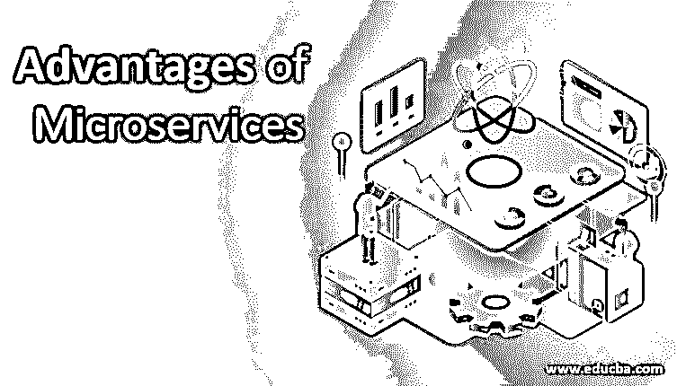
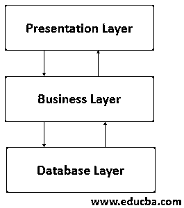
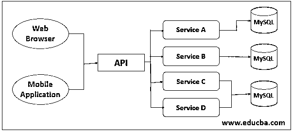

# 微服务的优势

> 原文：<https://www.educba.com/advantages-of-microservices/>

## 微服务优势介绍

所有 IT 公司都在围绕微服务展开大量讨论。随着新趋势的出现，每个公司都必须采用新技术来维持自己在市场中的地位。那么微服务背后的症结是什么？为什么以及如何在我们周围掀起热潮？本文将介绍整体架构和微服务架构，它们之间的区别以及优缺点。

微服务=小服务 1 +小服务 2 +小服务 3 + …

<small>网页开发、编程语言、软件测试&其他</small>

### 整体设计

整体式设计是指构建在一个整体中。技术定义可以是一个单一的应用程序，它有一个分成多个特性的代码库。它有一个可执行或可部署的文件。IT 行业使用这种架构已经很长时间了。有时这种架构也称为多层架构，分为三层或更多层。

### 单片架构的优缺点

以下是单片架构的优点和缺点:

#### 优势

*   开发很简单。
*   测试单片应用程序很容易。只需启动应用程序进行端到端测试，就万事大吉了。我们也可以使用 Selenium 编写自动化。
*   部署很容易，只需复制打包的应用程序并将其部署在服务器上。

许多成功的企业应用程序都是以单一的方式开发的。单片架构已经成功运行了几十年。但是，随着新技术改变市场，IT 行业的工作方式也发生了转变。到底发生了什么？让我们看看这一切是如何开始的。

#### 不足之处

*   庞大的代码库让理解变得复杂。
*   由于庞大的代码库，ide 上的霸主。
*   一切都是紧密耦合的，这使得改变技术或框架变得极其困难。
*   因为它太大，所以应用程序会减慢启动时间。
*   具有这种架构的应用程序很难扩展。
*   可靠性是个问题。任何错误修复都有可能导致整个流程瘫痪。

### 从整体服务到微服务的旅程

在最初的日子里，业界更多地关注将 web 浏览器作为客户端的桌面或笔记本设备，这不需要暴露任何 API？但突然之间，范式从台式机/笔记本电脑转向了移动和智能设备。现在，企业需要一种不同的方法来提供数据。如今，每个移动应用程序都需要互联网连接。现在，每个企业都希望在 web 之前开发移动应用程序。这将单片架构引向了微服务架构。

### 微服务架构

微服务架构意味着用多个称为服务的小单元构建一个大的应用程序。这些服务中的每一项都将独立开发、测试和部署。每个服务都可以使用 REST(表述性状态转移)协议相互通信。每项服务既可以在单台机器上运行，也可以在不同的机器上运行。每个服务都可以有自己的存储系统。微服务就是将一个大系统分成小块。每个开发人员或团队都拥有大型应用程序的一部分。但是它也有一些不足之处。让我们先看优点，然后再看缺点。

### 微服务架构的优缺点

以下是微服务架构的优点和缺点:

#### 优势

*   它将应用程序分解成小的服务(松散耦合)，使得开发、维护更快，也更容易理解。
*   它使每个服务能够独立扩展。
*   它消除了采用新技术的障碍，因为开发人员可以自由选择最适合他们的技术。
*   它允许以灵活的方式将自动部署与持续集成工具(如 Jenkins、Hudson 等)集成。

术语松耦合和紧耦合在开发中有相当重要的意义。如果你想更多地了解他们，就走出去寻找他们。你会发现关于他们的令人兴奋的讨论和文章。现在回到我们的主题，我们已经研究了它的好处。让我们也看看不足之处。

#### 不足之处

*   微服务架构是一个分布式系统；因此，您必须建立一个相互通信机制，并处理部分故障。
*   所有的服务可能都有自己的存储，所以最终您可能不得不使用基于一致性的方法。对开发者来说哪个更有挑战性？
*   在 monolithic 应用程序中，很容易在相应的模块中进行更改，但您必须在微服务中仔细规划和协调对每个服务的更改。
*   单一应用程序可以部署在负载均衡器后面的相同服务器上。但是对于微服务，每个服务都有不同的实例，每个实例都需要配置、部署、扩展和监控。
*   微服务的测试也可能[困难。一个服务可能依赖于其他服务；因此，为了测试一个服务，您可能需要一起运行多个服务。](https://www.educba.com/microservices-tools/)

当我们比较两件事的时候，幕后的理解就变得非常容易了。但在微服务之前，市场上已经有了类似的架构——[SOA(面向服务的架构)](https://www.educba.com/what-is-soa/)。微服务和 SOA 的相似之处多于不同之处。区分它们可能很难。但是是的，当你了解它的时候，你就很了解它。除了了解什么是微服务以及它与其他架构的区别之外，还有很多东西需要了解。个人认为，Springboot 是 Java 开发者构建 REST 服务的一个优秀框架。我发现研究它们很有趣。所以如果你有兴趣，我会建议你试着开发一个。

### 结论

任何建筑设计都有优点和缺点。这取决于选择哪种架构的要求。所以知道你需要什么，决定什么最适合它。在你开发一些东西之前，总是寻找最佳实践。

### 推荐文章

这是微服务优势的指南。这里我们详细讨论微服务架构和单片架构的基本概念、优点以及缺点。您也可以浏览我们推荐的其他文章，了解更多信息——

1.  [微服务 vs 网络服务](https://www.educba.com/microservices-vs-webservices/)
2.  [什么是微服务？](https://www.educba.com/what-is-microservices/)
3.  [微服务 vs 整体服务](https://www.educba.com/microservice-vs-monolithic/)
4.  [微服务面试问题](https://www.educba.com/microservices-interview-questions/)

