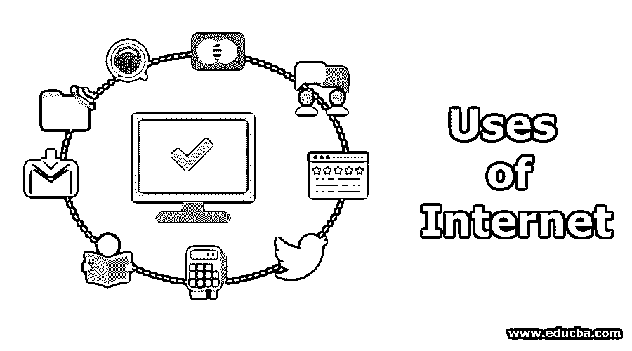
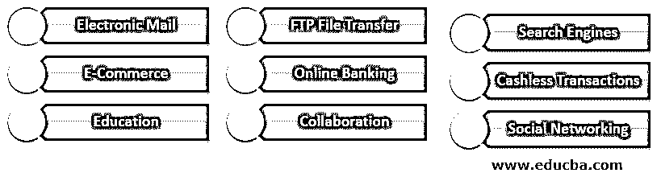

# 互联网的使用

> 原文：<https://www.educba.com/uses-of-internet/>

## 互联网使用介绍

互联网是一种虚拟的网络媒介，可以在各种设备上连接和使用。它使用户能够发送、接收、收集、存储、更新、删除等等。互联网的使用每天都在扩展它的边界。互联网的一些主要用途是电子商务、电子学习、知识共享、社会联系等。所以，在这个话题中，我们将学习互联网的用途。

### 我们为什么使用互联网？

互联网的主要用途如下:

<small>网页开发、编程语言、软件测试&其他</small>

*   实时搜索全球各地的任何信息。
*   与他人沟通和协作。
*   在办公室远程办公或在家工作。
*   与商业实体进行交易。
*   从遥控器下载文件。
*   获得教育和娱乐。
*   进行社交。
*   做小组活动。
*   从远程设备(固定的和移动的)收集运行数据。
*   在数据传输到中央服务器时对其进行处理。
*   获取周围设备、系统的实时数据，以及是否自动执行活动。
*   针对决策支持系统设计决策系统。
*   连接人、利益相关者、机器和一切。

### 互联网的 9 大用途

以下是互联网的主要用途，详细解释如下:

#### 1.电子邮件

互联网的第一个主要用途是电子邮件。人们蜂拥而至，通过电子邮件分享信息、数据文件、照片、视频、商务交流等等。这加快了人与人之间的交流，提高了业务效率。电子邮件减少了纸张的使用和物理邮件系统的负荷。

尽管其他最新的协作工具提供了许多丰富的功能，但它们无法阻止电子邮件的普及，电子邮件仍然主宰着官方和个人通信。有许多免费的电子邮件网站提供邮件服务，实际上每个人都有一个通过电子邮件连接的电子邮件地址。电子邮件的概念为开发许多改进协作的创新工具铺平了道路。

#### 2.FTP 文件传输

这是早期互联网的第二个主要用例。FTP 是[文件传输协议](https://www.educba.com/what-is-ftp/)，它使两个利益相关者能够通过互联网媒体以安全的方式进行数据交换。数据交换可能发生在两个商业实体或有业务往来的客户之间，反之亦然。通常，电子邮件会限制可共享文件的大小，在公共网络上共享敏感和机密数据是不安全的。FTP 概念仍在移动应用程序中用于文件下载。

#### 3.搜索引擎

这些引擎定位一个人寻找的信息，在全球的任何一台服务器上都可以找到。谷歌、雅虎和 MSN 是当今著名的搜索引擎。人们可以在这个网站上搜索任何内容，搜索问题可以是任何格式。人们已经开始使用谷歌这个词作为通用动词，与搜索同义。

#### 4.电子商务

互联网使得以在线方式销售商品和服务成为可能。许多电子商务平台供应商，如亚马逊和 Ola，将市场上可用的几种产品/服务聚合在一起，并通过其门户网站销售给客户。产品由平台供应商采购，存储在他们的仓库中，由他们以自己的品牌包装和分销。顾客得到很好的折扣，而且不用去实体店。

#### 5.网上银行

被称为网上银行，它允许坐在家里或在手机上轻松地进行银行交易。随着网络银行 24×7 服务的普及，银行分支机构的客流量明显下降。任何金额的钱都可以通过这一设施即时转账。电子银行支持电费、电话费和其他服务支付。

#### 6.无现金交易

通过借记卡、信用卡和 UPI gateway 在商品销售点支付账单的情况越来越多。随着这些交易的增长，系统中的现金流通减少了。它每年增长 50%以上，预计在未来 5 年内将增长 10 倍。

#### 7.教育

互联网通过结构化的导航和搜索工具提供了关于任何主题的大量教育材料。人们可以寻找任何阅读材料，互联网将从世界任何地方的任何服务器上为他们获取，人们不必去图书馆翻阅书籍。那些无法参加物理(面对面)课程的人可以参加在线课程，在那里他们可以通过视频方式与世界另一端的老师联系，并在其他视听工具的支持下学习该课程。

#### 8.合作

messenger、Skype 和其他视频会议工具等在线聊天工具可以帮助人们全天候保持联系，轻松进行业务和个人讨论。这避免了人们不必要的旅行，节省了他们用于生产的时间。互联网也促进了在家工作，无缝连接到办公室，避免了日常通勤。

#### 9.网络社交

互联网将人们在网上联系起来，使他们能够组成社会团体。交流关于社会/政治问题的信息、想法、观点和意见。政治和社会组织利用这个平台在公众中促进他们的利益。

### 互联网的应用

随着 IOT 、[人工智能技术](https://www.educba.com/what-is-artificial-intelligence/)的[演进，在云中计算资源的支持下，越来越多的新应用程序正在互联网层上开发，其中一些是:](https://www.educba.com/introduction-to-iot/)

1.  跟踪车队管理系统
2.  监控行驶车辆的健康状况——远程信息处理
3.  无人驾驶汽车——5G 网络
4.  远程诊断和触发设备的预防性维护
5.  从外面监视家中的孩子
6.  在线事件流
7.  娱乐–内容共享平台(OTT)、互联网电视、网络连续剧
8.  连接的机器–制造 0

### 推荐文章

这是互联网使用指南。在这里，我们讨论了互联网用途的介绍、9 大用途以及各自的应用。你也可以看看下面的文章来了解更多-

1.  [什么是云技术？](https://www.educba.com/what-is-cloud-technology/)
2.  什么是虚拟主机？
3.  [网络营销工具](https://www.educba.com/internet-marketing-tool/)
4.  [基于互联网的商业理念](https://www.educba.com/internet-based-business-ideas/)

