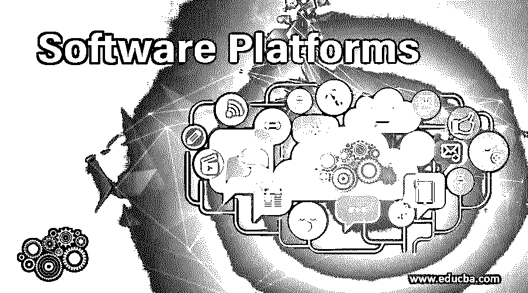

# 软件平台

> 原文：<https://www.educba.com/software-platforms/>

## 软件平台介绍

下面的文章列出了软件平台的概要。建立一个成功的平台比做出正确的取舍更重要。为了理解这些妥协，你需要知道你是如何构建一个平台的。我们选择帮助平台上的创业者了解这些权衡，找到他们的榜样，并向许多其他平台学习。不是每个平台都是等价的。所有这些网站包括优步、谷歌搜索、亚马逊网络服务、Twitter、Whatsapp、Waze、WeWork、Airbnb、Twilio、亚马逊市场、Instagram 和比特币。同时，这些网络在创造网络效应、互动、访问率、开发机制、促销、定价方法和货币化方法方面也有很大不同。

### 软件平台的类型

下面给出了不同类型的软件平台:

<small>网页开发、编程语言、软件测试&其他</small>

#### 1.实用平台

Zenefits、Kayak 和 Google search 都是实用平台的例子。平台通过提供有益的，通常是免费的服务来吸引用户。当许多用户使用这种可用的服务时，网络向第二类消费者开放，即谷歌搜索广告商、Kayak 航空公司或 Zenefits 保险公司。

有用的服务本身没有网络效应。用户吸引公司，但公司不一定吸引平台上的用户。我们在谷歌搜索上寻找信息，而不是广告。部署实用工具平台非常简单——尽量确保您有一个有用的服务，能够产生频繁的使用，并且边际成本微不足道。在足够数量的用户创造了一项资产后，为企业开放你的服务，让网络赚钱。

#### 2.技术平台

技术平台的例子有微软 Azure、Twilio 和 AWS(亚马逊网络服务)。技术平台提供在广泛的产品中重用的组件或服务。通过非法创新，第三方开发者将这些构建模块和服务集成到他们的产品中，以增加平台的受欢迎程度。请记住，开发系统不是双面的。

他们不应该将参与者连接到平台。软件公司通常通过向开发者提供服务来赚钱，而最终用户通常看不到他们。例如，尽管网飞在其亚马逊网络服务(AWS)平台上运行其视频流媒体服务，但最终用户只能与网飞交流。AWS 是手术用管。这使得引入开发项目变得容易得多，因为鸡还是蛋的问题在多重或对等网络中是无法解决的。

#### 3.计算平台

计算平台允许平台用户和第三方开发者之间的交互，与技术平台形成鲜明对比。开发者在技术平台上“拥有”用户。框架在计算机应用程序中“拥有”消费者。谷歌 Android 或苹果 iOS 和微软 Windows 等框架电脑使该平台对消费者更有用，并通过新的使用案例拓宽了该平台。

用户和开发者之间的联系是通过应用商店/市场在现代计算机平台上建立的，这简化了应用的发现、建议、激活和货币化。当达到临界质量时，计算网络发展出强烈的双向网络效应。开发者创造软件，应用吸引用户，所以这就是开发者吸引用户的原因，等等。需要成功引入计算机框架来解决这一挑战。

#### 4.数据采集平台

InsideSales.com、Wave 和 OPensignal 是数据采集平台的最佳范例。这种系统通过平台服务向用户提供有用的服务并产生数据。提供数据的安排实际上是网络加入的一个要求。所有平台用户收集的数据都返回给服务，让它更好地为用户服务。在这样的网络中，网络影响是基于数据而不是用户。

使用产生数据，让平台可供用户使用，吸引更多用户，产生更多数据等等。当网络上有足够多的用户时，服务价值主张从免费地图转向基于从应用程序的所有用户处获得的数据进行交通预测。

#### 5.内容分发平台

内容分发平台的例子有 Outbrain、Google AdSense、Millennium Media 和 Smaato。这些网络将消费者接触点所有者连接到希望向用户提供内容的内容所有者。通过网站上的接触点，对内容所有者的吸引力越大。平台上提供给接触点所有者的信息越多，产品就越有吸引力。

#### 6.按需服务平台

Munchery、uber 和 Heal 都是按需服务平台的例子。该平台的目标是提供由独立服务提供商网络提供的端到端服务。交易与市场交易有很大不同。按需服务平台结合了一站式服务的发现、订购、支付、完成、验证和确认。

### 推荐文章

这是软件平台的指南。这里我们分别讨论软件平台的基本概念和不同类型。您也可以看看以下文章，了解更多信息–

1.  [手机应用软件](https://www.educba.com/mobile-application-software/)
2.  [物联网软件](https://www.educba.com/iot-software/)
3.  [什么是桌面软件？](https://www.educba.com/what-is-desktop-software/)
4.  [机器学习软件](https://www.educba.com/machine-learning-software/)

