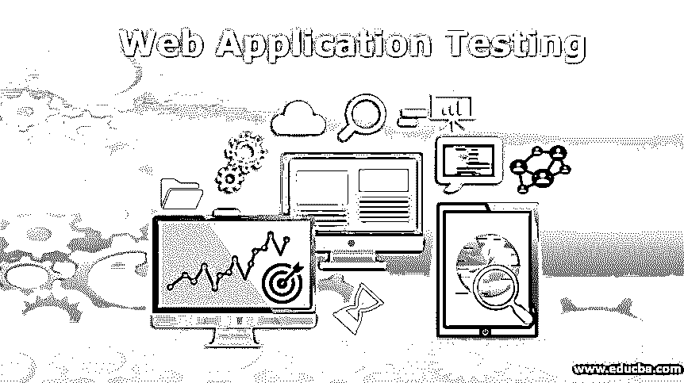
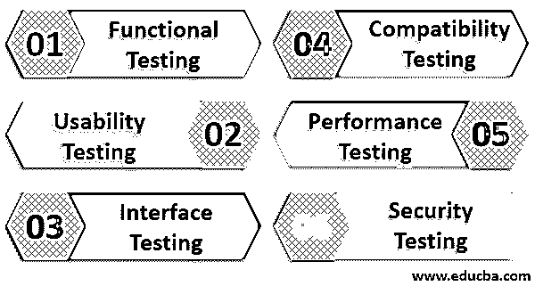

# Web 应用程序测试

> 原文：<https://www.educba.com/web-application-testing/>

## Web 应用程序测试简介

Web 应用程序测试是一种专门用于 web 应用程序或任何其他基于 web 的应用程序软件的测试。它总是包括各种其他测试方法，如功能测试、可用性测试、集成测试、数据库测试、兼容性测试等。为了测试应用程序的所有精心设计的功能特性、用户界面、导航模式、应用程序和数据库之间的通信，这基本上涵盖了 Web 应用程序的端到端流程。

### Web 应用的高级测试技术

下面给出了不同的 Web 应用程序测试技术:

<small>网页开发、编程语言、软件测试&其他</small>

#### 1.功能测试

功能测试技术包括测试 web 应用程序页面中包含的链接、与数据库的连接、为获取和存储信息而创建的表单、cookies 等。

**a .链路测试**

*   检查 web 应用程序中包含的每个内部链接。
*   检查 web 应用程序中包含的指向另一个域的每个传出链接。
*   检查跳转到同一页面上其他点的链接。
*   检查向用户发送电子邮件的链接。
*   查找任何断开的链接。

**b .数据库测试**

*   测试数据完整性。
*   在更新、修改或执行任何与数据库相关的功能时查找错误。
*   测试所有查询是否正确执行和检索数据。

**c .表格测试**

*   测试应该自动填充的默认值。
*   测试每个已定义字段的验证逻辑。
*   在字段中插入不正确的输入，并查找结果。
*   测试查看、删除、修改或更新表单的选项。

**d . cookie 测试**

*   通过在浏览器设置中启用 cookies 进行测试。
*   禁用 cookies 并测试。
*   测试 cookies 加密。
*   会话结束后测试 cookies 过期和用户统计信息。
*   测试安全性影响 cookies 删除。

#### 2.可用性测试

它帮助你增强人机交互。它确保了流畅的用户体验。可用性测试主要需要进行三种测试

**a .对比测试**

随着 web 应用程序的数量与日俱增，竞争也日益激烈。因此，比较可用性测试旨在将您的应用程序与市场上的其他应用程序进行比较。

**b .探索性测试**

顾名思义，这里用户测试端到端的不同场景。几个用例被应用于不同的服务以获得不同的结果。事实证明，最小化 web 应用程序中的任何缺口并突出设计中需要关注的领域非常有用。

**c .可用性评估**

每当我们更新我们的产品，或者检查新产品时，可用性评估就开始了。它通常发生在新产品的发布前阶段和更新产品的发布后阶段。它确保用户对这种新的/更新的产品有积极的体验。

#### 3.接口测试

它关注服务器之间的交互，一个是您的应用服务器，另一个是 web 服务器。它包括检查通信是否顺利以及与网络、硬件和软件的兼容性。

需要重点关注的三个主要领域是:

**a .申请**

该应用程序通过 UI 或 REST/SOAP API 提供访问。因此，验证是重要的一步。两个接口都应该有适当的验证。

**b .网络服务器**

它负责在后端处理所有传入的请求。应该确保每个传入的请求都得到正确处理，并且不会被 web 服务器拒绝。

c .数据库

不应该破坏数据完整性，数据库应该为每个查询提供适当的结果。不应允许直接访问，并且应返回正确的访问限制消息。

#### 4.兼容性测试

它确保了应用程序在各种设备和浏览器上的兼容性。

兼容性测试包括前面提到的测试:

**a .设备兼容**

您的应用程序应该具有足够的响应能力，能够适应不同大小和形状的不同类型的设备。在当今时代，设备兼容性测试是必要的，因为每个人都携带适合自己需求的不同设备。

**b .浏览器兼容性**

不同的用户使用不同的浏览器，如 Firefox、Chrome、Internet Explorer、Safari 等。根据他们的喜好。您的应用程序应该能够跨各种浏览器呈现自己。浏览器兼容性测试确保不存在与 AJAX、JavaScript、HTML 和 CSS 相关的问题。

#### 5.性能试验

它测试应用程序在不同负载条件下的响应时间。性能测试可分为以下几类测试:

**a .压力测试**

它测试 web 应用程序可以接受的负载的最大限制。应用程序承受超过其极限的负载，然后测试其行为。

**b .负载测试**

它测试应用程序在不同负载量下的响应时间。它还测量应用服务器和数据库的容量。

**c .浸泡试验**

它也被称为耐力测试。它测量高负载下的内存利用率和 CPU 利用率。

**d .尖峰测试**

顾名思义，应用程序被置于波动负载中，其性能被测量。例如，尝试访问应用程序的用户数量的突然减少和增加，并查看应用程序如何处理这些峰值。

#### 6.安全测试

这是执行 web 应用程序测试时最重要的测试之一。它阻止对应用程序的未授权访问。它确保敏感信息在应用程序中是安全的。

以下是测试人员可以执行的一些安全测试技术:

*   越权存取
*   拒绝服务
*   身份欺骗
*   漏洞扫描
*   URL 操作
*   SQL 注入
*   权限提升

### 结论

希望这篇文章包含了所有可能应用于您的应用程序的测试技术。它将帮助您无缝地测试您的应用程序。永远记住让你的应用程序通过各种测试，以找出你在开发时可能遗漏的漏洞。因此，在让 web 应用程序投入使用之前，请写下测试计划。

### 推荐文章

这是一个 Web 应用程序测试指南。在这里，我们讨论 web 应用程序的高级测试技术，如功能测试、可用性测试、界面测试等。您也可以浏览我们推荐的其他文章，了解更多信息——

1.  [网站测试工具](https://www.educba.com/website-testing-tool/)
2.  [GUI 测试](https://www.educba.com/gui-testing/)
3.  [JMeter 负载测试](https://www.educba.com/jmeter-load-testing/)
4.  [ASP.NET 核心单元测试](https://www.educba.com/asp-dot-net-core-unit-testing/)

