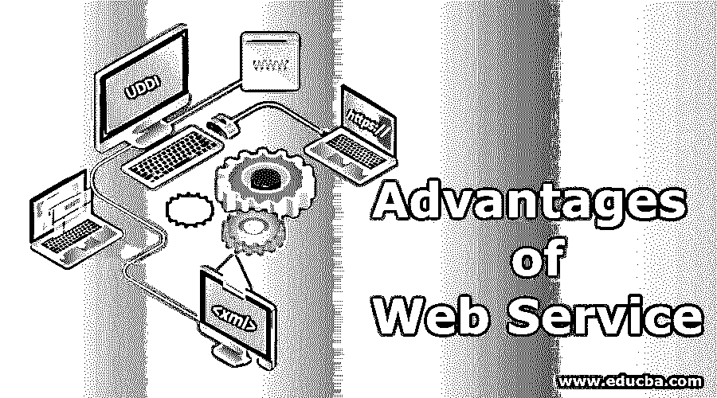

# web 服务的优势

> 原文：<https://www.educba.com/advantages-of-web-service/>

## Web 服务优势介绍

高级业务应用程序使用各种编程阶段来创建在线应用程序。一些应用程序可能是用 Java 创建的，其他的可能是用。Net，而 Angular JS、Node.js 等其他一些。通常，这些异构应用程序之间需要某种类型的通信。因为它们是利用不同的高级方言组装的，所以很难保证应用程序之间的精确对应。这是 web 服务出现的地方。Web 服务提供了一个典型的平台，允许基于不同编程语言的不同应用程序能够相互交流。

### Web 服务的优势

互联网发展产生的 web 服务思想。网络服务背后的计划是推动互联网成为一种基于价值的工具，而不仅仅是一种视觉装置。这些应用程序到应用程序的协作由现有原则驱动并基于这些原则，例如:

<small>网页开发、编程语言、软件测试&其他</small>

*   可扩展标记语言(XML)
*   超文本传输协议(HTTP)
*   清洁工
*   广泛的描述、发现和整合(UDDI)
*   Web 服务描述语言(WSDL)

以下是利用 web 服务的优势:

#### 1.揭示框架的现有功能

web 管理是可以使用 HTTP 远程调用的托管代码；也就是说，它倾向于使用 HTTP 查询来启动。Web 管理使您能够发现当前代码在框架上的便利性。当它在框架上被发现时，其他应用程序可以使用你的程序的便利性。

#### 2.互用性

Web 服务互操作性的目标是从一个编程应用程序开始，然后到下一个应用程序，给出一致的编程关联。《清洁剂》、《WSDL 公约》和《UDDI 公约》描述了一种寻找和调用产品应用策略的自我描述方法——很少考虑区域或阶段。信息被编组到 XML 请求和反应报告中，并利用 HTTP 或基于消息的约定在编程包之间移动。互操作性问题悄悄出现在披露、定义和征集/反应工具中。

*   Web 管理使各种应用程序能够相互开玩笑，并在它们之间共享信息和管理。广泛的用途可以互相交谈。因此，与编写显式应用程序必须理解的显式代码相反，您现在可以编写所有应用程序都能理解的非独占代码。
*   当测试改变框架设计，继承框架，混合编程方言，组成框架时，web 管理被证明是有用的。
*   也许网络管理最显著的优点是它们提供了一种非排他性的合作方式。Web benefits 只需要为它们在工作之间谈一个类似的消息约定。到目前为止，已经创建了一个典型的基于规范的专门化技术的安排，该技术结合了 HTTP、WSDL、SOAP。这些使得 web 管理成为可能。

#### 3.有序协议

Web 管理使用制度化的行业标准显示进行通信。所有四个层(服务传输层、XML 消息传递层、服务描述层和服务发现层)都使用了 web 组织展示栈中描述良好的展示。这种展示栈的系统化为商业提供了各种焦点，例如，广泛的选择范围，由于竞争而导致的成本下降，以及质量的提高。

#### 4.易用性

Web 服务旨在通过 web 使用；也就是说，简单地说，类似于一个页面，人们可以通过 web 获得 web 管理能力。web 管理的能力从简单的数据查询转变为复杂的算法计算。因此，当帮助被用来揭示业务原理时，在这一点上，它可以被使用而不需要太多的延伸。

#### 5.再易用性

Web 服务旨在被整合以传达更多有价值的管理。Web 管理填充为构建方块，这使得在不同的管理中重用 Web 服务片段变得简单。此外，继承应用程序可以打包到 web 管理中供他人使用。

#### 6.发送容量

Web 服务是通过标准的互联网进步来传递的。例如，利用 Apache、Axis2 进行 HTTP、WSDL 驱动的管理。这样便于传达。

#### 7.灵活

这体现了改变的能力。当一个企业的 IT 框架被精简到管理中时，处理新的业务请求的新的有用性包括聚集现有的管理。显然，可能需要更多的管理人员来制造，但总的来说，这比没有任何准备就重新组装另一个框架要简单得多。

#### 8.质量

与重用相关，基于 web 服务改进方法使管理能够通过集合现有的管理来工作，期望这样的管理现在使用已知的执行属性是一致的。因此，新的框架将更简单。

#### 9.费用

开发新框架的费用完全减少了，因为这些框架是从即时 web 管理中收集的。这种成本的降低转化为收益，可能会传递给客户。客户仍然会从成本削减和网站管理的熟练程度中获益。

#### 10.最小工作量通信(基于 XML)

Web 服务在数据描述和数据传输层使用 XML。使用 [XML](https://www.educba.com/what-is-xml/) 摆脱了任何框架组织、工作系统或舞台官员。基于 Web 服务的应用程序在它们的内部层次上是可操作的应用程序。

### 结论

理想情况下，本文让您了解了 Web 管理的能力，尤其是解决软件工程师和框架创建者面临的大量跨阶段可用性问题。制作 Web 服务包括大量类似的想法和任务，我们在制作任何种类的应用程序时都会面临这些。我们描述创建服务所需的有用性和逻辑。

### 推荐文章

这是一个关于 Web 服务优势的指南。这里我们讨论基本概念，以及 Web 服务的十大优势，比如互操作性、有序协议和易用性等。您也可以浏览我们推荐的其他文章，了解更多信息——

1.  [如何用 Java 创建 Webservice？](https://www.educba.com/how-to-create-webservice-in-java/)
2.  [网络服务的类型](https://www.educba.com/types-of-web-services/)
3.  [网络服务的架构](https://www.educba.com/architecture-of-web-services/)
4.  [Azure 云服务](https://www.educba.com/azure-cloud-service/)

