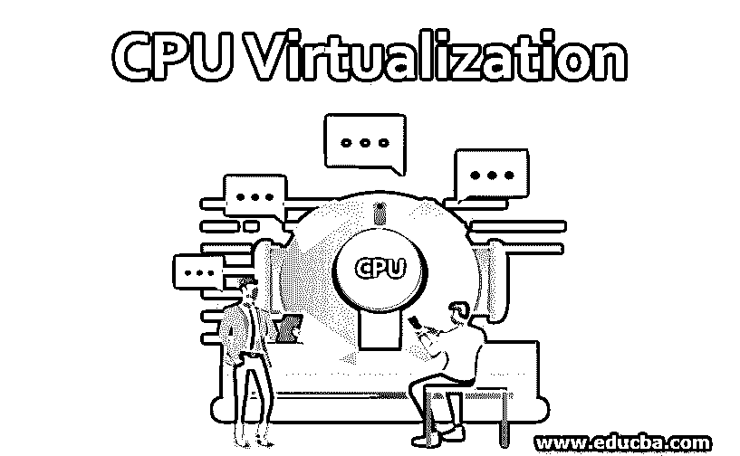
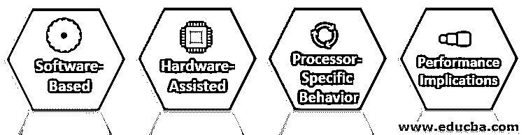

# CPU 虚拟化

> 原文：<https://www.educba.com/cpu-virtualization/>

## CPU 虚拟化简介

CPU 虚拟化是一种需要单个 CPU 工作的云计算技术，它充当多台机器一起工作。自 20 世纪 60 年代硬件虚拟化或 CPU 虚拟化流行以来，虚拟化就一直存在。为了高效工作并利用所有计算资源协同工作，发明了 CPU 虚拟化，通过在一台机器上轻松运行每个操作系统来管理事物。虚拟化主要通过节省时间来关注效率和性能相关的操作。需要时，使用硬件资源，底层处理指令以使虚拟机工作。

### 什么是 CPU 虚拟化？

CPU 虚拟化强调通过虚拟机运行程序和指令，给人在物理工作站上工作的感觉。所有的操作都由仿真器处理，仿真器控制软件根据它来运行。然而，CPU 虚拟化并不充当模拟器。模拟器的运行方式与普通计算机相同。它复制相同的副本或数据，并生成相同的输出，就像物理机一样。仿真功能提供了很好的可移植性，有助于在单个平台上工作，就像在多个平台上工作一样。

<small>网页开发、编程语言、软件测试&其他</small>

借助 CPU 虚拟化，所有虚拟机都充当物理机，并像拥有各种虚拟处理器一样分配其托管资源。当所有托管服务收到请求时，每个虚拟机都会共享物理资源。最后，虚拟机获得分配给它们的单个 CPU 的份额，作为单处理器充当双处理器。

### CPU 虚拟化的类型

可用的各种类型的 CPU 虚拟化如下

**1。基于软件的 CPU 虚拟化**

这种 CPU 虚拟化是基于软件的，在它的帮助下，应用程序代码在处理器上执行，特权代码首先被翻译，翻译后的代码直接在处理器上执行。这种翻译纯粹被称为二进制翻译(BT)。被翻译的代码非常大，同时执行起来也很慢。基于特权编码的客户程序运行起来非常流畅和快速。基于重要的特权代码组件(如系统调用)的代码程序或应用程序在虚拟环境中运行速度较慢。

**2。硬件辅助的 CPU 虚拟化**

有一些硬件可以从某些处理器获得支持 CPU 虚拟化的帮助。这里，访客用户使用不同版本的代码和执行模式，称为访客模式。访客代码主要在访客模式下运行。硬件辅助 CPU 虚拟化最大的好处是，在使用它进行硬件辅助时，不需要进行转换。为此，系统调用比预期运行得更快。需要更新页表的工作负载有机会从来宾模式退出到根模式，最终会降低程序的性能和效率。

**3。虚拟化和特定于处理器的行为**

尽管具有 CPU 模型的特定软件行为，虚拟机仍然有助于检测系统运行的处理器模型。处理器型号因 CPU 及其提供的各种功能而异，而产生输出的应用程序通常会利用这些功能。在这种情况下，vMotion 不能用于迁移在功能丰富的处理器上运行的虚拟机。增强的 vMotion 兼容性可以轻松处理这一功能。

**4。CPU 虚拟化的性能影响**

CPU 虚拟化增加了基于工作负载和所用虚拟化的开销。任何应用程序都主要依赖等待指令首先执行的 CPU 能力。此类应用程序需要使用 CPU 虚拟化来获取需要首先执行的命令或执行。这种开销占用了总的处理时间，并导致性能和 CPU 虚拟化执行的整体下降。

### 为什么 CPU 虚拟化很重要？

CPU 虚拟化在很多方面都很重要，它的实用性在云计算行业中已经非常普遍。我将简要介绍使用 CPU 虚拟化的优势，陈述如下:

*   使用 CPU 虚拟化，整体性能和效率在很大程度上得到了提高，因为它通常需要虚拟机在单个 CPU 上工作，像同时使用多个处理器一样共享资源。这节省了成本和金钱。
*   由于 CPU 虚拟化使用虚拟机在单个共享系统上的独立操作系统上工作，安全性也由 it 来维护。这些机器也是分开存放的。正因为如此，任何网络攻击或软件故障都无法破坏系统，因为一台机器无法影响另一台机器。
*   它纯粹在虚拟机和硬件资源上工作。它由一台存储所有计算资源的服务器组成，处理是基于所有相关系统共享的 CPU 指令进行的。由于硬件需求更少，并且没有物理机器的使用，这就是为什么成本非常低，并且节省了时间。
*   它提供了计算资源的最佳备份，因为数据是从单个系统中存储和共享的。它为依赖单一系统的用户提供了可靠性，并为用户提供了更多的数据检索选择，让他们感到满意。
*   它还提供了强大而快速的部署过程选项，因此它可以毫无麻烦地到达客户端，并且它还保持了原子性。虚拟化确保所需的数据通过介质到达所需的客户端，并检查是否存在任何限制，同时快速消除这些限制。

### 结论

它是云市场中最时尚的云计算技术之一，旨在通过保持性能和工作效率之间的平衡来提供最佳输出，从而节省大量资金并获得更高的领域。

### 推荐文章

这是 CPU 虚拟化的指南。在这里，我们讨论 CPU 虚拟化及其类型的介绍和重要性。您也可以看看以下文章，了解更多信息–

1.  [Openstack 与虚拟化](https://www.educba.com/openstack-vs-virtualization/)
2.  [存储虚拟化](https://www.educba.com/storage-virtualization/)
3.  [虚拟化平台](https://www.educba.com/virtualization-platforms/)
4.  [虚拟化的优势](https://www.educba.com/virtualization-benefits/)

