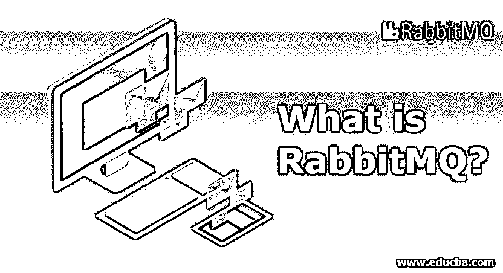
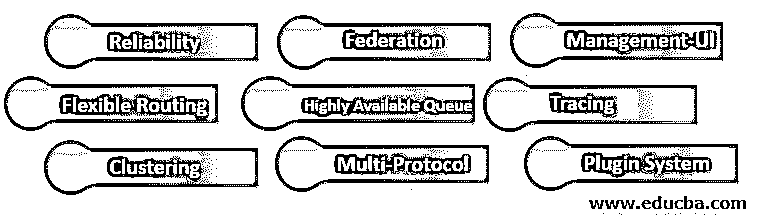

# 什么是 RabbitMQ？

> 原文：<https://www.educba.com/what-is-rabbitmq/>

## RabbitMQ 简介

RabbitMQ 是使用最广泛的开源消息代理之一。它最初是基于高级消息队列协议(AMQP)的。后来，对它进行了修改，以支持消息队列遥测传输(MQTT)、面向流文本的消息协议(STOMP)和其他几种常见协议。RabbitMQ 被设计用于过去 25 年中开发的各种消息传递场景。它以可靠性和互操作性而闻名。它已经用多种语言实现了；因此，它是构建可靠、大规模、集群化、弹性消息传递基础设施的最佳选择之一。

### 什么是 RabbitMQ？

它是一个传统的消息传递代理，支持许多消息传递协议，如 AMQP、MQTT 和 STOMP，也称为混合代理。它支持发布-订阅、点对点、请求-回复消息传递技术的几种变体。它使用智能代理/非智能消费者模型，专注于一致地向消费者传递消息。如果配置得当，它可以提供很好的性能，支持 Java、Ruby、中的客户端库[。NET、PHP 和许多其他语言，并提供了几个插件，可以添加这些插件来扩展用例及集成场景。它提供同步和异步通信模式。](https://www.educba.com/java-vs-ruby/)

<small>网页开发、编程语言、软件测试&其他</small>

RabbitMQ 支持不同用例的各种确认，并支持跨消息队列的事务。它还允许分离各种事务语义(如果需要的话)。它还允许分布式事务，如 X/Open XA 事务。它还支持消息分组和幂等消息。在访问队列方面，它支持很多细粒度的控制。人们可以限制对某些队列的访问，管理深度等等。

运营和安全是 RabbitMQ 的强项。RabbitMQ 管理插件为监控和管理提供了基于浏览器的 UI，为操作提供了 HTTP UI 和 CLI 工具。除了 TLS 支持之外，RabbitMQ 还附带了 RBAC 内置的数据存储、LDAP 或基于 HTTPS 的外部提供商。

### 我们为什么使用 RabbitMQ？

RabbitMQ 是一个消息代理，广泛用于从 web 服务器获得快速响应，而不是执行资源密集型操作，这会让用户等待结果。它还适用于在多个消费者之间分发消息，或者在高负载下在消费者之间进行负载平衡。

以下是一些更喜欢使用 RabbitMQ 的场景:

*   您的应用程序需要使用不同消息协议的组合，如 STOMP、AMQP、MQTT 等。
*   如果您对每个消息都有更好、更一致的控制，那将会很有帮助。
*   您的应用程序需要不止一种消息传递技术，如发布/订阅、点对点、请求/回复等。
*   当我们需要在特定的服务器、服务器组或所有服务器上运行相同的作业时，这很有用。应用程序发送一封邮件，exchange 将对其进行路由。这是因为 RabbitMQ 强大的路由功能。
*   如果您需要将您的消息传递代理与现有的 IT 基础设施集成，RabbitMQ 是最佳选择。

如果你的应用需要在流历史上运行，RabbitMQ 也可以[和 Cassandra](https://www.educba.com/what-is-cassandra/) (No-SQL)一起使用，如果你的应用需要使用无限队列，你也可以使用 LevelDB 插件。

### 我们可以用 RabbitMQ 做什么？

消息传递允许应用程序连接和纵向扩展。应用程序可以相互连接，作为更大应用程序的一部分，或者终端用户的设备和数据。RabbitMQ 是一个消息传递代理——消息传递的中间实体。它为您的应用程序提供了一个发送和接收消息的公共平台，并为您的消息提供了一个安全的存放位置，直到被使用为止。

它提供以下功能:

*   **可靠性:**它提供了许多特性，允许您在可靠性、交付确认(包括持久性、高可用性和发布确认)之间权衡性能。
*   **灵活路由:**消息到达交换机，然后路由到队列。RabbitMQ 为各种用例提供了许多预定义的交换。您可以通过将交换绑定在一起或者将自己的交换类型定义为插件来定义更复杂的路由。
*   **集群:**本地网络上的两个或更多 RabbitMQ 服务器可以集群在一起，形成一个大型代理。
*   **联合:**对于某些用例，服务器需要比集群所允许的更不可靠、更松散的连接。RabbitMQ 为这种情况提供了一个联邦模型。
*   **高可用队列:**队列可以在集群的几个节点上复制，这确保了即使在硬件故障的情况下消息也是安全的。
*   多协议: RabbitMQ 支持多种消息协议。
*   **管理-UI:** RabbitMQ 配备了一个易于使用的管理 UI，有助于对代理的各个方面进行平稳的控制和监控。
*   **跟踪:**如果系统行为不当，RabbitMQ 会提供跟踪支持，以找出破坏系统的原因。
*   **插件系统:** RabbitMQ 自带各种插件，你也可以根据需求编写自定义插件。

### 结论

RabbitMQ 在业界被广泛使用，因为它支持复杂路由。它已被许多大公司/组织采用，如 JP 摩根、NASA(用于星云云计算)和 Google。事实上，它在印度的 Aadhar 项目中也有应用，该项目是世界上最大的生物特征数据库。

### 推荐文章

这是一本关于什么是 RabbitMQ 的指南。这里我们讨论为什么我们使用 RabbitMQ，我们可以用它做什么，以及它的特性。您也可以看看以下文章，了解更多信息–

1.  [rabbitq 替代品](https://www.educba.com/rabbitmq-alternatives/)
2.  [卡夫卡的替代品](https://www.educba.com/kafka-alternatives/)
3.  [rabbitq 体系结构](https://www.educba.com/rabbitmq-architecture/)
4.  [rabbitq vs redis](https://www.educba.com/rabbitmq-vs-redis/)

