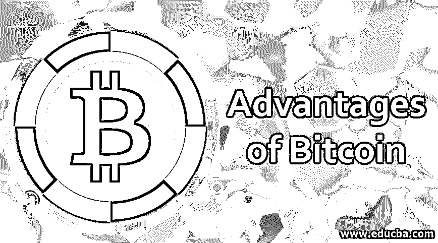

# 比特币的优势

> 原文：<https://www.educba.com/advantages-of-bitcoin/>

## 比特币优势介绍

以下文章概述了比特币的优势。比特币是一种加密货币(即虚拟创造的货币)，允许点对点交易。它于 2009 年由中本聪创立。比特币旨在控制比特币产生和流动的数量，保护交易，并使用户的身份匿名。

### 比特币是如何运作的？

下面给出了比特币的工作原理:

<small>网页开发、编程语言、软件测试&其他</small>

*   比特币使用公共数字账本以加密的方式记录和验证交易。
*   这是通过生成复杂的计算机算法来实现的，人们通过挖掘这些算法来换取小额比特币作为费用。
*   对接收者的有效性和完整性的两端都有验证。最先验证这一交易的矿工(算法创造者和编码者)获得一小块作为费用。
*   更新后的事务处理将分布在整个区块链网络中，以备将来核实，并添加到共享分类帐中。

### 比特币的优势

比特币在几个方面彻底改变了支付模式，让我们看看它的优势:

*   比特币最大的特点就是不在政府或者银行这样的某种中央集权体制之下。在不稳定时期，不用担心钱会被没收或锁定，这种情况曾在希腊发生过，当时政府只限制每天 67 美元的交易限额。
*   事实证明，在政府不稳定或银行国有化的国家，比特币特别有用，因为这些国家正在发生或已经发生恶性通货膨胀的经济危机(例如:委内瑞拉或波兰)。这导致比特币在相对公平的汇率下价格上涨和波动。
*   此外，这还有效地降低了通过第三方支付时涉及的交易成本。作为一个分散的系统，所有的交易都是透明地完成和一致地控制。随着时间的推移，货币汇率不断升值和贬值，这尤其阻碍了跨货币交易期间承担的寄宿费用的交易波动。
*   被加密的每一个加密货币单位都具有唯一的标识，这种货币不可能被伪造，并且它是进行货币交易的更安全的形式。这也使得不具备专业技术知识的怀有恶意的人很难对系统造成威胁。
*   由于传统货币是由纸或金属制成的，因此在其制造过程中有助于自然资源的利用。比特币在对交易进行数字加密后进行数字签名和认证，由区块链或数字账本发送。这样，只有电子数据被创建，这占用了云网络中的空间，并且没有利用任何原材料来进行金融交易。随着自然资源的污染和退化日益严重，他们使用比特币来减少对树木和矿物的影响，这些都是有限的。
*   与其他交易模式(银行卡或借记卡的实体形式)相比，通过比特币进行的交易被证明要快得多。事实证明，对于涉及货币变化的大量国际交易来说，这一点基本上是正确的。由于比特币数量有限，且不受政府稳定等外部因素影响。
*   如果用户使用比特币购物，一个非常重要的方面会对他们产生积极影响，那就是没有销售税或服务税方面的应税扣除。只有非常少的一部分作为他们的角色费用被记入“矿工”的账户。随着大公司开始接受比特币支付，现在通过比特币购物变得非常容易。接受比特币的著名公司之一是:
    *   微软是为了它的在线 X-Box 商店。
    *   在线域名提供商。
    *   Overstock 是一家允许多种加密货币的在线零售商。
    *   希尔顿和万豪酒店等连锁酒店。
    *   沃尔玛和梅西百货在门店和在线模式中都有比特币支付选项。
    *   像 GAP 和丝芙兰这样的时尚和个人审美品牌允许通过比特币购买。

*   使用比特币增加了交易的便利性。没有必要进行身份验证和提供各种个人信息，如地址证明、年龄证明和其他与个人财务状况相关的重要事实。你需要做的只是下载一个支持比特币交易的数字钱包(比如比特币基地、特雷佐或罗宾汉),然后进行支付或收款。然而，这种模式有可能被用于非法或欺诈性质的非法交易。但与此同时，随着金融机构发生大量数据泄露事件，您有机会保护您的个人数据免受不当处理。
*   不择手段的卖主不能欺骗另一方，说没有付款或没有收到付款，所进行的交易不仅出现在网络的所有区段，而且不能被区块链的任何人改变。
*   和股市类似，比特币和其他加密货币都可以交易。最初投资了比特币，后来又卖出的人，从自己的金融决策中获得了巨大的收益。以著名的百万富翁埃里克·费恩曼先生为例，他在 11 岁时向祖母借了 1000 美元投资。当时，1 台设备的成本为 12 美元，到 2013 年，每台设备的成本上升到 1200 美元，这为 Erik 带来了财富，使他获得了 1000 倍的投资回报。许多知名人士认为，投资加密货币市场是一个非常明智的决定，因为它处于初始阶段，特别是像 Etherium 这样的其他加密货币。

### 结论

可以理解的是，企业和零售客户都可以通过接受比特币等加密货币获得众多好处，这些加密货币使用区块链技术，作为传统快钱的替代品，更安全、更快捷、更方便，这将使消费者有权力和自由在自己手中访问和控制他们的财务。

### 推荐文章

这是比特币优势的指南。在这里，我们详细讨论了比特币的介绍和工作原理及其优势。您也可以阅读以下文章，了解更多信息——

1.  [区块链安全吗？](https://www.educba.com/is-blockchain-safe/)
2.  [什么是区块链？](https://www.educba.com/what-is-blockchain-technology/)
3.  [勒索软件解密工具](https://www.educba.com/ransomware-decryption-tools/)
4.  [双调排序](https://www.educba.com/bitonic-sort/)

