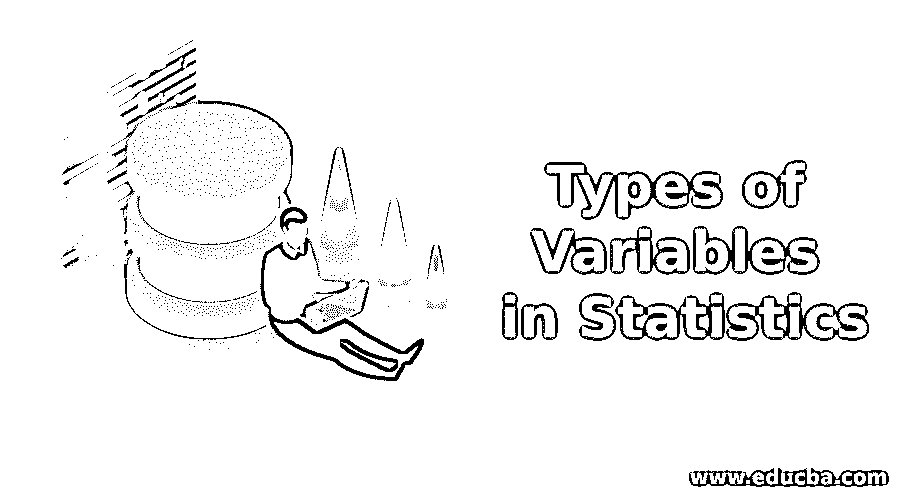

# 统计学中变量的类型

> 原文：<https://www.educba.com/types-of-variables-in-statistics/>

## **统计学中变量类型介绍**

下一篇文章概述了统计中变量的类型。根据环境变化的值被称为变量。变量可以以任何形式出现，如特征、因素或陈述，它将根据应用环境的变化而不断变化。统计学中的这类变量大致分为四类，如自变量、因变量、分类变量和连续变量。除此之外，定量和定性变量以名义变量、顺序变量、区间变量和比率变量的形式保存数据。每种类型的数据都有独特的属性。

### 统计学中不同类型的变量

在统计学中，变量是一个代数术语，表示未知值，它不是一个数值格式的固定值。为了便于计算，这种类型的变量被用于许多类型的研究。因此，有许多不同类型的变量可以应用于不同的领域。许多其他变量被讨论到最低限度地被列为研究者评估的活跃变量。出现在自变量之前的变量称为先行变量。

<small>网页开发、编程语言、软件测试&其他</small>

#### 1.自变量

自变量是在研究中为观察因变量的影响而计算的变量。它也被称为结果变量、预测变量或实验变量。例如，一位经理要求 100 名员工完成一个项目。他应该知道每个员工的能力。他想知道聪明人和失败人背后的原因。第一个原因是有些人会为了在预计的时间内完成项目而夜以继日地努力工作，另一个原因是有些人天生聪明，比其他人更聪明。与自变量相似的变量称为协变量，但受因变量影响，但不如感兴趣的变量常见。

#### 2.因变量

因变量也称为标准变量，应用于非实验环境。因变量依赖于自变量。从上面提到的例子来看，项目的生产率或完成是主要的标准，它依赖于估计的时间和智商。在这里，独立变量是智商和估计时间，它们可能会也可能不会反映在员工的生产率中。因此，预计时间的延长或提高一个人的智商对员工的生产力没有任何意义，因为它是不可预测的。

因此，经理的重点是致力于独立变量，如分配的时间和智商，导致员工生产力的某些变化，这是因变量。所以这两个变量在某种程度上是相关的。在计量经济学中，受其他变量影响的变量称为内生变量。影响因变量和自变量之间关系的隐藏变量称为潜伏变量。当一个自变量不受任何其他变量的影响，并在一定程度上受到限制时，称为解释变量。

#### 3.分类变量

这是一个范围很广的变量，它是无限的，没有数字数据。这些变量在统计软件中称为定性变量或属性变量。这类变量又进一步分为名义变量、序数变量和二分变量。名义变量没有任何内在的顺序。例如，开发人员根据网络结构将其环境分为不同类型的网络，如 P2P、云计算、普适计算、物联网。因此，在这里，网络的类型是一个名义变量，由四个类别组成。标称变量中存在的不同类别可以被称为标称变量级别或组。二分变量也叫二进制值，只有两类。

例如，如果我们问一个人他有一辆车，他只会回答是或不是。这种类型的两个不同的名义变量被称为二分法。只是只占两个值，比如 0 或者 1。它可以是是或不是，短或长，等等。序数变量是包括两个或多个类别的名义变量。如果你看到任何一张酒店反馈表，都有优秀、良好、较好、较差、很差等五个等级。因此，我们可以借助于对研究有意义的序数变量来对水平进行排序。它是明确的，价值可以被考虑用于决策。

#### 4.连续变量

测量一些计数或数量的变量，没有任何边界，称为连续变量。它可以分解成比率、区间或离散变量。区间变量有其集中属性，用一些数值的范围来标定。这个例子可以用摄氏度或华氏度校准温度，但没有给出任何两种不同的含义；它们显示最佳温度，严格来说，这不是一个比例变量。

它只能代表特定的一组值，例如，停车场中的几辆自行车是分散的，因为地面只能容纳有限的一部分来停放自行车。比率变量以间隔出现；它有一个额外的条件，即任何测量值为零表示没有该变量的值。简单来说，四米的距离是两米距离的两倍。它根据测量值的比率进行操作。除了这些提到的变量，虚拟变量可用于回归分析，以建立与非关联分类变量的关系。例如，如果用户具有类别“拥有宠物”和“拥有家”，则可以将 1 分配给“拥有宠物”，将 0 分配给“拥有家”。

在实验中保持不变的因素称为控制变量。在一个实验中，如果科学家想测试植物生长的光，他应该控制水和土壤质量的值。对获得的实验值有潜在影响的附加变量称为混杂变量。

### 推荐文章

这是统计学中变量类型的指南。这里我们讨论统计学中变量的介绍和不同类型。您也可以看看以下文章，了解更多信息–

1.  [统计分析](https://www.educba.com/statistical-analysis/)
2.  [弱大数定律](https://www.educba.com/weak-law-of-large-numbers/)
3.  [R 中的简单线性回归](https://www.educba.com/simple-linear-regression-in-r/)
4.  [机器学习的统计数据](https://www.educba.com/statistics-for-machine-learning/)

