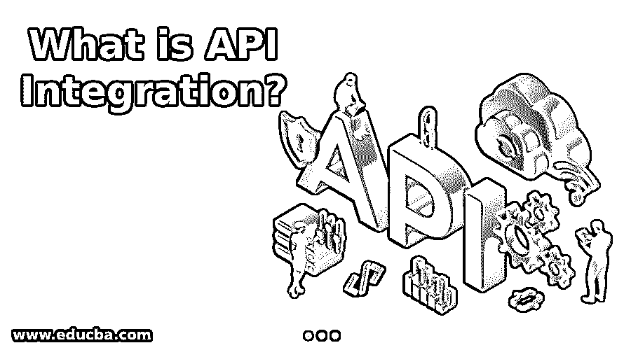
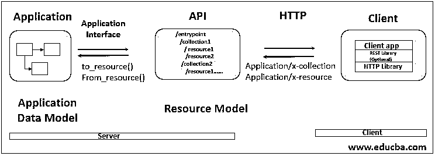

# 什么是 API 集成？

> 原文：<https://www.educba.com/what-is-api-integration/>

## 什么是 API 集成？

API(应用编程接口)被分类为一种信使，用于处理不同类型的用户请求和维护系统的功能。API 有助于与应用程序数据和设备进行交互。数据传输可以通过 API 实现，并保持程序和设备之间的连接。使用 API，应用系统能够与组织的后端系统通信。新的 API 可以通过向应用添加代码来创建，并且可以与应用集成以在应用中提供新的功能。可以通过 API 维护不同应用程序之间的通信。

### API 与架构的集成

API 的开发帮助系统与系统的其他部分进行通信，并与数据库系统进行交互。API 为用户和系统之间的通信提供了一个公共平台。API 集成起着重要的作用，因为它有助于自动化各种应用程序的工作流。如果不使用 API 集成，所有这些工作都需要手动完成，既费时又费力。通过 API 集成，数据可以以非常安全的方式快速传输。通过 API，用户可以轻松访问 web 服务和应用程序。用户可以使用 REST APIs 与系统进行交互。开发人员开发 API 是为了一些特定的目的，并按照系统的要求。当用户使用应用程序时，他们可以请求任何类型的服务，该请求被传输到系统，然后该请求由系统提供服务，系统向用户显示输出。设备可以通过 API 集成连接到系统，而不需要任何努力和时间。

<small>网页开发、编程语言、软件测试&其他</small>

在上图中，有一个客户端、应用程序系统和 API。用户可以使用应用程序提供的不同 API 与系统进行交互。在上图中，系统提供了各种 API，这些 API 充当资源模型并在应用程序和客户端之间进行通信。应用程序仅使用该资源模型在用户端呈现输出。

### API 集成是如何工作的？

随着开发人员完成编码部分并设计 API，接下来的工作是将 API 与系统集成，并使系统能够使用这些 API。因为 API 有助于提供不同系统之间的功能抽象。API 作为一个接口，帮助应用程序与其用户进行交互，并向用户提供各种功能。用户可以通过使用许多 API 与系统通信。当用户与系统交互并查询一些数据时，API 就出现了。API 与数据库交互，从数据库获取数据，将其转换成某种可显示的形式，并向用户显示数据。API 用于服务于用户的请求和需求，并充当系统和用户之间的通信平台。API 与设备、数据和应用程序进行交互。可以在使用 API 时创建连接。API 处理用户请求并将该请求传输到系统，并与系统交互。然后在系统中开始处理，然后由系统形成结果。然后这个结果由 API 发送给用户。

### API 集成的优势

对于现代技术时代，对 API 的需求是系统的一个重要组成部分。有许多 API 提供不同的功能来增加系统的使用。API 集成的众多优势如下所述:

*   **帮助连接到云应用:**有不同类型的 API 为系统提供连接到云平台的功能。API 集成被认为是连接到云平台的标准。需要一个 API 集成平台来帮助系统连接到云 API。
*   **不同的 API 各种功能:**随着系统 API 数量的增加，系统的功能和特性也随之增加。API 可以被设计用于帮助系统更好地执行并向用户提供各种功能的每一个特征。API 集成平台的使用有助于快速创建新的 API，并节省开发人员的精力和时间。
*   **帮助集成数据:**API 帮助集成系统的数据库。数据库用于存储大量数据，API 可用于从数据库中提取数据。该组织使用内部使用的 API，通过大量数据提取 API 从数据库中提取数据。API 有助于减少数据获取的工作量，因为由于数据库中存在的数据的大小，获取数据可能需要时间。
*   **有助于更好的管理:**随着开发人员为组织开发新的 API，这项活动需要由管理人员进行适当的管理。API 将帮助系统并使其更有效。API 集成有助于更好地管理系统，并提高组织的生产率。
*   **与应用程序的交互变得容易:**APIs 集成平台为用户提供了一个与系统轻松沟通的平台，无需花费额外的精力和时间。用户可以使用各种 API 轻松访问系统的功能。API 提供了与应用程序直接通信的平台。对于每个特性，组织需要不同的 API 来正确地进行 API 管理，因为这对组织来说是一项至关重要的任务。

### 结论

API 集成充当与系统和用户交互的公共平台。API 充当进入系统和访问系统功能的入口点。API 用于与数据相关的操作、系统通信等等。开发人员开发代码并生成新的 API 来增加系统的功能。

### 推荐文章

这是一个什么是 API 集成的指南？.在这里，我们还将讨论简介，以及 API 集成是如何工作的？除了好处。您也可以看看以下文章，了解更多信息–

1.  [集成架构](https://www.educba.com/integration-architecture/)
2.  [Java 中的 API 是什么？](https://www.educba.com/what-is-api-in-java/)
3.  [现代数据集成](https://www.educba.com/modern-data-integration/)
4.  [吉拉 vs 阿萨纳](https://www.educba.com/jira-vs-asana/)

