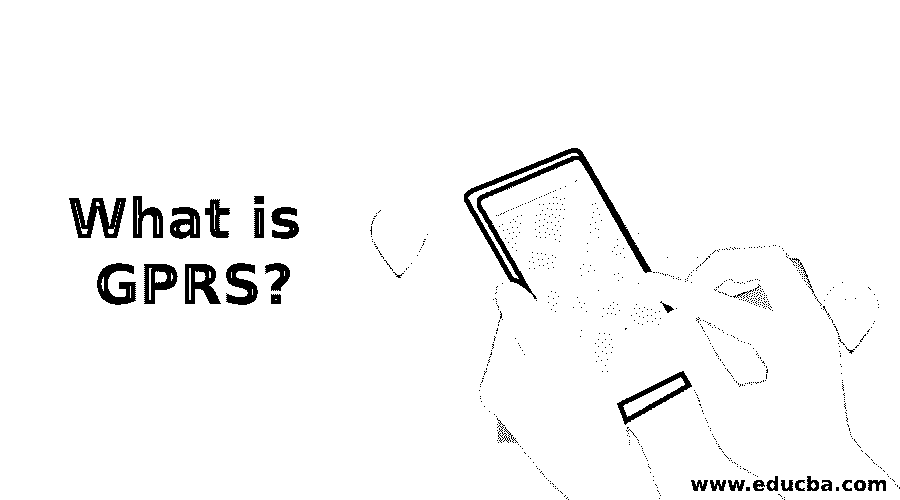

# 什么是 GPRS？

> 原文：<https://www.educba.com/what-is-gprs/>

## GPRS 简介

GPRS 被扩展为通用分组无线业务，并且它被用于 2G 或 3G 蜂窝通信中。它是由欧洲电信协会在 i-mode 分组和 CDPD 技术的影响下开发的，现在由第三代合作伙伴项目管理。它广泛应用于移动通信。一般来说，考虑到在计费时间交换的大量信息以及通过计算连接时间管理的电路交换数据，它被出售。考虑到所有的实用程序，GPRS 捆绑数据上限是根据 MB、运行速度和签署的政策收费的。

### 我们为什么要用 GPRS？

GPRS 技术是基于 GSM 带宽中未使用的部分来传输和接收数据包。GPRS 和传统连接的区别在于质量水平。它可以以多种方式实现，其中可以在最少的时间内访问更高的数据速率。

<small>网页开发、编程语言、软件测试&其他</small>

在一般的 GSM 移动中，配置是冗长的方法，并且数据许可被限制在每秒 9.6 千比特。当在实践中提供时，话路的建立时间减少了一秒，ISDN 线路的数据速率被限制在每秒几十千比特。GPRS 的分组传输使得由电路交换设备提供的系统简单且用户友好。电路提供的服务取决于连接持续时间。

它不适用于拥塞的流量，并且用户应该为整个连接时间付费，即使对于没有分组被传输的空闲情况也是如此。但是对于分组交换设备，计费取决于传输的几个数据。即使用户长时间在线，他也能从中受益，但计费将基于传输的数据量。

### GPRS 的特点

以下是 GPRS 的功能:

1.通过同时利用所有八个时隙，最大理论速度可以达到 171.2kbps。

2.通过 GPRS 可以提供即时服务，并且可以根据要求和依赖的覆盖范围和强度立即交换信息。

3.GPRS 的应用开发可以被允许用于移动电话范围，从网络浏览器访问、网上冲浪、聊天、附件传输。

4.它还使创建的移动应用程序能够实现更快、更好的应用程序，这是前几代产品所不具备的。

5.GPRS 到 GSM 分组电路的扩展实现了许多下列可能的服务。

*   通过短信选项广播消息。
*   它支持不间断的互联网接入。
*   允许在多媒体图像上发送消息服务。
*   启用 PoC，即无线一键通服务。
*   实施具有即时消息服务和存在的无线村。
*   无线应用协议是作为智能设备的互联网连接而建立的。
*   互联网是在具有点对点服务的互联网络中传播的。
*   点到多点提供了连接多个节点的多播选项和群组呼叫。
*   SMS 传输速度大约是每分钟 30 条 SMS 消息，这比标准 SMS 快得多，标准 SMS 的传输速度大约是每分钟 6 到 10 条 SMS 消息。

### 优点和缺点

以下是 GPRS 的优点和缺点:

#### 优势

*   GPRS 将移动用户带出通常的社会，进入 WAP 世界，互联网最终进入手机，统治世界。
*   通过应用 GPRS，可以在互联网上与移动设备交换大量的信息。
*   它使移动电话能够与便携式笔记本电脑进行紧凑的互联网连接。
*   在少数情况下，无法立即访问互联网，但 GPRS 在移动网络中起到了救命稻草的作用。
*   当连接到膝上型电脑时，大多数手机可以实现为调制解调器；GPRS 将是一个很好的备份选择。
*   随着直接连接到笔记本电脑的更快的数据卡的出现，便携性的因素被最小化了。
*   GPRS 接入在远程位置是可能的；通过使用标准的 GSM 网络，通过 GPRS 的交互是便宜的。
*   即时消息服务和邮件服务支持用户通过 GPRS 连接以低费用发送消息，以替代短消息服务。
*   客户只为传输的数据付费，而不是在连接互联网时付费。
*   它提供无线上网服务，无论在任何地点，只要有网络信号。
*   它使用户能够在笔记本电脑或手机上使用互联网浏览数据，甚至访问远程位置。
*   使用 GPRS，用户可以持续连接到互联网。

#### 不足之处

*   GPRS 技术利用蜂窝网络的 GSM 来发送数据，即使当连接不活动时也是如此。
*   不能使用网络相关功能，但是数据会话照常运行。
*   属于 B 级 GPRS 设备。当任何两个无线电集成到设备中时，它使两个功能能够同时执行。
*   属于 A 类，不太普及，涉及面广，价格贵。
*   这些移动电话属于 b 类。
*   GPRS 的连接速度比笔记本电脑上的 56K 连接速度慢。这是由于 GPRS 的一些限制。
*   几乎没有支持提高速度的增强功能，但有线网络的运营赢得了移动互联网连接。
*   由于用于互联网连接的基站上的语音流量负载，GPRS 的连接速度比其他网络更快。
*   当与 GPRS 连接相关联时，如果许多用户在指定的位置同时在电话上进行交互，则存在许多问题。

### 结论

它仅在 GSM 覆盖时可用，因此它使用户能够在 HSDPA 或 3G 不可用时连接到互联网。如果用户通过 GPRS 接入互联网，它不会阻止通过 GSM 网络的来电。它允许用户在浏览数据或从网络下载数据时接听或拨打音频电话。

### 推荐文章

这是一个什么是 GPRS 的指南？这里我们讨论引言；我们为什么要用 GPRS？特点、优点和缺点。您也可以看看以下文章，了解更多信息–

1.  [计算机网络的类型](https://www.educba.com/types-of-computer-network/)
2.  [Java 中的可比](https://www.educba.com/comparable-in-java/)
3.  [JavaScript 展平数组](https://www.educba.com/javascript-flatten-array/)
4.  [JavaScript 数组过滤器](https://www.educba.com/javascript-array-filter/)

