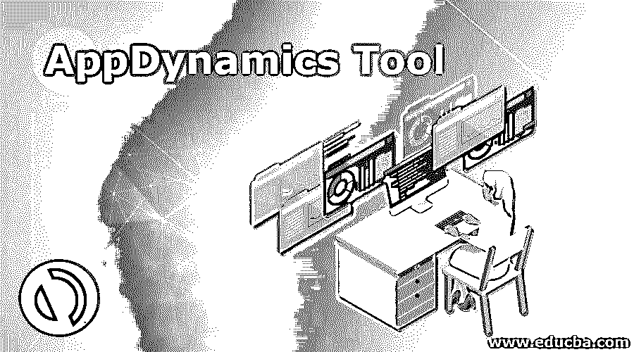

# AppDynamics 工具

> 原文：<https://www.educba.com/appdynamics-tool/>

## **app dynamics 工具简介**

在任何环境中轻松监控和管理应用程序都不容易，尤其是在云环境中。由于我们不知道应用程序的容量和工作范围，因此很难评估应用程序的性能。在这里，AppDynamics 工具有助于识别和管理应用程序在云环境和服务器中的工作。应用程序的可用性也通过 AppDynamics 通知。创建报告是为了监控应用程序的性能，这有助于很好地管理应用程序。该工具还附有一条学习曲线。

### AppDynamics 工具说明

*   这些工具采用的方法与其他工具不同。他们使用分析，每个应用程序的细节都被考虑在内。这不仅有助于 AppDynamics，还有助于应用程序的日志。对于应用程序中完成的每一笔交易，该工具都会收集细节，无论是基本的还是详细的，这使得 AD 工具对任何使用它的人都更加友好。因为任何细节，无论是基本的还是更详细的，都可以在该工具的报告或日志中看到。
*   AD 工具可以在生产和开发环境中使用。在生产环境中，工具会记录所有事务及其性能。这主要是为生产环境构建的，因为该工具本身遵循一种敏捷的方法。记录下正常性能，如果在应用程序中发现任何问题，就会发出警报。这为工具中的应用程序提供了适当的响应时间。
*   对响应时间和用户的响应时间进行比较。这种比较有助于通过自学习曲线找出工具的性能。由于代理会自动收集所有详细信息，甚至是正常行为的详细信息，因此可以轻松完成故障排除。这是一个分析方法的示例，这有助于该工具找出针对不同问题的警报集。因此，用户可以很好地修复它，因为这些是在任何重大影响之前设置的，从而确保在工具的帮助下应用程序正常工作。
*   我们知道，如果深入捕获数据，就可以轻松识别与应用程序及其环境的工作相关的所有信息。但是这种数据捕获并不容易，因为它需要更多的资源和更多的存储。AD 工具在这里起到了拯救作用，因为它记录了应用程序的整个工作过程，即使应用程序没有显示任何故障模式。这使得该工具能够利用其分析能力来管理应用程序的性能。
*   这种记录有助于监控应用程序，并在测试和预生产环境中使用它。AD 工具记录下每个请求和每个事务，这有助于监控应用程序的性能。如果开发人员还有其他工作要做，他们可以指示工具自己工作，或者在交易量超过限制时停止工作。因此，如果工具感觉到数据量增加或收集到足够的信息，它就会自动停止。此警报有助于系统正常工作，其性能不会因工作时间过长而中断。
*   代理与 AD 工具一起工作，他们监控应用程序的性能，支持工具的基础设施，并且对工具了如指掌。这使得该工具能够在人工支持下高效工作。他们了解整个应用生态系统及其环境，并记录性能数据。该日志数据被发送到控制器，以便可以看到应用程序的性能。这种可视化表示是通过系统中的用户界面来完成的。
*   在这个工具中不会发生可访问性问题，因为它被设计为在任何适合具有所有访问权限的应用程序的环境中工作。代理正在使用控制器，可以看到实时性能。这有助于提高性能，并协调应用程序和所用工具的带宽。
*   任何环境中的应用程序都会发出许多请求。代理通过工具知道这些请求，这些请求被用来创建请求映射。这有助于管理和可视化应用程序的性能以及事务历史。
*   当进行交易时，无论是业务交易还是文件传输，都要注意细节，包括发出的请求、响应时间、解决时间以及与交易对应的文件。这有助于以日志分析的方式管理请求，并掌握所有细节。应用程序的失败不是一个问题，或者我可以说，如果在 AD 工具监控的同时进行适当的监控，应用程序不会失败吗？
*   作为思科的一部分，AppDynamics 工具已经整合了机器学习和人工智能来监控和管理数据。异常检测、回归等多种机器学习技术将有助于监控和检测垃圾邮件和未经授权的请求。这将减少在系统中监控广告工具的代理的工作。此外，机器学习有助于收集数据并自行创建日志，而不是使用外部工具在系统中创建报告。在机器学习的帮助下识别和创建业务绩效指标。这有助于诊断应用程序中的问题，并完美地管理它们。自动缩放是在人工智能的帮助下在 AD 工具中使用的另一种技术。

### 结论–app dynamics 工具

该工具确保向用户提供应用程序的代码级可见性。由于代理的应用程序被严密监控，每一行代码都被仔细检查并用于系统的性能改进。服务器监控工具也在使用。

<small>网页开发、编程语言、软件测试&其他</small>

### 推荐文章

这是一个 AppDynamics 工具的指南。这里我们详细讨论 AppDynamics 工具的解释，以便更好的理解。您也可以浏览我们的其他相关文章，了解更多信息——

1.  [测试覆盖工具](https://www.educba.com/test-coverage-tools/)
2.  [移动测试工具](https://www.educba.com/mobile-testing-tools/)
3.  [压力测试工具](https://www.educba.com/stress-testing-tools/)
4.  [Web 测试工具](https://www.educba.com/web-testing-tools/)

