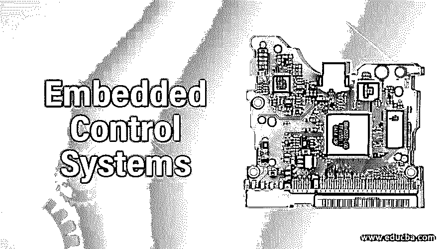

# 嵌入式控制系统

> 原文：<https://www.educba.com/embedded-control-systems/>

## 嵌入式控制系统介绍

嵌入式系统被定义为放置在另一个系统中的系统。它被定义为一组用于设计某种特定任务的系统。在嵌入式系统中，软件系统被放在硬件系统中完成某个特定的任务。嵌入式系统可归类为基于微控制器的系统，可用于任何特定类型的操作。嵌入式系统可以是独立的，也可以驻留在另一个大型系统中。

### 什么是嵌入式控制系统？

嵌入式系统是一种功能强大、速度快、体积小的系统，因此它可以很容易地安装在其他系统中并执行它们的任务。嵌入式系统可以被归类为计算机系统，但是它们不执行由计算机系统执行的操作。嵌入式系统可用于移动电话、医疗设备或任何其他制造设备。嵌入式系统可以执行各种类型的操作和功能，并用于控制较大系统的较小部分。嵌入式系统通常是软件和硬件系统以及其他组件的组合，以便可以执行特定的操作。

<small>网页开发、编程语言、软件测试&其他</small>

例如，车内制动系统可以作为一个嵌入式系统。但是当嵌入式系统被设计时，一旦它被设计，功能就不能被改变。另一方面，在计算机系统中，这种替换组件和软件的功能是可能的。在嵌入式系统中，可以执行单个功能或多个功能，但是一旦设计完成，就不能为嵌入式系统更改功能。微处理器是嵌入式系统的关键部件。

安装的系统中有三个不同的部件。这些描述如下:

1.  **硬件:**硬件是包含微控制器和微处理器等物理实体的组件。
2.  **应用软件:**用于控制系统功能的应用软件
3.  **RTOS:** 实时操作系统控制应用软件，并帮助处理器执行有助于控制设备延迟的进程。可以使用嵌入式系统来调度过程执行，并且可以由该系统来控制该执行。

嵌入式系统可以用于执行操作，或者可以帮助以重复的方式执行任务。例如，在寻呼机系统中使用了嵌入式系统。与其他系统相比，嵌入式系统可以很容易地安装在单芯片中，并且功耗非常低。可以非常快速地执行这些功能，并且在执行这些功能时不花费时间。嵌入式系统具有类似 ROM 的存储器，并且不需要任何类型的第二存储器。在嵌入式系统中，硬件系统用于控制设备的安全性和性能，而软件系统用于控制系统的灵活性和其他功能。

### 为什么我们需要嵌入式控制系统？

嵌入式系统广泛用于设计具有不同功能的系统，与计算机系统相比，嵌入式系统是廉价的设备。在更大的系统中使用嵌入式系统可以降低系统的总成本，并且系统可以容易地执行功能。嵌入式系统也是优选的，因为与通用系统相比，该系统的功耗非常低，嵌入式系统没有尺寸限制，并且性能比其他系统好得多。嵌入式系统作为一种完美的解决方案，可以设计出功耗低、成本低、性能可靠、功能多样的系统。

### 嵌入式控制系统的重要性

嵌入式系统可以很容易地安装在大型系统中，用于控制系统中的其他设备。嵌入式系统的功耗非常低，这有助于降低设备成本，提高嵌入式系统使用的重要性。现代类型的嵌入式系统使用其中的微控制器。特定任务可以由嵌入式系统控制，这有助于降低设备成本并设计低成本的设备，并且可以从该设备产生可靠的输出。

目前，几乎每个设备都包含嵌入式系统，如数字手表、洗衣机、扫描仪、安全系统、ATM、移动电话交通灯以及许多其他系统。对于任何大型系统来说，嵌入式系统都是非常重要的系统，在这个技术世界中有着无限的用途，并且可以很容易地安装到任何类型的新系统或产品中。嵌入式系统也被认为是物联网的一部分，因此数据可以很容易地传输，在这个过程中需要较少的人工参与。

嵌入式系统最受青睐，因为它可以根据用户需求轻松定制，功耗非常低，系统成本非常低，性能可以提高几倍。由于嵌入式系统对开发和系统设计技能的要求很高，因此巨大的优势也带来了一些缺点。目前开发的微处理器大多用于嵌入式系统。对于任何类型的集成电路，嵌入式系统都是系统的心脏，因为所有的操作都是由嵌入式系统控制的。

嵌入式系统不同于微控制器，因为微控制器具有不同的体系结构，需要 RAM、闪存来控制系统，但是在嵌入式系统中，不需要外部存储器，外部存储器有助于控制系统。嵌入式系统具有一定的局限性，因为在嵌入式系统中无法识别缺陷。但是使用嵌入式系统开发多个应用程序的开发者可以依赖嵌入式系统来获得性能。并且嵌入式系统在当前的技术世界中具有一定的重要性，因为几乎每个设备都在使用嵌入式系统来执行任何特定的任务。

### 结论

嵌入式系统是用于各种设备的系统类型。嵌入式系统可以很容易地安装在任何设备上，体积小，性能好，功耗低，价格便宜。所有这些限制使得嵌入式系统在应用程序中更受开发者的欢迎和青睐。

### 推荐文章

这是嵌入式控制系统指南。在这里我们讨论什么是嵌入式控制系统，重要的，以及为什么我们需要详细了解它。您也可以浏览我们的其他相关文章，了解更多信息——

1.  [什么是微控制器？](https://www.educba.com/what-is-microcontroller/)
2.  [软件即服务(Saas)](https://www.educba.com/what-is-software-as-a-service-saas/)
3.  [博客洞察你的分析](https://www.educba.com/blogging-insights-your-analytics-can-tell-you/)
4.  [提高生产率技术](https://www.educba.com/technology-to-improve-productivity/)

