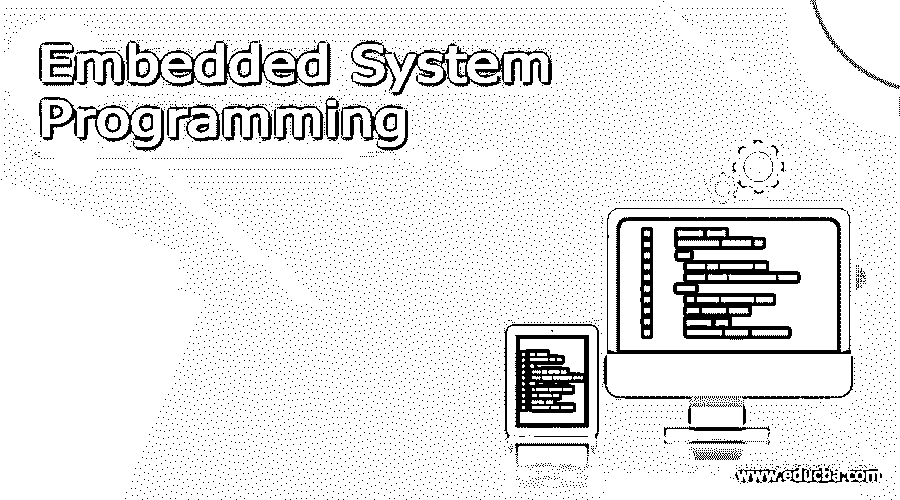

# 嵌入式系统编程

> 原文：<https://www.educba.com/embedded-system-programming/>

## 嵌入式系统编程导论

开发人员使用嵌入式编程语言对嵌入式系统进行编码。编程语言提供了对低级设备硬件的访问。有多种编程语言可用于嵌入式系统。嵌入式系统只不过是由输入/输出外围设备、计算机存储元件和计算机处理器组成的计算机系统的组合。因此，它们作为机械和电子硬件组件的一部分被嵌入，以使该机器成为一个完整的机器，这就是所谓的嵌入式系统。使这个嵌入式组件执行其实时操作的编程语言称为嵌入式系统编程语言，本文将简要讨论。

### 什么是嵌入式系统编程？

如上所述，在嵌入式系统的硬件组件中执行以使其执行某些功能的程序被称为嵌入式系统编程。许多编程语言可用于嵌入式系统，如 C、C++、Java、Python、JavaScript、Rust、Assembly、Ada、Verilog、Embedded C++。Lua，B#，等等。

<small>网页开发、编程语言、软件测试&其他</small>

### 如何学习嵌入式系统编程？

要学习嵌入式系统编程，需要遵循一定的步骤，以使其实时高效地工作。

*   精通 C 语言，因为大多数工具链和微控制器都支持 C 语言作为有效的主要语言。
*   对电流、电压、功率、欧姆、电阻等电子术语有基本的理解。尝试使用实时电路和在线模拟器进行一些实验。
*   熟悉电烙铁、数字万用表、JTAG 适配器、OMLEX 适配器、ST link 和一些硬件调试器等电子元件的工作。
*   现在，要执行编译器，需要微控制器和其他工具链来将程序加载到硬件中。所以最好选择带 arm-GCC 和开放式 OCD 的 STM32 套件。这种组合不像 Arduino 那样用户友好，而是应用在实时应用中。
*   然后，选择器件并浏览数据手册。但是不要完全相信。反复阅读数据手册，但不要相信它。它只是知识的来源，帮助你开始。

### 流行的嵌入式系统编程

开发人员首选的流行编程语言是 C、Python、Java 和 C++。少数几种有一些优点和局限性，讨论如下:

*   c 是一种编译语言，是其他语言的基础。80%的嵌入式行业使用 C 编程，因为它更有效。但是开发人员发现它更复杂，因为它使用了技术编码方法。
*   C++有大部分像 C 一样的味道，并且有一些标准库，这些都很耗时。开始时可能很复杂，但可以理解为不一致的做法。
*   Python 在机器学习、数据分析和人工智能方面大放异彩。它是开源的，易于阅读、编写和执行，并且是免费的。因为它不是语言确定性的，所以它不适用于实时操作系统。
*   Java 是一种基于互联网应用的通用语言，被广泛使用。在 Android 操作系统上，Java 是嵌入式系统的最佳选择。这里的代码是可靠的和可移植的。所以一旦写好了，就可以轻松的运输了。Java 可能很复杂，有时会导致性能问题，因为它在 GUI 上工作，在实时系统中不实用。
*   JavaScript 在嵌入式系统中是基于文本的，对于需要突出图形和联网的 HTML5 来说是合适的选择。但是它的运行效率最低，并且需要维护。

### 顶级嵌入式系统编程

顶级的嵌入式系统编程语言有 C、C++、Java、Python、Micropython、Rust、Ada 和 Assembly。上一节讨论了 C、C++、Java 和 python。因此，这里将讨论下一代顶级嵌入式系统编程语言。

*   MicroPython: MicroPython 是 Python 的一个版本，是为微控制器设计的。它简单易学，开源，免费使用。与 C++和 C 相比，这些代码不能快速执行，并且占用大量内存空间。
*   Rust: Rust 是 Mozilla 为了安全和性能而开发的一种高级编程语言。它有助于构建缺陷有限的安全代码。但是编译需要时间，而且还没有标准化。它用于多堆叠系统。
*   Ada: Ada 非常可靠和高效，但是它没有被广泛使用，执行起来也很困难。它在关键应用程序中用于检测运行时错误和数组访问错误。
*   汇编:汇编是一种低级编程语言，旨在与硬件组件进行通信，它的工作速度快，内存效率高。但是维护和阅读并不容易。

### 比较嵌入式系统编程

| **编程语言** | **优点** | **记过** | **应用** |
| **C** | c 广泛用于所有实时应用程序和其他编程语言的构建模块。它以执行迅速、稳定、高效而著称。 | 现代编码技术很难用它来实现。它是一种低级的嵌入式编程语言，开发人员发现很难开发它。 | 它用于许多嵌入式应用程序和实时古代环境。 |
| **C++** | 它有 C 语言的所有功能，也有一些 C 语言不支持的不同功能。它在一个强大的标准库上工作，非常耗时。 | 很难学习和执行。 | 它被应用在许多嵌入式系统中 |
| **Python** | 它是一种解释语言，开发者不需要交叉代码编译。从硬件上学习、编译和移植代码很容易。 | 它缺乏静态和编译分析，代码应该被仔细检查以避免运行时错误。 | 它用于应用处理器以及用户和嵌入式系统之间的接口。 |
| **Java** | Java 具有可移植性和可靠性。它很容易运输。它是开源的，支持多任务处理。 | 因为它使用垃圾收集器，所以会导致性能问题。 | 它用于基于互联网的应用程序。它适用于带有其他微控制器的嵌入式系统。 |
| **MicroPython** | 它被设计成在微控制器上执行。它有许多标准库，可以导入以有效地完成任务。 | 代码无法快速编译，运行速度慢，耗费时间多。 | 它适用于带有微控制器的嵌入式系统。 |
| **JavaScript** | 它最适用于网络和图形内容，后者适用于 HTML | 它的运行效率很差。 | 它应用于人机界面系统。 |

### 结论

因此，这些是广泛使用的有效的嵌入式编程语言，并且可以根据用户及其环境的要求来实现。每一个都有独特的优势，使其完全有效，以获得显着的成果。

### 推荐文章

这是一本嵌入式系统编程指南。这里我们讨论一下定义，什么是嵌入式系统编程，如何学习嵌入式系统编程？.您也可以看看以下文章，了解更多信息–

1.  [Python Web 开发](https://www.educba.com/python-web-development/)
2.  [面向对象的编程范例](https://www.educba.com/object-oriented-programming-paradigm/)
3.  [谷歌开发工具](https://www.educba.com/google-development-tools/)
4.  [应用软件 vs 系统软件](https://www.educba.com/application-software-vs-system-software/)

