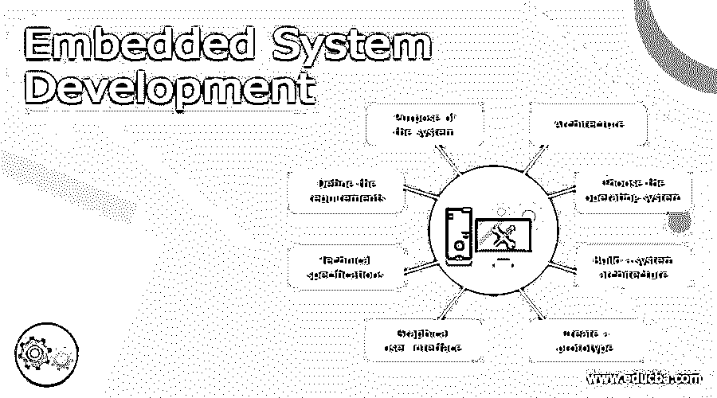

# 嵌入式系统开发

> 原文：<https://www.educba.com/embedded-system-development/>

## 嵌入式系统开发的定义

计算机系统有一部分精密的功能内置在一个更大的机械或电气系统中，这个系统叫做嵌入式系统。它通常用于服务计算限制较少的实时场景。它作为包括机械和硬件部分的完整设备的一部分嵌入。有多种方法可用于开发、设计、规划、分析和实现该嵌入式系统，以使其为特定目的而工作，本文将对此进行讨论。

### 什么是嵌入式系统开发？

嵌入式系统需要完成特定的任务，而不是像多任务计算机那样运行。很少有嵌入式系统具有满足所有标准(如可用性、安全性等)的实时性能。因此，嵌入式系统致力于完成特定的任务，并且其结构简单以降低成本。因此，设计工程师可以对其进行优化和增强，以提高可靠性和性能。嵌入式系统的范围从便携式组件到大型混合动力汽车不等。像洗衣机、烤箱和洗碗机这样的家用电器都有嵌入式系统，以提供更高的效率和灵活性。

<small>网页开发、编程语言、软件测试&其他</small>

### 嵌入式系统开发理念

初露头角的年轻人对获取嵌入式系统的实用知识表现出极大的兴趣，他们在 PIC 微控制器或 8051 微控制器的帮助下开始了他们的项目。这些项目为他们提供了强大的接口来关联不同的传感器、输入、输出小工具和其他通信设备。嵌入式系统的基本概念包括交通领域的嵌入式 web 技术、汽车自动化、安全和安保系统、工业中部署的 SCADA、瞬态控制项目、门锁系统、太阳能跟踪系统、ARM 技术、无线信息循环系统、RFID 项目等等。有多个项目可用。

### 嵌入式系统开发设计实现

下面列出了设计嵌入式系统的基本步骤，

*   **系统用途:**

消费者或制造商应该决定嵌入式系统的可能需求，他们应该定义产品的可靠性。工程师们必须集思广益，研究该系统的工作原理。他们很想知道系统的价格，在这个系统中，客户愿意为它付费。

*   **定义需求:**

工程师将决定产品的意图，并准备回答这些问题，比如还需要完成什么功能，产品的尺寸、形状、重量、成本限制。

*   **技术规格:**

该文件应提供技术规范，包括环境条件、制造部件和所用部件的其他细节。

*   **图形用户界面:**

很少有嵌入式系统需要一个简单的图形显示界面来为用户提供有关系统运行的信息。但是是否保留 GUI 取决于设计工程师。

*   **创建原型:**

开发一个在硬件上工作的标准原型，找到必要的组件以及它们如何协同工作，这是很有帮助的。

*   **构建系统架构:**

在这一步，整个计划将准备就绪，可以开始设计嵌入式系统想要工作的架构。工程师应研究如何向设备供电，如何将系统连接到互联网，以及可以使用什么操作系统。

*   **选择操作系统:**

工程师可以决定操作系统，它需要是最好的和可靠的，因为它被集成到实时组件中。因此，它们应该快速、可靠、有时间限制且安全。如果不是，他们也可以选择非实时效率较低的操作系统。

*   **架构:**

嵌入式系统中常用的架构是冯诺依曼架构和哈佛架构。如果代码和数据位于各个存储块中，则称为 Hardvard 架构，当代码和数据位于单个存储块中时，则称为 Von Neumann 架构。

冯·诺依曼体系结构有一条用于数据和指令的数据总线。所以 CPU 一次只执行一个操作。它要么进行读或写操作，要么从内存中获取数据。因此，在公共总线中，不会发生数据操作或存储器提取过程。它支持标准硬件，并支持使用顺序存储器。哈佛架构为信号总线和存储器提供了独立的区域来处理数据和指令。该体系结构在 CPU 中有不同的存储区域，在这些区域中没有地方存储指令作为信息。它们有独立的存储空间，在内部数据总线上工作，允许访问数据和指令。

*   **策划:**

首先，嵌入式系统应该响应特定的需求。它可以是公共相关的，也可以是私有的，或者是公司相关的。交付的最终产品应该有一个新的解决方案，并且应该在出现任何问题时进行更新。当需求明确时，工程师就可以针对受众的选择开展工作。设计工程师应该了解他的产品的最终用户；最终用户的性别、职业和年龄等特征在决策中也起着至关重要的作用。工程师应该了解最终用户在什么情况下寻找产品。

*   **分析:**

旨在开发的设备应该解决特定的问题。在这个分析阶段，设计工程师应该熟悉他的潜在竞争对手。因为很少有人在嵌入式系统的开发中取得领先地位，有些人甚至失败了。因此，从他们的经历中吸取教训是很重要的。它提供了接近产品的更好方法。分析竞争对手的产品及其价格，克服设计中的缺陷，也将预测最终用户的反应。

### 结论

因此，嵌入式系统的开发有许多过程，应该有效地、没有任何缺点地遵循它，以获得可靠和有效的最终产品，该产品应该有很高的需求，并且该产品将达到显著的高度。

### 推荐文章

这是一个嵌入式系统开发指南。这里我们讨论一下定义，什么是嵌入式系统开发，思路，设计实现。您也可以看看以下文章，了解更多信息–

1.  [嵌入式系统应用](https://www.educba.com/embedded-systems-applications/)
2.  [嵌入式系统架构](https://www.educba.com/embedded-systems-architecture/)
3.  [嵌入式系统的类型](https://www.educba.com/types-of-embedded-systems/)
4.  [嵌入式系统安全](https://www.educba.com/embedded-systems-security/)

